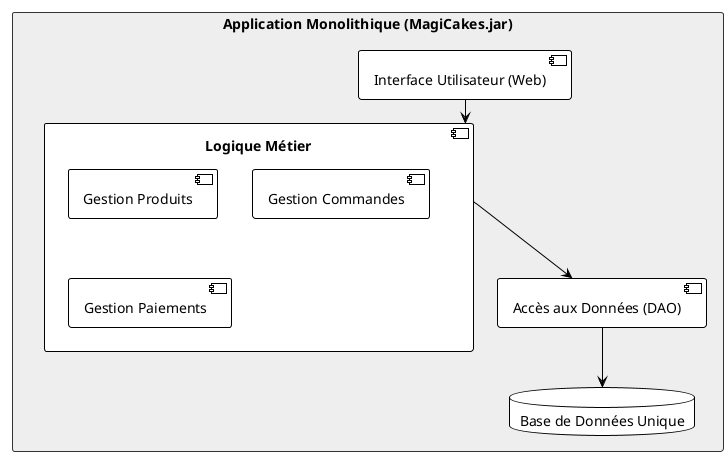
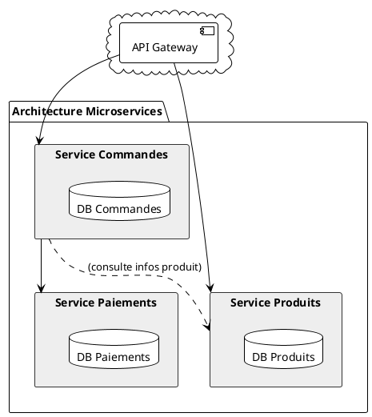

# Module 1 : Les Fondations - Du Monolithe aux Microservices (L'essentiel)

### Objectifs Pédagogiques

À la fin de cette partie, vous serez capable de :
*   Expliquer ce qu'est une architecture monolithique, avec ses forces et ses faiblesses.
*   Définir ce qu'est un microservice.
*   Énoncer et expliquer les principes clés d'une architecture microservices : Responsabilité Unique, Autonomie, et Décentralisation.
*   Articuler la principale motivation derrière la transition vers les microservices.

### Introduction : Pourquoi est-ce utile ?

Imaginez que vous lancez une boutique en ligne de gâteaux faits maison, appelons-la "MagiCakes". Au début, vous êtes seul ou dans une petite équipe. Vous développez une application web unique qui gère tout : le catalogue de gâteaux, les commandes des clients, les paiements et l'interface utilisateur. Tout est dans un seul et même projet. C'est simple, rapide à développer et à déployer. C'est une **architecture monolithique**.

Votre succès est fulgurant ! Les commandes affluent. Vous devez embaucher plus de développeurs. Bientôt, le "simple" projet devient un géant de code, un "Big Ball of Mud" (une grosse boule de boue). Le moindre changement, même une simple correction de texte, demande de re-tester et de redéployer toute l'application. Mettre à l'échelle pour le rush de Noël ? Vous devez dupliquer toute l'énorme application, même les parties qui ne sont pas surchargées. Un bug dans la gestion des avis clients fait planter tout le site, y compris la prise de commande !

C'est pour résoudre ces "problèmes de riche" que l'architecture microservices a été pensée. Elle vous propose de déconstruire cette énorme application en de plus petits services, plus simples et indépendants. C'est ce voyage que nous allons commencer ensemble.

### L'ère du Monolithe : Un seul pour tous

Une application monolithique est construite comme une seule et unique unité. Tous les modules (interface utilisateur, logique métier, accès aux données) sont développés, déployés et mis à l'échelle ensemble.

<tabs>
<tab title="Forces">
<ul>
    <li><b>Simplicité de développement :</b> Au début, un seul projet est plus facile à gérer.</li>
    <li><b>Débogage et tests simplifiés :</b> Tout s'exécute sur le même processus. Suivre un appel de l'interface à la base de données est direct.</li>
    <li><b>Déploiement simple :</b> Il n'y a qu'un seul artefact à déployer (un <code>.jar</code>, un <code>.war</code>...).</li>
</ul>
</tab>
<tab title="Limites">
<ul>
    <li><b>Couplage fort :</b> Tous les modules sont étroitement liés. Un changement dans un module peut avoir des effets de bord imprévus sur un autre.</li>
    <li><b>Mise à l'échelle difficile :</b> Si seule la gestion des produits est surchargée, vous devez quand même mettre à l'échelle toute l'application. C'est coûteux et inefficace.</li>
    <li><b>Verrouillage technologique :</b> L'ensemble du projet est coincé avec la pile technologique choisie au départ. Changer de langage ou de version de framework est un projet titanesque.</li>
    <li><b>Déploiements lents et risqués :</b> Plus l'application grossit, plus les temps de compilation, de test et de démarrage s'allongent. Chaque déploiement est un événement à haut risque.</li>
</ul>
</tab>
</tabs>

### La Révolution Microservices : Diviser pour mieux régner

Face aux limites du monolithe, une nouvelle approche a émergé.

> **Définition :** L'architecture **microservices** est un style d'architecture où une application complexe est décomposée en un ensemble de **petits services indépendants**. Chaque service est construit autour d'une **capacité métier** spécifique et communique avec les autres via des API bien définies, le plus souvent via le réseau (HTTP/REST).

Reprenons notre exemple "MagiCakes" :

Cette architecture repose sur quelques principes fondamentaux.

#### 1. Principe de Responsabilité Unique (Single Responsibility Principle - SRP)

C'est le cœur de la philosophie. Chaque microservice doit avoir **une seule et unique raison de changer**. Il est responsable d'une petite partie du domaine métier de l'application.

*   **Service Produits :** Gère tout ce qui concerne les gâteaux (création, mise à jour, affichage, gestion du stock). Il ne sait rien des clients ou des commandes.
*   **Service Commandes :** Gère le cycle de vie d'une commande (création, validation, expédition). Il demande des informations au service produits et au service paiements, mais ne gère pas leurs logiques internes.

> **Conseil :** Le découpage est la partie la plus difficile. Un bon découpage se fait par **capacité métier** ("business capability"), pas par couche technique. On ne fait pas un "service-controller", un "service-service" et un "service-repository". On fait un "service-produits".

#### 2. Autonomie

L'autonomie est le super-pouvoir des microservices. Chaque service est :
*   **Déployable indépendamment :** L'équipe du service Produits peut déployer une nouvelle version à 14h sans que l'équipe du service Commandes ne soit au courant.
*   **Propriétaire de ses données :** C'est un point crucial. Chaque service gère sa propre base de données. Le service Commandes ne peut PAS accéder directement à la base de données du service Produits. Il doit passer par son API. Cela garantit un couplage faible.

<warning>
<b>Le piège de la base de données partagée !</b>
Si plusieurs services partagent la même base de données, ils ne sont pas vraiment indépendants. Un changement de schéma pour un service peut casser tous les autres. Vous avez alors créé ce qu'on appelle un **monolithe distribué**, qui combine les inconvénients des deux mondes !
</warning>

#### 3. Décentralisation

Contrairement au monolithe où tout est centralisé, les microservices favorisent la décentralisation.
*   **Gouvernance décentralisée :** Chaque équipe est responsable de son service de bout en bout ("You build it, you run it"). Elle peut choisir les technologies les plus adaptées à son besoin (langage, type de base de données...). C'est le **polyglottisme technologique**.
*   **Gestion des données décentralisée :** Comme vu plus haut, chaque service gère ses données. Cela introduit de nouveaux défis (comment faire une requête qui joint des données de deux services ?), que nous aborderons plus tard.

---

### Exercice 1 : Identification des microservices potentiels

**Contexte :** Vous êtes chargé de concevoir l'architecture d'une nouvelle plateforme de vente de livres en ligne, "BookHive".

**Description fonctionnelle de BookHive :**
Les utilisateurs peuvent s'inscrire et gérer leur profil. Ils peuvent rechercher des livres par titre, auteur ou ISBN. Ils peuvent consulter les détails d'un livre, y compris sa description, son prix et les avis d'autres lecteurs. Ils peuvent ajouter des livres à un panier, passer une commande en validant leur panier et en fournissant une adresse de livraison. Le paiement est traité par un système externe. Une fois la commande payée, une notification par email est envoyée à l'utilisateur et la commande est transmise au service d'expédition pour préparation.

**Votre mission :**
En vous basant sur le principe de responsabilité unique, identifiez et nommez au moins 4 microservices potentiels pour cette application. Pour chaque service, décrivez en une phrase sa responsabilité principale.

#### Correction exercice 1 {collapsible='true'}

Voici une proposition de découpage possible pour l'application "BookHive". Il n'y a pas une seule bonne réponse, mais la logique de découpage par domaine métier doit être respectée.

*   **Service Utilisateur (User Service)**
    *   **Responsabilité :** Gérer l'inscription, l'authentification, et les informations de profil des utilisateurs (nom, adresses, etc.).

*   **Service Catalogue (Catalog Service ou Product Service)**
    *   **Responsabilité :** Gérer toutes les informations relatives aux livres : titre, auteur, ISBN, description, stock, prix. Il expose des API pour rechercher et consulter les livres.

*   **Service Commande (Order Service)**
    *   **Responsabilité :** Gérer le cycle de vie des commandes, de la création (validation du panier) au suivi de l'expédition. Il interagit avec les autres services pour obtenir les informations nécessaires (utilisateur, détails du livre, paiement).

*   **Service Paiement (Payment Service)**
    *   **Responsabilité :** Gérer les transactions financières. Il communique avec les prestataires de paiement externes et informe le service de commande du succès ou de l'échec d'un paiement.

*   **Service Notification (Notification Service)**
    *   **Responsabilité :** Envoyer des communications aux utilisateurs (email, SMS, push). Par exemple, l'email de confirmation de commande. Ce service est appelé par d'autres (comme le service Commande) quand une notification doit être envoyée.

Ce découpage permet à chaque équipe de se concentrer sur un aspect métier clair et de faire évoluer son service sans impacter directement les autres.

---

### Auto-évaluation

Prenez un moment pour répondre à ces questions. Les corrections se trouvent à la toute fin du support de cours.

1.  **(Question ouverte)** Avec vos propres mots, expliquez la différence fondamentale entre la mise à l'échelle d'une application monolithique et celle d'une architecture microservices.
2.  **(QCM)** Quel est le principal inconvénient d'un monolithe qui grandit beaucoup ?
    *   A) Il est impossible d'utiliser des bases de données.
    *   B) Le couplage fort entre les modules rend les changements difficiles et risqués.
    *   C) Il ne peut pas être écrit en Java.
    *   D) Il ne peut pas avoir d'interface utilisateur web.
3.  **(QCM)** Lequel de ces principes N'EST PAS un pilier de l'architecture microservices ?
    *   A) Responsabilité unique par service.
    *   B) Base de données unique et centralisée pour tous les services.
    *   C) Autonomie de déploiement.
    *   D) Décentralisation de la gouvernance.
4.  **(Question ouverte)** Pourquoi le principe "un service, une base de données" est-il si important pour garantir l'autonomie d'un microservice ?
5.  **(QCM)** Dans notre exemple MagiCakes, l'équipe marketing