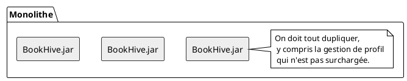
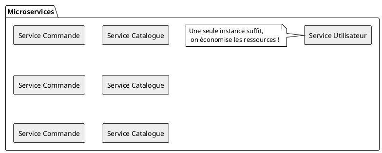
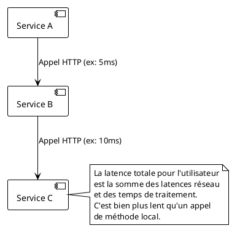
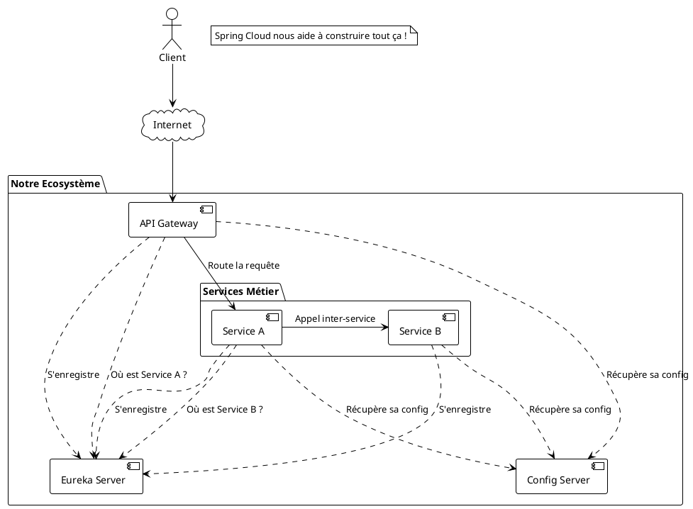

# Module 1 : Avantages, Défis et notre Allié Spring Cloud (Pour aller plus loin)

### Objectifs Pédagogiques

À la fin de cette partie, vous serez capable de :

* Lister et expliquer les avantages majeurs de l'architecture microservices.
* Identifier les principaux défis et inconvénients de cette approche.
* Comprendre le rôle de l'écosystème Spring Cloud et comment il nous aidera à relever ces défis.
* Justifier le choix d'une architecture microservices pour un projet donné.

### Introduction : La médaille a toujours deux faces

Dans la partie précédente, nous avons décidé de déconstruire notre monolithe "MagiCakes" en plusieurs petits services.
C'est fantastique ! On imagine déjà des équipes autonomes, des déploiements fluides, une application qui résiste aux
pannes... Mais ce passage n'est pas magique.

Imaginez que vous déménagez d'un grand manoir (le monolithe) pour habiter dans un village de charmants petits cottages (
les microservices). Vous gagnez en indépendance (chaque cottage peut être décoré différemment), en résilience (un
incendie dans un cottage n'affecte pas les autres). Mais vous héritez de nouveaux problèmes : il faut construire des
routes pour que les villageois communiquent, un système postal pour échanger des biens, et un plan de la ville pour que
personne ne se perde.

Cette partie explore les deux faces de cette médaille : les puissants avantages qui nous motivent, et les défis de "
gestion du village" que nous devrons relever. Heureusement, nous ne partirons pas de zéro ; nous aurons une boîte à
outils formidable : **Spring Cloud**.

### Les Promesses des Microservices : Les Avantages Concrets

#### 1. Scalabilité Indépendante

C'est l'un des arguments les plus forts. Dans une architecture microservices, vous pouvez mettre à l'échelle uniquement
les parties de votre application qui en ont besoin.

* **Scénario :** C'est le Black Friday sur notre site "BookHive". Le nombre de personnes qui recherchent des livres et
  passent commande explose. Par contre, très peu de gens mettent à jour leur profil utilisateur à ce moment-là.

#### 2. Résilience et Isolation des Pannes

Un bug dans un service ne doit pas entraîner l'indisponibilité de toute l'application.

* **Scénario :** Sur "BookHive", le service qui gère les avis des lecteurs rencontre un bug critique et ne répond plus.
    * **Dans le monolithe :** Une exception non gérée dans le module d'avis peut faire planter le thread du serveur d'
      applications, rendant tout le site inaccessible. Le client ne peut même plus acheter de livres.
    * **En microservices :** Le service d'avis est en panne. L'API du service Catalogue qui renvoie les détails d'un
      livre peut être conçue pour continuer à fonctionner, en renvoyant les informations du livre... sans les avis. La
      fonctionnalité principale (la vente) est préservée.

> **Conseil :** Cette résilience n'est pas automatique. Elle se construit avec des patterns comme le **Circuit Breaker
** (disjoncteur), que nous étudierons en détail plus tard.

#### 3. Indépendance Technologique et Équipes Autonomes

Puisque les services sont indépendants, les équipes qui les développent le sont aussi.

* **Polyglottisme technologique :** L'équipe du service "Recherche" de BookHive veut utiliser Elasticsearch et un
  service écrit en Python pour ses capacités d'analyse de texte. L'équipe "Commande" préfère la robustesse de
  Java/Spring et d'une base de données PostgreSQL. C'est possible !
* **Déploiement agile :** L'équipe "Catalogue" peut déployer la version 1.2 de son service un mardi à 15h, tandis que
  l'équipe "Utilisateur" déploie la version 1.1 un mercredi à 10h. Fini les plannings de déploiement monolithiques
  complexes et risqués qui bloquent tout le monde.

### Les Défis à Relever : Rien n'est gratuit

Adopter les microservices, c'est accepter une nouvelle forme de complexité.

#### 1. Complexité Opérationnelle

Gérer un seul service est simple. En gérer 10, 50 ou 100 est un tout autre métier.

* **Déploiement :** Vous devez automatiser le déploiement de N services.
* **Monitoring :** Vous devez surveiller N services. Comment savoir si l'application globale est en bonne santé ?
* **Logging :** Un utilisateur signale une erreur. Sa requête a traversé 4 services. Comment retrouver le log pertinent
  dans chacun d'eux et reconstituer l'histoire ?

#### 2. Latence Réseau

Dans un monolithe, un module en appelle un autre via un appel de méthode en mémoire. C'est quasi-instantané. En
microservices, les services s'appellent via le réseau.

Chaque appel réseau ajoute de la latence et un point de défaillance potentiel (le réseau n'est jamais fiable à 100%).

#### 3. Consistance des Données Distribuées

C'est l'un des défis les plus complexes.

* **Scénario :** Un client passe une commande sur "BookHive". Deux choses doivent se passer :
    1. Une nouvelle commande est créée dans la base de données du `service-commande`.
    2. Le stock du livre doit être décrémenté dans la base de données du `service-catalogue`.

<warning>
<b>Que se passe-t-il si l'étape 2 échoue ?</b>
La commande est créée, le client est peut-être même débité, mais le stock n'est pas mis à jour. Catastrophe ! Dans un monolithe, on utiliserait une transaction de base de données (ACID) pour s'assurer que soit les deux opérations réussissent, soit les deux échouent. On ne peut pas faire ça avec deux bases de données distinctes. Il faut utiliser des stratégies de compensation et des patterns avancés comme les **Sagas** pour atteindre une **consistance à terme** (eventual consistency).
</warning>

### Notre Boîte à Outils : L'Écosystème Spring Cloud

Face à ces défis, faut-il tout réinventer ? Heureusement, non ! La communauté Spring a créé **Spring Cloud**, un
ensemble de projets qui fournissent des solutions éprouvées aux problèmes récurrents des architectures distribuées.

Spring Cloud n'est pas un framework, mais une **collection de dépendances** qui s'intègrent parfaitement avec Spring
Boot.

Voici une cartographie des problèmes et des solutions Spring Cloud que nous allons explorer :

| Problème / Défi                                               | Solution Spring Cloud que nous utiliserons | Rôle                                                            |
|---------------------------------------------------------------|--------------------------------------------|-----------------------------------------------------------------|
| Comment mes services se trouvent-ils les uns les autres ?     | **Spring Cloud Netflix Eureka**            | Un annuaire (Service Registry) où chaque service s'enregistre.  |
| Comment appeler un autre service sans connaître son IP/port ? | **Spring Cloud OpenFeign**                 | Un client REST déclaratif qui utilise le nom du service.        |
| Comment gérer la configuration de tous mes services ?         | **Spring Cloud Config Server**             | Un serveur centralisé pour les fichiers de configuration.       |
| Comment protéger mon application des pannes en cascade ?      | **Resilience4j**                           | Un disjoncteur (Circuit Breaker) pour isoler les pannes.        |
| Comment exposer un point d'entrée unique et sécurisé ?        | **Spring Cloud Gateway**                   | Une passerelle API intelligente pour le routage et les filtres. |
| Comment suivre une requête à travers plusieurs services ?     | **Micrometer Tracing**                     | Un outil pour le tracing distribué.                             |

Voici une vision de l'architecture cible que nous allons construire pas à pas :

---

### Exercice 2 : Analyse Avantages/Défis

**Contexte :** L'équipe de "BookHive" est en réunion d'architecture.

* **Situation A :** L'équipe marketing veut pouvoir lancer des "ventes flash" très complexes, dont les règles de calcul
  de prix changent toutes les semaines. L'équipe en charge de cette fonctionnalité est très junior et apprend un nouveau
  framework de règles métier.
* **Situation B :** Le PDG veut une nouvelle fonctionnalité "Recommandations personnalisées" qui doit analyser
  l'historique d'achat de TOUS les clients et les données de navigation pour suggérer des livres. C'est un traitement
  très lourd.

**Votre mission :**
Pour chaque situation, identifiez :

1. Le principal **avantage** d'une architecture microservices pour répondre à ce besoin.
2. Le principal **défi** ou risque que cette architecture introduit et auquel il faudra faire attention.

#### Correction exercice 2 {collapsible='true'}

* **Situation A (Ventes flash avec règles changeantes)**
    1. **Avantage :** **Isolation et autonomie.** On peut créer un `pricing-service` dédié. L'équipe junior peut
       expérimenter, faire des erreurs et redéployer son service très fréquemment (`agilité`) sans jamais risquer de
       casser le service de commande ou le catalogue (`résilience`). Ils peuvent même utiliser leur nouveau framework
       sans l'imposer au reste de l'entreprise (`indépendance technologique`).
    2. **Défi :** **Performance et fiabilité (Latence & Résilience).** Le service de commande dépendra fortement du
       `pricing-service` pour calculer le total du panier. Si ce nouveau service est lent, tout le processus de paiement
       sera lent. S'il tombe en panne, personne ne peut plus acheter. Il faudra donc impérativement mettre en place un *
       *Circuit Breaker** avec une solution de repli (fallback), par exemple : "Si le service de prix ne répond pas en
       200ms, appliquer le prix standard sans promotion".

* **Situation B (Recommandations personnalisées)**
    1. **Avantage :** **Scalabilité et indépendance technologique.** Le moteur de recommandation peut être développé
       dans un service dédié, potentiellement en Python avec des librairies de Machine Learning. Surtout, ce service
       peut être hébergé sur des serveurs spécifiques avec beaucoup de CPU et de RAM et être **mis à l'échelle
       indépendamment** du reste de l'application, sans impacter les performances du processus de commande.
    2. **Défi :** **Consistance et accès aux données.** Pour faire des recommandations, ce service a besoin de données
       qui "appartiennent" à d'autres services (historique des commandes du `service-commande`, profil de l'utilisateur
       du `service-utilisateur`...). Comment va-t-il y accéder ? Faire des appels API synchrones pour des millions de
       données est inenvisageable. Le défi sera de mettre en place une stratégie de **réplication de données asynchrone
       ** (par exemple, via des événements) pour que le `recommendation-service` ait sa propre copie des données,
       optimisée pour ses besoins d'analyse. C'est un parfait exemple du défi de la **gestion des données distribuées**.

---

### Auto-évaluation

Prenez un moment pour répondre à ces questions. Les corrections se trouvent à la toute fin du support de cours.

1. **(QCM)** Pour le lancement d'un nouveau jeu vidéo très attendu, un site e-commerce s'attend à un pic massif sur la
   page du produit et lors de la finalisation de l'achat, mais pas sur les autres parties du site. Quel avantage des
   microservices est le plus pertinent ici ?
    * A) L'indépendance technologique.
    * B) La scalabilité indépendante.
    * C) La simplicité de gestion des logs.
    * D) L'absence de latence réseau.
2. **(Question ouverte)** Expliquez le concept de "panne en cascade" (cascading failure) et nommez le pattern ainsi que
   le composant Spring Cloud qui permettent de s'en prémunir.
3. **(QCM)** Une startup décide de construire son application avec 5 microservices, chacun écrit dans un langage
   différent (Java, Python, Go, Node.js, Ruby). C'est un exemple de :
    * A) Résilience.
    * B) Scalabilité.
    * C) Polyglottisme technologique.
    * D) Consistance des données.
4. **(Question ouverte)** Votre `service-commande` doit appeler le `service-produit` pour vérifier le prix d'un article.
   Listez deux nouveaux types de problèmes qui n'existeraient pas si les deux modules étaient dans un monolithe.
5. **(QCM)** Quel est le rôle principal de Spring Cloud Eureka ?
    * A) Sécuriser les communications entre services.
    * B) Stocker les fichiers de configuration de manière centralisée.
    * C) Permettre aux services de se trouver les uns les autres sur le réseau.
    * D) Router les requêtes des utilisateurs vers le bon service.

---

### Conclusion de la partie

Nous avons maintenant une vision équilibrée et réaliste de l'architecture microservices. Ce n'est pas une solution
miracle, mais un **arbitrage** (trade-off) : nous échangeons la simplicité de développement et d'opération du monolithe
contre une plus grande **scalabilité, résilience et agilité** à grande échelle.

Vous avez découvert que chaque avantage vient avec son lot de défis, notamment la **complexité opérationnelle**, la *
*latence réseau** et la **gestion des données distribuées**.

Mais la bonne nouvelle est que nous ne sommes pas seuls. **L'écosystème Spring Cloud** a été spécifiquement conçu pour
nous fournir des outils robustes afin de maîtriser cette complexité.

Nous avons posé toutes les bases théoriques nécessaires. Il est maintenant temps de passer à la pratique ! Dans le
prochain module, nous allons enfin mettre les mains dans le cambouis, définir notre projet fil rouge et créer notre tout
premier microservice avec Spring Boot. Allons-y 