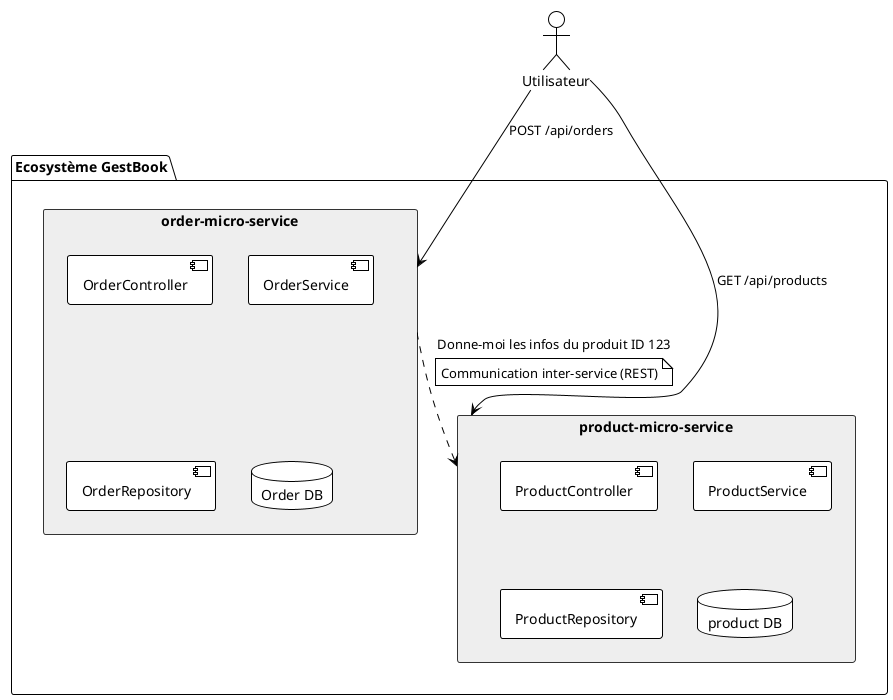
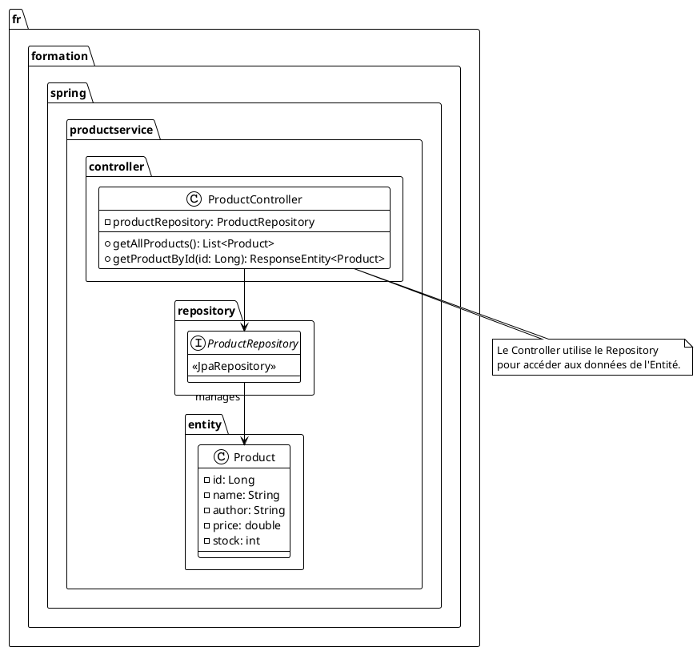

# Module 2 : Cas d'étude et Premier Microservice

### Objectifs Pédagogiques

À la fin de ce module, vous serez capable de :

* Décrire l'application fil rouge "GestBook" que nous allons construire.
* Justifier le découpage fonctionnel en microservices de cette application.
* Créer, configurer et lancer un premier microservice Spring Boot.
* Exposer une API REST simple avec Spring Web.

### Introduction : De la théorie à la pratique

Jusqu'à présent, nous avons beaucoup parlé de concepts : monolithe, microservices, scalabilité, résilience... Il est
temps de rendre tout cela tangible. Pour apprendre à construire une architecture microservices, rien de mieux que d'en
construire une, pièce par pièce.

C'est pourquoi nous allons travailler sur un projet fil rouge tout au long de ce cours. L'idée n'est pas de construire
une application de production complète, mais un **squelette fonctionnel** qui nous servira de terrain de jeu pour
explorer chaque concept de Spring Cloud.

Aujourd'hui, nous allons dessiner les plans de notre future application "GestBook", une version simplifiée de notre
plateforme de vente de livres, et nous allons poser la première brique : le service qui gère les produits. Préparez
votre IDE, l'aventure du code commence maintenant !

### Notre Projet Fil Rouge : "GestBook"

"GestBook" est une application e-commerce minimaliste pour la vente de livres. Elle permettra de réaliser les actions de
base d'un site de vente en ligne.

#### Fonctionnalités Cibles :

1. **Gestion du Catalogue :** L'application doit permettre de lister les livres disponibles, de voir le détail d'un
   livre (titre, auteur, prix) et d'ajouter de nouveaux livres (pour les administrateurs).
2. **Gestion des Commandes :** Un utilisateur (pour l'instant anonyme) doit pouvoir créer une commande contenant un ou
   plusieurs livres.
3. **Consultation :** Il doit être possible de récupérer les détails d'une commande passée, incluant les informations
   sur les livres qu'elle contient.

#### Le Découpage Fonctionnel en Microservices

En nous basant sur le principe de responsabilité unique, nous allons découper "GestBook" en deux services principaux
pour commencer. C'est un découpage simple, mais suffisant pour explorer la communication inter-services, qui est au cœur
de notre apprentissage.

1. **`product-service` (Service Produit)**
    * **Responsabilité :** C'est le maître du catalogue de livres. Il gère toutes les informations relatives aux
      produits : création, lecture, mise à jour, suppression (CRUD). Il ne sait rien des commandes ou des clients.
    * **Base de données :** Il aura sa propre base de données contenant une table `products`.
    * **Technologie :** Spring Boot, Spring Web, Spring Data JPA, H2 (pour la simplicité au début).

2. **`order-service` (Service Commande)**
    * **Responsabilité :** Il gère la création et la consultation des commandes. Une commande est essentiellement une
      liste de produits et une date.
    * **Interaction :** Pour créer une commande, il devra vérifier que les produits demandés existent et récupérer leur
      prix. Pour cela, il devra **communiquer avec `product-service`**.
    * **Base de données :** Il aura sa propre base de données avec des tables `orders` et `order_items`.
    * **Technologie :** Spring Boot, Spring Web, Spring Data JPA, H2.

Voici notre plan d'architecture initial :



### Création de notre premier Microservice : `product-service`

<procedure>
<p>Nous allons commencer par créer le squelette du <code>product-service</code>. Nous utiliserons le <a href="https://start.spring.io/">Spring Initializr</a>, l'outil incontournable pour démarrer un projet Spring Boot.</p>

<p><b>Configuration du projet sur start.spring.io :</b></p>
<ul>
    <li><b>Project :</b> Maven Project</li>
    <li><b>Language :</b> Java</li>
    <li><b>Spring Boot :</b> 3.2.x (ou une version stable récente)</li>
    <li><b>Project Metadata :</b>
        <ul>
            <li><b>Group :</b> <code>fr.formation.spring</code></li>
            <li><b>Artifact :</b> <code>product-service</code></li>
            <li><b>Name :</b> <code>product-service</code></li>
            <li><b>Description :</b> Service pour gérer le catalogue de livres</li>
            <li><b>Package name :</b> <code>fr.formation.spring.productservice</code></li>
            <li><b>Packaging :</b> Jar</li>
            <li><b>Java :</b> 17 (ou plus récent)</li>
        </ul>
    </li>
    <li><b>Dependencies :</b>
        <ul>
            <li><code>Spring Web</code> : Pour créer des API REST.</li>
            <li><code>Spring Data JPA</code> : Pour interagir facilement avec la base de données.</li>
            <li><code>H2 Database</code> : Une base de données en mémoire, parfaite pour le développement.</li>
            <li><code>Lombok</code> : Pour réduire le code "boilerplate" (getters, setters, etc.).</li>
        </ul>
    </li>
</ul>

<p>Cliquez sur "GENERATE", téléchargez le .zip, et ouvrez le projet dans votre IDE préféré (IntelliJ IDEA, VS Code, Eclipse...).</p>
</procedure>

#### Structure du projet

Une fois le projet ouvert, vous aurez une structure classique de projet Spring Boot :

```
product-service/
├── pom.xml                 # Le fichier de configuration Maven
└── src/
    └── main/
        ├── java/
        │   └── fr/
        │       └── formation/
        │           └── spring/
        │               └── productservice/
        │                   └── ProductServiceApplication.java
        └── resources/
            └── application.properties # Le fichier de configuration
```

#### Fichier `pom.xml`

Le `pom.xml` généré contient toutes les dépendances que nous avons demandées. Voici un extrait des dépendances clés :

```xml
<!-- pom.xml -->
<dependencies>
    <dependency>
        <groupId>org.springframework.boot</groupId>
        <artifactId>spring-boot-starter-data-jpa</artifactId>
    </dependency>
    <dependency>
        <groupId>org.springframework.boot</groupId>
        <artifactId>spring-boot-starter-web</artifactId>
    </dependency>

    <dependency>
        <groupId>com.h2database</groupId>
        <artifactId>h2</artifactId>
        <scope>runtime</scope>
    </dependency>
    <dependency>
        <groupId>org.projectlombok</groupId>
        <artifactId>lombok</artifactId>
        <optional>true</optional>
    </dependency>
    <dependency>
        <groupId>org.springframework.boot</groupId>
        <artifactId>spring-boot-starter-test</artifactId>
        <scope>test</scope>
    </dependency>
</dependencies>
```

#### Configuration de l'application

Configurons notre service pour qu'il soit identifiable.

<p>Dans <code>src/main/resources/application.properties</code>, ajoutez les lignes suivantes :</p>
```properties
# Indique le port sur lequel le serveur va démarrer.
# On choisit un port différent pour chaque service pour éviter les conflits.
server.port=8081

# Le nom de notre application. Très important pour la suite !

spring.application.name=product-service

# Configuration de la base de données H2

# Activer la console web de H2 pour visualiser nos données

spring.h2.console.enabled=true

# Définir le chemin d'accès à la console

spring.h2.console.path=/h2-console

# Configuration de la source de données JPA

spring.datasource.url=jdbc:h2:mem:productdb
spring.datasource.driverClassName=org.h2.Driver
spring.datasource.username=sa
spring.datasource.password=password
spring.jpa.database-platform=org.hibernate.dialect.H2Dialect
spring.jpa.hibernate.ddl-auto=update

```

> **Conseil :** Utiliser des ports différents pour chaque microservice (8081, 8082, etc.) est une pratique courante en développement local pour pouvoir les lancer tous en même temps sur votre machine.

### Implémentation de la logique métier

Maintenant, ajoutons le code pour gérer nos produits.

#### 1. L'Entité `Product`

C'est la représentation de notre table `products` en Java.

```java
// package fr.formation.spring.productservice.entity;

import jakarta.persistence.Entity;
import jakarta.persistence.GeneratedValue;
import jakarta.persistence.GenerationType;
import jakarta.persistence.Id;
import lombok.Data;
import lombok.NoArgsConstructor;
import lombok.AllArgsConstructor;

@Entity     // Indique que cette classe est une entité JPA
@Data       // Lombok : génère getters, setters, toString, etc.
@NoArgsConstructor
@AllArgsConstructor
@Table(name = "products")
public class Product {

    @Id // Clé primaire
    @GeneratedValue(strategy = GenerationType.IDENTITY) // Auto-incrément
    private Long id;

    private String name;    // Nom du livre
    private String author;  // Auteur du livre
    private String isbn;    // ISBN du livre
    private double price;   // Prix du livre
    private int stock;      // Quantité en stock
}
```

#### 2. Le `ProductRepository`

C'est une interface qui nous permettra de faire des opérations CRUD sur nos produits sans écrire une seule ligne de SQL.
C'est la magie de Spring Data JPA !

```java
// package fr.formation.spring.productservice.repository;

import fr.formation.spring.productservice.entity.Product;
import org.springframework.data.jpa.repository.JpaRepository;

// On étend JpaRepository en spécifiant l'entité (Product)
// et le type de sa clé primaire (Long).
public interface ProductRepository extends JpaRepository<Product, Long> {
    // Spring Data JPA va automatiquement implémenter les méthodes
    // comme findAll(), findById(), save(), deleteById(), etc.
}
```

#### 3. Le `ProductController`

C'est notre porte d'entrée. Il expose les points d'accès (endpoints) de notre API REST.

```java
// package fr.formation.spring.productservice.controller;

import fr.formation.spring.productservice.entity.Product;
import fr.formation.spring.productservice.repository.ProductRepository;
import org.springframework.http.ResponseEntity;
import org.springframework.web.bind.annotation.*;

import java.util.List;
import java.util.Optional;

@RestController // Indique que c'est un contrôleur REST
@RequestMapping("/api/products") // Préfixe pour tous les endpoints de cette classe
public class ProductController {

    // Injection de dépendance de notre repository
    private final ProductRepository productRepository;

    public ProductController(ProductRepository productRepository) {
        this.productRepository = productRepository;
    }

    // Endpoint pour récupérer tous les produits
    // GET http://localhost:8081/api/products
    @GetMapping
    public List<Product> getAllProducts() {
        return productRepository.findAll();
    }

    // Endpoint pour récupérer un produit par son ID
    // GET http://localhost:8081/api/products/1
    @GetMapping("/{id}")
    public ResponseEntity<Product> getProductById(@PathVariable Long id) {
        Optional<Product> product = productRepository.findById(id);
        // On retourne le produit avec un statut 200 OK,
        // ou un statut 404 Not Found s'il n'existe pas.
        return product.map(ResponseEntity::ok)
                .orElseGet(() -> ResponseEntity.notFound().build());
    }
}
```

Diagramme de classes simplifié pour `product-service` :



### Hydrater la base de données pour les tests

Pour ne pas avoir une API qui renvoie une liste vide au démarrage, nous allons insérer quelques données de test.

<procedure>
<p>Créez un fichier <code>src/main/resources/import.sql</code>. Spring Boot exécutera automatiquement ce script au 
démarrage contre notre base H2.</p>
</procedure>

```sql
-- src/main/resources/import.sql

INSERT INTO products (name, author, isbn, price, stock) VALUES ('L\'Étranger', 'Albert Camus', '978-2070360024', 6.50, 85);
INSERT INTO products (name, author, isbn, price, stock) VALUES ('Dune, Tome 1', 'Frank Herbert', '978-2266223299', 11.90, 65);
INSERT INTO products (name, author, isbn, price, stock) VALUES ('Clean Code', 'Robert C. Martin', '978-0132350884', 35.50, 90);
INSERT INTO products (name, author, isbn, price, stock) VALUES ('Harry Potter à l''école des sorciers', 'J.K. Rowling', '978-2070643028', 8.70, 250);
INSERT INTO products (name, author, isbn, price, stock) VALUES ('Le Petit Prince', 'Antoine de Saint-Exupéry', '978-2070612758', 8.90, 120);
```

<warning>
Attention !  <br/>
Dans la dernière version de Spring, il est crucial de nommer le fichier de fixtures <code>import.sql</code> et non 
<code>data.sql</code>. 
En effet, avec ce dernier nom Spring tentera de charger les données avant que JPA ait généré le schéma.
</warning>

### Lancement et validation

1. Lancez l'application en exécutant la méthode `main` de la classe `ProductServiceApplication.java`.
2. Ouvrez votre navigateur ou un client API (Postman, Insomnia, ou le client HTTP d'IntelliJ).
3. Faites un appel `GET` à `http://localhost:8081/api/products`.

Vous devriez recevoir une réponse JSON avec la liste des 3 livres que nous avons insérés !

Requête HTTP pour IntelliJ :

```http
### Get all products
GET http://localhost:8081/api/products
Accept: application/json
```

---

### Exercice 3 : Ajouter un endpoint de création

**Contexte :** Notre `product-service` peut lister et lire des produits. Il nous manque une fonctionnalité essentielle :
en ajouter de nouveaux.

**Votre mission :**

1. Dans `ProductController`, ajoutez une méthode pour gérer la création d'un nouveau produit.
2. L'endpoint doit répondre à une requête `POST` sur `/api/products`.
3. Le corps de la requête contiendra le JSON du produit à créer (sans l'ID).
4. La méthode doit utiliser `productRepository.save()` pour persister le nouveau produit.
5. La réponse doit être le produit nouvellement créé (avec son ID généré) et un statut HTTP `201 Created`.

#### Correction exercice 3 {collapsible='true'}

Voici l'implémentation de la méthode à ajouter dans la classe `ProductController`.

```java
// Dans la classe fr.formation.spring.productservice.controller.ProductController

// ... (imports et code existant)

import org.springframework.http.HttpStatus;
// ...

// ... (méthodes GET existantes)

// Endpoint pour créer un nouveau produit

// POST http://localhost:8081/api/products
@PostMapping
@ResponseStatus(HttpStatus.CREATED) // Définit le code de statut HTTP à 201
public Product createProduct(@RequestBody Product product) {
    // @RequestBody indique à Spring de convertir le JSON
    // du corps de la requête en un objet Product.
    // L'ID du produit entrant sera null.
    // La méthode save() renvoie l'entité persistée,
    // qui inclut maintenant l'ID généré par la base de données.
    return productRepository.save(product);
}
```

**Test avec le client HTTP d'IntelliJ :**

```http
### Create a new product
POST http://localhost:8081/api/products
Content-Type: application/json

{
  "name": "Le Mythe de Sisyphe",
  "author": "Albert Camus",
  "isbn": "978-2070322886",
  "price": 7.60,
  "stock": 25
}
```

Après avoir exécuté cette requête, si vous refaites un `GET` sur `/api/products`, vous verrez le nouveau livre ajouté à
la liste.

---

### Auto-évaluation

Prenez un moment pour répondre à ces questions. Les corrections se trouvent à la toute fin du support de cours.

1. **(QCM)** Quelle dépendance Maven est indispensable pour créer des endpoints REST avec Spring Boot ?
    * A) `spring-boot-starter-data-jpa`
    * B) `spring-boot-starter-web`
    * C) `h2`
    * D) `lombok`
2. **(Question ouverte)** Quel est le rôle de l'annotation `@RestController` ? Quelle est la différence avec
   `@Controller` ?
3. **(QCM)** Dans notre `application.properties`, à quoi sert la ligne `server.port=8081` ?
    * A) À nommer l'application.
    * B) À définir la version de Java à utiliser.
    * C) À spécifier le port d'écoute du serveur web embarqué.
    * D) À activer la console H2.
4. **(Question ouverte)** Expliquez ce que fait la ligne
   `public interface ProductRepository extends JpaRepository<Product, Long>`. Pourquoi n'avons-nous pas besoin d'écrire
   de code dans cette interface pour que `findById` fonctionne ?
5. **(QCM)** Pour tester notre nouvel endpoint de création, quelle méthode HTTP et quel code de statut de succès sont
   attendus ?
    * A) GET, 200 OK
    * B) POST, 201 Created
    * C) PUT, 200 OK
    * D) POST, 200 OK

---

### Conclusion

Félicitations, vous avez franchi une étape majeure ! Vous ne vous êtes pas contenté de lire la théorie, vous avez *
*construit votre premier microservice**. Vous avez créé un projet Spring Boot de A à Z, configuré une base de données en
mémoire, défini une entité JPA, exposé une API REST et même inséré des données de test.

Ce `product-service` est la première brique de notre architecture "GestBook". Il est simple, mais fonctionnel et
autonome.

Cependant, un microservice seul n'a que peu d'intérêt. Sa puissance vient de sa capacité à interagir avec d'autres. Mais
avant de construire notre deuxième service et de les faire communiquer, nous allons nous attaquer à un problème
fondamental du monde moderne : comment "packager" et exécuter notre service de manière fiable et reproductible n'importe
où ? La réponse est **Docker**. Dans le prochain TP, nous allons mettre notre `product-service` en conteneur.