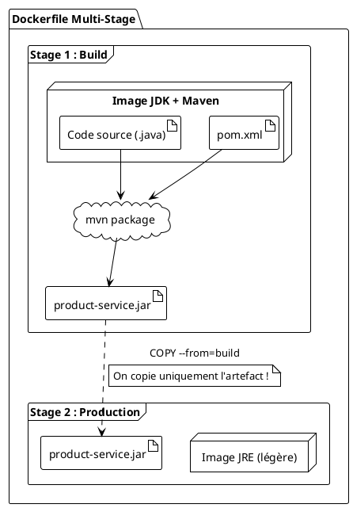

# TP 1 : Mettre notre service en boîte : la Dockerisation

### Objectifs Pédagogiques

À la fin de ce TP, vous serez capable de :
*   Expliquer l'utilité de Docker pour un développeur.
*   Écrire un `Dockerfile` optimisé en plusieurs étapes (multi-stage build).
*   Construire une image Docker pour une application Spring Boot.
*   Lancer un conteneur Docker et interagir avec l'application qu'il héberge.

### Introduction : Le syndrome du "ça marche sur ma machine"

Vous avez tous vécu ou vivrez cette situation : vous terminez une fonctionnalité, tout fonctionne parfaitement sur votre poste. Vous la livrez, et là, c'est le drame. Votre collègue vous dit "ça ne marche pas chez moi" ou, pire, ça ne fonctionne pas sur le serveur de production. Les raisons peuvent être multiples : une version différente de Java, une variable d'environnement manquante, une configuration système spécifique... C'est un cauchemar à déboguer.

Docker résout ce problème. Imaginez un conteneur de transport maritime. Peu importe ce qu'il y a dedans (des voitures, des bananes, des ordinateurs), il se manipule toujours de la même façon. Docker fait la même chose pour nos applications. On "emboîte" notre application et toutes ses dépendances (la bonne version de Java, les bons fichiers, etc.) dans une **image**. Cette image peut ensuite être exécutée de manière identique sur n'importe quelle machine disposant de Docker, créant ainsi un **conteneur**.

Aujourd'hui, nous allons créer le "conteneur maritime" pour notre `product-service`, pour qu'il puisse voyager et s'exécuter n'importe où, de manière fiable et prédictible.

### Qu'est-ce qu'un Dockerfile ?

Un `Dockerfile` est tout simplement un fichier texte qui contient la "recette" pour construire une image Docker. C'est une liste d'instructions, étape par étape.

#### L'approche naïve (à ne pas faire en production)

On pourrait créer un `Dockerfile` très simple :
1.  Prendre une image Java avec Maven.
2.  Copier tout notre code source.
3.  Lancer la compilation avec Maven.
4.  Lancer le `.jar` généré.

Le problème ? L'image finale contiendrait tout le code source, Maven, et le JDK complet. C'est une image énorme (plusieurs centaines de Mo) et peu sécurisée (elle embarque des outils de build inutiles en production).

#### L'approche optimisée : Le Multi-Stage Build

C'est la bonne pratique que nous allons utiliser. L'idée est d'utiliser plusieurs "étapes" (stages) dans notre `Dockerfile`.

*   **Étape 1 : Le "Build Stage"**
    *   On utilise une image complète (avec JDK et Maven) pour compiler notre code et créer le fichier `.jar`.
    *   Cette étape est temporaire.

*   **Étape 2 : Le "Runtime Stage"**
    *   On part d'une image de base beaucoup plus légère, qui contient uniquement l'environnement d'exécution Java (JRE).
    *   On copie **uniquement** le fichier `.jar` généré à l'étape 1 dans cette nouvelle image.

Le résultat ? Une image finale légère, optimisée et sécurisée, qui ne contient que le strict nécessaire pour exécuter notre application.



### TP : Dockerisation de `product-service`

<procedure>
<p><b>Pré-requis :</b> Assurez-vous que Docker Desktop (ou l'équivalent sur votre OS) est installé et en cours d'exécution sur votre machine.</p>

<p><b>Étape 1 : Packaging de l'application</b></p>
<p>Avant de construire l'image, nous avons besoin du fichier <code>.jar</code>. Ouvrez un terminal à la racine de votre projet <code>product-service</code> et exécutez la commande Maven :</p>
<command>
mvn clean package
</command>
<p>Cette commande va compiler votre code, lancer les tests et créer un fichier <code>product-service-0.0.1-SNAPSHOT.jar</code> dans le répertoire <code>target</code>.</p>


<p><b>Étape 2 : Création du Dockerfile</b></p>
<p>À la racine de votre projet <code>product-service</code> (au même niveau que <code>pom.xml</code>), créez un nouveau fichier nommé <code>Dockerfile</code> (sans extension).</p>
<p>Copiez-y le contenu suivant :</p>

```docker
# ----- STAGE 1: Build -----
# On utilise une image officielle Maven avec une version de Java 17
# On nomme cette étape "build" pour pouvoir s'y référer plus tard.
FROM maven:3.8.5-openjdk-17 AS build

# On définit le répertoire de travail dans l'image
WORKDIR /app

# On copie d'abord le pom.xml pour tirer parti du cache Docker.
# Si le pom.xml ne change pas, Docker n'aura pas à ré-télécharger
# les dépendances à chaque build.
COPY pom.xml .
RUN mvn dependency:go-offline

# On copie le reste du code source
COPY src ./src

# On lance la compilation et la création du .jar
# -DskipTests pour ne pas relancer les tests dans Docker
RUN mvn package -DskipTests


# ----- STAGE 2: Runtime -----
# On part d'une image légère contenant uniquement le JRE 17
FROM eclipse-temurin:17-jre-focal

# On définit le répertoire de travail
WORKDIR /app

# On copie UNIQUEMENT le .jar généré depuis l'étape "build"
COPY --from=build /app/target/*.jar app.jar

# On expose le port sur lequel notre application tourne à l'intérieur
# du conteneur. C'est le port 8081 que nous avons défini.
EXPOSE 8081

# C'est la commande qui sera exécutée au démarrage du conteneur
ENTRYPOINT ["java", "-jar", "app.jar"]
```

<p><b>Étape 3 : Construction de l'image Docker</b></p>
<p>Dans votre terminal, toujours à la racine du projet, lancez la commande de build :</p>
<command>
docker build -t product-service:1.0 .
</command>
<ul>
    <li><code>docker build</code> : la commande pour construire une image.</li>
    <li><code>-t product-service:1.0</code> : l'option <code>-t</code> (tag) permet de nommer notre image. Ici, <code>product-service</code> est le nom et <code>1.0</code> est la version.</li>
    <li><code>.</code> : indique que le contexte de build (où trouver le Dockerfile et les fichiers à copier) est le répertoire courant.</li>
</ul>
<p>Docker va maintenant exécuter chaque instruction du Dockerfile. Cela peut prendre un peu de temps la première fois.</p>


<p><b>Étape 4 : Lancement du conteneur</b></p>
<p>Une fois l'image construite, nous pouvons lancer un conteneur basé sur celle-ci :</p>
<command>
docker run -d -p 8081:8081 --name my-product-service product-service:1.0
</command>
<ul>
    <li><code>docker run</code> : la commande pour lancer un conteneur.</li>
    <li><code>-d</code> : (detach) pour lancer le conteneur en arrière-plan.</li>
    <li><code>-p 8081:8081</code> : c'est très important ! On mappe le port 8081 de notre machine (host) vers le port 8081 du conteneur (celui qu'on a exposé).</li>
    <li><code>--name my-product-service</code> : on donne un nom lisible à notre conteneur.</li>
    <li><code>product-service:1.0</code> : le nom de l'image à utiliser.</li>
</ul>

<p><b>Étape 5 : Validation</b></p>
<p>Vérifiez que votre conteneur est bien en cours d'exécution :</p>
<command>
docker ps
</command>
<p>Vous devriez voir une ligne avec le nom <code>my-product-service</code>.</p>
<p>Maintenant, testez l'API exactement comme avant. Ouvrez votre client HTTP et faites l'appel :</p>
<pre><code class="http">
### Get all products (from Docker container)
GET http://localhost:8081/api/products
Accept: application/json
</code></pre>
<p>Magique ! Vous devriez recevoir la même réponse JSON. Votre application tourne maintenant dans un conteneur isolé, mais elle est accessible depuis votre machine grâce au mappage de port.</p>
</procedure>

---
### Exercice 4 : Configurer le conteneur au lancement

**Contexte :** Parfois, on veut pouvoir changer une configuration sans avoir à reconstruire l'image Docker. Spring Boot est très doué pour lire les variables d'environnement. On peut s'en servir pour surcharger les propriétés de `application.properties`.

**Votre mission :**
1.  Arrêtez et supprimez le conteneur précédent (`docker stop my-product-service` puis `docker rm my-product-service`).
2.  Relancez le conteneur `product-service` en utilisant la même image, mais cette fois-ci, demandez-lui de démarrer sur le port **9090** au lieu du port 8081. Vous devrez pour cela :
    *   Modifier le mappage de port.
    *   Passer une variable d'environnement au conteneur pour surcharger la propriété `server.port`.
3.  Validez que vous pouvez appeler l'API sur `http://localhost:9090/api/products`.

**Indice :** L'option pour passer une variable d'environnement avec `docker run` est `-e`. Par exemple, `-e MA_VARIABLE=ma_valeur`. Spring Boot reconnaît la variable d'environnement `SERVER_PORT` pour surcharger `server.port`.

#### Correction exercice 4 {collapsible='true'}

Voici la commande `docker run` à utiliser pour accomplir cette tâche :

```bash
docker run -d -p 9090:9090 -e SERVER_PORT=9090 \
--name my-product-service-on-9090 product-service:1.0
```

**Explication :**
*   `-p 9090:9090` : On mappe le port 9090 de notre machine au port 9090 du conteneur.
*   `-e SERVER_PORT=9090` : On définit une variable d'environnement `SERVER_PORT` à l'intérieur du conteneur. Spring Boot la détecte automatiquement et l'utilise pour configurer le port de son serveur embarqué, surchargeant ainsi la valeur `server.port=8081` du fichier `application.properties`.

**Validation :**
Vous pouvez maintenant appeler votre service avec succès sur le nouveau port.

```http
### Get all products (from Docker container on port 9090)
GET http://localhost:9090/api/products
Accept: application/json
```
Cet exercice démontre la flexibilité des conteneurs : on peut adapter leur comportement au moment du lancement sans jamais toucher à l'image elle-même.

---

### Auto-évaluation

Prenez un moment pour répondre à ces questions. Les corrections se trouvent à la toute fin du support de cours.

1.  **(Question ouverte)** Quel est le principal avantage d'utiliser un "multi-stage build" dans un Dockerfile pour une application Java ?
2.  **(QCM)** Quelle commande Docker permet de voir les conteneurs actuellement en cours d'exécution ?
    *   A) `docker images`
    *   B) `docker ps`
    *   C) `docker run`
    *   D) `docker build`
3.  **(QCM)** Dans un `Dockerfile`, quelle est la différence entre l'instruction `RUN` et l'instruction `ENTRYPOINT` ?
    *   A) Il n'y a pas de différence, elles sont interchangeables.
    *   B) `RUN` exécute une commande pendant la construction de l'image, `ENTRYPOINT` spécifie la commande à exécuter quand un conteneur est lancé.
    *   C) `ENTRYPOINT` exécute une commande pendant la construction de l'image, `RUN` spécifie la commande à exécuter quand un conteneur est lancé.
    *   D) `RUN` est pour les commandes Linux, `ENTRYPOINT` pour les commandes Java.
4.  **(Question ouverte)** J'exécute la commande `docker run -p 8000:8081 my-app`. Mon application dans le conteneur écoute sur le port 8081. Sur quelle URL devrais-je faire mon appel API depuis ma machine hôte ?
5.  **(QCM)** Dans notre `Dockerfile`, pourquoi copions-nous d'abord le `pom.xml` seul, avant de copier le reste du code source ?
    *   A) Pour que l'image soit plus petite.
    *   B) Pour des raisons de sécurité.
    *   C) Pour profiter du système de cache de Docker et accélérer les builds futurs.
    *   D) Parce que le `pom.xml` doit être dans un répertoire différent.

---

### Conclusion

Bravo ! Vous avez dockerisé votre premier microservice. Vous avez transformé votre code source et votre projet Maven en une **unité de déploiement standard, portable et isolée**. Vous avez appris à écrire un `Dockerfile` optimisé, à construire une image et à lancer un conteneur.

Ce n'est pas juste un exercice technique. C'est une compétence fondamentale dans l'écosystème microservices. Tous les services que nous allons créer par la suite seront systématiquement dockerisés. Cela nous permettra de les gérer, de les lier et de les orchestrer facilement.

Maintenant que nous avons une brique logicielle bien empaquetée, il est temps de s'attaquer au cœur du sujet : comment faire en sorte que nos briques communiquent entre elles ? C'est l'objet du prochain module, où nous explorerons les différentes stratégies de communication inter-services.