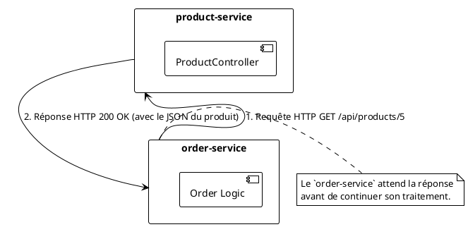
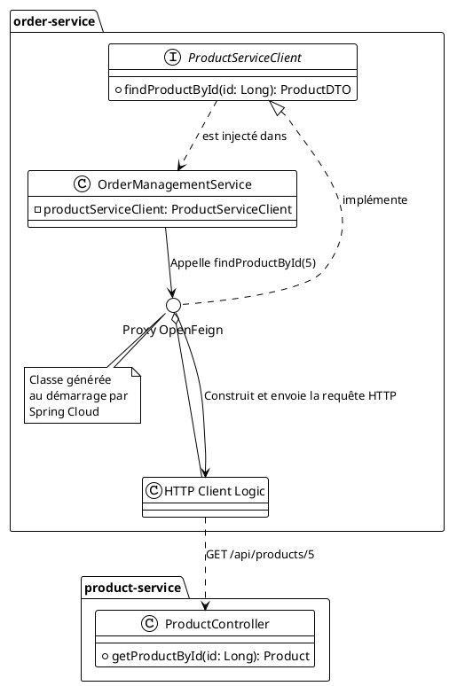

# Module 3 : La Grande Conversation - Communication Inter-services

### Objectifs Pédagogiques

À la fin de cette partie, vous serez capable de :

* Distinguer les modes de communication synchrone et asynchrone.
* Expliquer pourquoi l'utilisation d'URL en dur est une mauvaise pratique.
* Décrire le rôle d'un client HTTP pour la communication synchrone.
* Expliquer les avantages d'OpenFeign par rapport à des clients comme `RestTemplate`.
* Comprendre le principe d'un client REST déclaratif.

### Introduction : Comment faire parler nos services ?

Notre `product-service` est maintenant seul dans son conteneur Docker. Il est temps de lui donner un ami : le
`order-service`. Comme nous l'avons vu, `order-service` aura besoin de demander des informations à `product-service`.
Par exemple, "Pour créer une commande pour le livre avec l'ID 5, j'ai besoin de connaître son prix."

Mais comment organiser cette conversation ? Imaginez que nos services sont deux personnes dans des pièces séparées.

* **Approche Synchrone (le téléphone) :** Le service A (Commande) appelle le service B (Produit) et attend activement
  une réponse. Il est bloqué jusqu'à ce que le service B décroche, réponde et raccroche. C'est direct, simple à
  comprendre, mais si B ne répond pas, A reste bloqué.
* **Approche Asynchrone (le courrier postal) :** Le service A (Commande) envoie une lettre (un message) dans une boîte
  aux lettres. Il ne s'attend pas à une réponse immédiate et peut continuer ses autres tâches. Le service B (un autre
  service de notification, par exemple) viendra plus tard relever le courrier et le traiter. C'est plus résilient et
  découplé, mais plus complexe à suivre.

Aujourd'hui, nous allons nous concentrer sur la communication **synchrone**, qui est la plus courante pour des requêtes
de type "lecture" ou "validation". Et nous allons voir comment le faire de manière élégante et maintenable.

### La communication synchrone : L'appel HTTP/REST

Le moyen le plus simple et le plus répandu pour que deux services communiquent de manière synchrone est d'utiliser le
protocole que vous connaissez déjà très bien : HTTP. Le service appelant agit comme un client, et le service appelé
comme un serveur.



### Le Problème des URLs en Dur

Imaginons que nous développons la logique de `order-service`. Pour appeler `product-service`, la première idée serait
d'écrire du code qui ressemble à ça :

```java
// Ceci est un PSEUDO-CODE pour illustrer le problème.
// NE PAS UTILISER EN PRATIQUE !
String productUrl = "http://localhost:8081/api/products/5";
// ... code pour faire un appel HTTP à cette URL ...
```

**Pourquoi est-ce une très mauvaise idée ?**

1. **Manque de flexibilité :** `localhost` ne fonctionne qu'en développement local. En production, l'adresse IP du
   `product-service` sera différente et probablement dynamique.
2. **Difficulté de mise à l'échelle :** Et si nous avons 3 instances du `product-service` pour gérer la charge ? Vers
   laquelle des trois adresses IP faut-il faire l'appel ? Comment répartir la charge ?
3. **Cauchemar de configuration :** On pourrait mettre l'URL dans un fichier de configuration, mais on se retrouverait à
   gérer une liste d'URLs pour chaque service que l'on veut appeler. C'est lourd et source d'erreurs.

> **Le problème fondamental :** Le `order-service` ne devrait pas avoir à connaître l'emplacement physique (`IP:port`)
> du `product-service`. Il devrait pouvoir dire : "Je veux parler au service qui s'appelle `product-service`, peu importe
> où il se trouve." C'est le problème que nous résoudrons avec la **découverte de services (Service Discovery)** dans le
> prochain module.

En attendant, concentrons-nous sur la manière de *réaliser* l'appel HTTP côté client.

### Les clients HTTP en Spring

Pour faire un appel HTTP depuis une application Spring, plusieurs outils existent.

<tabs>
<tab title="RestTemplate (l'ancienne approche)">
Pendant des années, <code>RestTemplate</code> a été l'outil standard de Spring pour faire des appels REST synchrones.

<b>Exemple de code :</b>

```java
// Dans un service de 'order-service'
RestTemplate restTemplate = new RestTemplate();
String productServiceUrl = "http://localhost:8081/api/products/";

// Appel pour récupérer un produit spécifique
ResponseEntity<ProductDTO> response =
restTemplate.getForEntity(productServiceUrl + productId, ProductDTO.class);

ProductDTO product = response.getBody();

```
<p>
    <code>ProductDTO</code> est une classe dans <code>order-service</code> qui doit avoir la même structure que le JSON renvoyé par <code>product-service</code>.
</p>
<b>Inconvénients :</b>
<ul>
    <li>API un peu verbeuse.</li>
    <li>Créé avant l'ère de la programmation réactive, il est bloquant par nature.</li>
    <li>Il est maintenant en <b>mode maintenance</b> par l'équipe Spring, qui recommande d'utiliser <code>WebClient</code>.</li>
</ul>
</tab>
<tab title="WebClient (l'approche réactive moderne)">
<code>WebClient</code> est le client HTTP moderne, non-bloquant et réactif, issu de Spring WebFlux. Il peut être utilisé de manière synchrone (bloquante) ou asynchrone.

<b>Exemple de code :</b>

```java
// Dans un service de 'order-service'
WebClient webClient = WebClient.builder()
                        .baseUrl("http://localhost:8081/api/products")
                        .build();

// Appel pour récupérer un produit spécifique (mode synchrone)
ProductDTO product = webClient.get()
                            .uri("/{id}", productId)
                            .retrieve()
                            .bodyToMono(ProductDTO.class)
                            .block(); // .block() rend l'appel synchrone
```

<b>Avantages :</b>
<ul>
    <li>API "fluent" (chaînage de méthodes), plus lisible.</li>
    <li>Non-bloquant par défaut, excellent pour la performance.</li>
    <li>C'est l'outil recommandé par Spring pour les nouveaux projets.</li>
</ul>
</tab>
<tab title="OpenFeign (l'approche déclarative)">
Et si on n'avait même pas à écrire le code de l'appel HTTP ? C'est la promesse d'OpenFeign. C'est un projet de Spring Cloud qui transforme une interface Java en un client REST complet.

<b>Principe :</b> Vous écrivez une interface Java et vous l'annotez. Spring Cloud se charge de générer une implémentation qui fait les appels HTTP pour vous. C'est simple, lisible et puissant.

<b>Exemple de code :</b>

```java
// 1. Définir une interface dans 'order-service'
@FeignClient(name = "product-service", url = "http://localhost:8081")
public interface ProductServiceClient {

    @GetMapping("/api/products/{id}")
    ProductDTO findProductById(@PathVariable("id") Long id);

}

// 2. Utiliser l'interface dans un service
@Service
public class OrderManagementService {

    private final ProductServiceClient productServiceClient;

    // Spring injecte automatiquement une implémentation de l'interface
    public OrderManagementService(ProductServiceClient productServiceClient) {
        this.productServiceClient = productServiceClient;
    }

    public void createOrder(Long productId) {
        // C'est aussi simple qu'un appel de méthode local !
        ProductDTO product = productServiceClient.findProductById(productId);
        // ... logique de création de commande ...
        System.out.println("Produit récupéré : " + product.getName());
    }

}

```
C'est sur cette approche que nous allons nous concentrer, car elle simplifie énormément le code, le rend plus lisible et s'intègre parfaitement avec les autres composants de Spring Cloud que nous allons voir, comme la découverte de services.
</tab>
</tabs>

### Focus sur OpenFeign : La magie déclarative

Reprenons l'exemple d'OpenFeign. Qu'est-ce qui se passe réellement ?

1.  **Vous déclarez une interface (`ProductServiceClient`) :** Vous décrivez *ce que* vous voulez faire ("je veux une méthode qui fait un GET sur `/api/products/{id}`"), mais pas *comment* le faire.
2.  **Vous annotez l'interface :**
    *   `@FeignClient`: Indique à Spring Cloud que cette interface est un client Feign.
    *   `@GetMapping`, `@PostMapping`, etc. : Vous utilisez les mêmes annotations que dans un `@RestController`. C'est très intuitif ! Les signatures des méthodes doivent correspondre à celles des endpoints du service distant.
3.  **Spring Cloud fait le travail :** Au démarrage de l'application, Spring Cloud détecte cette interface, et génère dynamiquement une classe qui l'implémente. Cette classe contient tout le code `RestTemplate` ou `WebClient` nécessaire pour effectuer les appels HTTP.
4.  **Vous injectez et utilisez :** Vous pouvez alors injecter votre interface comme n'importe quel autre bean Spring et appeler ses méthodes. La complexité de l'appel HTTP est totalement masquée.



<warning>
<b>DTO (Data Transfer Object) : Un point crucial</b>
Quand <code>order-service</code> reçoit la réponse de <code>product-service</code>, il doit la "désérialiser" (transformer le JSON en objet Java). Pour cela, il a besoin d'une classe miroir.
<p>
On ne va pas copier/coller l'entité JPA <code>Product</code> de <code>product-service</code>, car cela créerait un couplage fort. À la place, on crée une simple classe POJO (Plain Old Java Object) dans <code>order-service</code>, appelée <b>DTO (Data Transfer Object)</b>. Cette classe, que l'on pourrait nommer <code>ProductDTO</code>, ne contient que les champs qui nous intéressent. C'est une bonne pratique qui permet de découpler les modèles internes des services.
</p>
</warning>

---

### Conclusion de la partie

Vous avez maintenant une compréhension claire des enjeux de la communication entre microservices. Vous savez qu'il
existe des approches **synchrones** et **asynchrones**, et que pour la communication synchrone, l'appel **HTTP/REST**
est roi.

Plus important encore, vous avez découvert **OpenFeign**, notre outil de prédilection pour réaliser ces appels. Vous
avez vu comment son approche **déclarative** nous permet d'abstraire la complexité des clients HTTP et de transformer un
appel réseau distant en un simple appel de méthode Java. C'est un gain immense en termes de lisibilité et de
maintenabilité du code.

Nous avons identifié le prochain problème à résoudre : comment se débarrasser des URLs en dur (
`url = "http://localhost:8081"`) dans notre annotation `@FeignClient` ? Comment faire pour que nos services se trouvent
dynamiquement sur le réseau ? Ce sera l'objet du prochain module, où nous introduirons un composant central de notre
architecture : l'annuaire de services, **Eureka**.

*Note : Cette partie étant principalement théorique, elle ne contient pas d'exercice. Les exercices pratiques sur
OpenFeign arriveront dans le TP 4, une fois que nous aurons mis en place la découverte de services.*

---

### Auto-évaluation

Prenez un moment pour répondre à ces questions. Les corrections se trouvent à la toute fin du support de cours.

1. **(Question ouverte)** Expliquez avec vos propres mots la différence entre une communication synchrone et asynchrone,
   en utilisant une analogie de votre choix (autre que le téléphone/courrier).
2. **(QCM)** Pourquoi est-il déconseillé d'utiliser des URL en dur dans le code pour les appels inter-services ?
    * A) Parce que les URL sont trop longues.
    * B) Parce que cela rend le code moins performant.
    * C) Parce que les adresses IP et les ports des services peuvent changer et qu'on ne peut pas gérer la scalabilité.
    * D) Parce que OpenFeign ne fonctionne pas avec des URL.
3. **(QCM)** Quel outil est aujourd'hui considéré comme l'approche "moderne" et recommandée par Spring pour faire des
   appels HTTP, notamment dans un contexte réactif ?
    * A) `RestTemplate`
    * B) `HttpClient`
    * C) `WebClient`
    * D) `Socket`
4. **(Question ouverte)** Qu'est-ce qu'une "approche déclarative" dans le contexte d'OpenFeign ? Qu'est-ce que l'on
   déclare ?
5. **(QCM)** Lorsque `order-service` appelle `product-service` via un client Feign, dans quel projet doit se trouver
   l'interface annotée avec `@FeignClient` ?
    * A) Dans `product-service`.
    * B) Dans `order-service`.
    * C) Dans un projet partagé entre les deux.
    * D) Dans le projet du serveur de configuration.