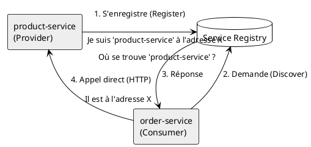
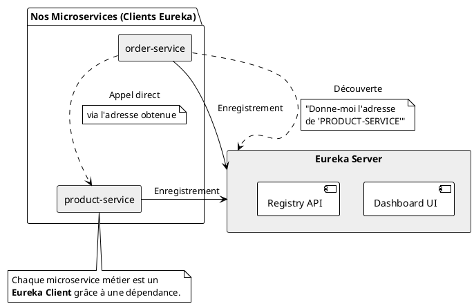
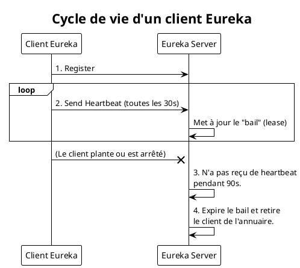

Parfait, nous avons identifié le problème des URL en dur. Il est temps d'introduire la solution : la découverte de services. Ce module est fondamental pour construire une architecture microservices dynamique et résiliente.

---

# Module 4 : La Découverte de Services - Qui est où ? (L'essentiel)

### Objectifs Pédagogiques

À la fin de cette partie, vous serez capable de :
*   Expliquer pourquoi un annuaire de services est indispensable dans une architecture microservices.
*   Décrire le pattern "Service Registry".
*   Présenter le rôle et l'architecture de Spring Cloud Netflix Eureka.
*   Expliquer le fonctionnement du mécanisme de "heartbeat" (pulsation).

### Introduction : Le problème de l'annuaire téléphonique

Imaginez que vous arrivez dans une nouvelle ville et que vous voulez appeler un plombier. Vous ne connaissez ni son nom, ni son numéro de téléphone, ni son adresse. Vous avez besoin d'un **annuaire** (comme les Pages Jaunes). Vous cherchez "plombier", l'annuaire vous donne une liste de plombiers disponibles avec leurs coordonnées, et vous pouvez alors les contacter.

Maintenant, transposons cela à nos microservices. Notre `order-service` (le client) veut appeler `product-service` (le plombier). Dans le module précédent, nous lui avons donné le numéro en dur : `http://localhost:8081`. Mais que se passe-t-il si :
*   Le `product-service` déménage (son adresse IP change) ?
*   Nous ouvrons plusieurs agences de plomberie (nous lançons plusieurs instances du `product-service` pour gérer la charge) ?
*   Un plombier prend sa retraite (une instance du service tombe en panne) ?

Notre `order-service` est perdu. Il a besoin d'un **annuaire dynamique**, qui sait en temps réel quels services sont disponibles et où ils se trouvent. C'est exactement le rôle du **Service Registry**.

### Le Pattern "Service Registry" (L'Annuaire de Services)

Le pattern Service Registry est une solution élégante à ce problème. Il repose sur trois acteurs :

1.  **Le Service Registry (L'annuaire) :** C'est un serveur dont le seul rôle est de tenir à jour une liste des services disponibles et de leurs emplacements (IP:port).
2.  **Le Service Provider (Le fournisseur de service) :** C'est notre microservice (ex: `product-service`). À son démarrage, il contacte le Service Registry et s'y **enregistre**, en disant "Salut, je suis `product-service` et je suis disponible à l'adresse `192.168.1.10:8081`".
3.  **Le Service Consumer (Le consommateur de service) :** C'est le microservice qui veut en appeler un autre (ex: `order-service`). Au lieu d'utiliser une URL en dur, il demande au Service Registry : "Salut, j'ai besoin de parler à `product-service`, peux-tu me donner son adresse ?". Le Registry lui renvoie l'adresse, et il peut alors effectuer l'appel.

L'énorme avantage est que le `Consumer` n'a besoin de connaître que l'adresse du `Registry`. Toutes les autres adresses sont découvertes dynamiquement.

### Notre Outil : Spring Cloud Netflix Eureka

Pour implémenter ce pattern, nous n'allons rien inventer. Nous allons utiliser un des composants les plus connus de l'écosystème Spring Cloud : **Netflix Eureka**.

Eureka a été développé par Netflix pour gérer leur immense flotte de microservices et a été rendu open-source. Spring Cloud fournit une intégration parfaite avec ce dernier.

L'architecture d'Eureka est simple et reflète le pattern que nous venons de voir :

*   **Eureka Server (Le serveur Eureka) :** C'est notre **Service Registry**. C'est un projet Spring Boot à part entière, que nous allons créer. Il expose une interface utilisateur web pour visualiser les services enregistrés et une API REST pour que les clients puissent interagir avec lui.
*   **Eureka Client (Le client Eureka) :** Ce n'est pas un projet séparé. C'est une simple dépendance que l'on ajoute à nos microservices (`product-service`, `order-service`, etc.). Cette dépendance leur donne la capacité de parler au serveur Eureka pour s'enregistrer et/ou découvrir d'autres services.

### Comment ça marche ? Le Mécanisme de "Heartbeat" (Pulsation)

Comment le serveur Eureka sait-il si un service enregistré est toujours en vie ? Il ne peut pas se fier uniquement à l'enregistrement initial. Le service pourrait tomber en panne ou être arrêté.

C'est là qu'intervient le **heartbeat** (battement de cœur).
Une fois qu'un client Eureka (comme notre `product-service`) est enregistré, il va envoyer périodiquement (par défaut toutes les 30 secondes) un petit signal au serveur Eureka, comme un battement de cœur. Ce signal dit simplement "Je suis toujours là et en bonne santé !".

*   Si le serveur Eureka reçoit les heartbeats, il maintient le service dans son annuaire comme étant `UP` (disponible).
*   Si le serveur Eureka ne reçoit plus de heartbeats d'un service après un certain temps (par défaut 90 secondes), il considère que le service est en panne. Il le marque comme `DOWN` et le retire de la liste des instances disponibles.

C'est un mécanisme crucial pour la **résilience** de notre architecture. Si une instance de `product-service` tombe, Eureka le saura rapidement et ne donnera plus son adresse aux autres services qui la demandent, évitant ainsi des appels vers un service qui n'existe plus.

<warning>
<b>Le Cache Côté Client</b>
Pour améliorer les performances et la résilience, les clients Eureka ne contactent pas le serveur à chaque appel. Ils maintiennent un **cache local** de l'annuaire. Par défaut, ils rafraîchissent ce cache toutes les 30 secondes.

Cela signifie que si un nouveau service s'enregistre, il peut y avoir un délai de 30 secondes avant que les autres services ne le "voient". C'est un compromis entre la fraîcheur des données et la charge sur le serveur Eureka.

</warning>

---

### Conclusion de la partie

Vous venez de découvrir la pierre angulaire qui rend une architecture microservices dynamique et robuste : la **découverte de services**. Vous comprenez maintenant pourquoi il est impossible de se fier à des adresses IP statiques et pourquoi un **Service Registry** est nécessaire.

Vous avez fait connaissance avec notre solution, **Spring Cloud Netflix Eureka**, et son architecture simple basée sur un **serveur** (l'annuaire) et des **clients** (nos microservices). Vous avez également compris le mécanisme vital de **heartbeat** qui permet au système de s'auto-guérir en détectant et en retirant les services qui ne répondent plus.

Nous avons toutes les cartes en main. Dans les prochains TP, nous allons mettre en pratique cette théorie :
1.  Nous allons créer et lancer notre propre serveur Eureka.
2.  Nous allons transformer notre `product-service` en client Eureka pour qu'il s'enregistre.
3.  Enfin, nous créerons le `order-service` et utiliserons OpenFeign et Eureka ensemble pour réaliser un appel inter-service dynamique, sans aucune URL en dur. L'aventure continue !

*Cette partie étant principalement théorique, elle ne contient pas d'exercice. Les TPs suivants seront entièrement dédiés à l'implémentation de ces concepts.*

---

### Auto-évaluation

Prenez un moment pour répondre à ces questions. Les corrections se trouvent à la toute fin du support de cours.

1.  **(Question ouverte)** En quoi le Service Registry contribue-t-il à la scalabilité horizontale (ajouter plus d'instances d'un même service) de notre architecture ?
2.  **(QCM)** Quel est le rôle principal d'un client Eureka ?
    *   A) Gérer l'interface utilisateur web du serveur Eureka.
    *   B) Uniquement s'enregistrer auprès du serveur Eureka.
    *   C) Uniquement découvrir d'autres services.
    *   D) S'enregistrer auprès du serveur Eureka et/ou découvrir d'autres services.
3.  **(QCM)** Qu'est-ce qu'un "heartbeat" dans le contexte d'Eureka ?
    *   A) Un appel API pour obtenir la liste des services.
    *   B) Un signal périodique envoyé par un client pour prouver qu'il est toujours en vie.
    *   C) Un log d'erreur envoyé au serveur Eureka.
    *   D) Le nom de l'interface utilisateur d'Eureka.
4.  **(Question ouverte)** Que se passe-t-il si le serveur Eureka tombe en panne ? Les services déjà en cours d'exécution peuvent-ils continuer à communiquer entre eux ? Pourquoi ?
5.  **(QCM)** Dans une architecture utilisant un Service Registry, le `order-service` a besoin de connaître l'adresse de...
    *   A) ...toutes les instances du `product-service`.
    *   B) ...uniquement une instance du `product-service`.
    *   C) ...uniquement l'adresse du serveur Eureka.
    *   D) ...il n'a besoin de connaître aucune adresse.