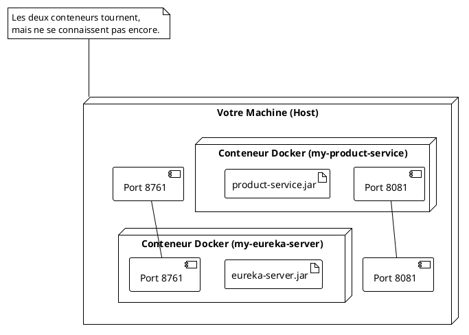

# TP 2 : Construction du Phare - Mise en place du Serveur de Découverte Eureka

### Objectifs Pédagogiques

À la fin de ce TP, vous serez capable de :

* Créer un projet Spring Boot pour héberger un serveur Eureka.
* Ajouter et configurer la dépendance `eureka-server`.
* Activer le rôle de serveur Eureka avec une seule annotation.
* Configurer et lancer le serveur Eureka.
* Dockeriser le serveur Eureka pour le rendre portable.

### Introduction : Bâtir notre tour de contrôle

Nous avons parlé de l'annuaire, du phare, de la tour de contrôle... Peu importe la métaphore, le concept est le même :
nous avons besoin d'un service central qui sait qui est qui et qui est où. Ce service, c'est notre **Serveur Eureka**.

Contrairement aux autres composants de Spring Cloud que nous verrons (comme OpenFeign ou le Circuit Breaker, qui sont
des dépendances dans nos services métier), le serveur Eureka est une **application à part entière**. C'est un
microservice dont le seul rôle est d'être un... annuaire de microservices.

Dans ce TP, nous allons construire ce serveur. Vous serez surpris de voir à quel point Spring Boot et Spring Cloud
rendent cette tâche simple. En quelques minutes, nous aurons un serveur de découverte fonctionnel, prêt à accueillir ses
premiers clients.

### TP : Création du Serveur Eureka

<procedure>
<p><b>Étape 1 : Création du projet via Spring Initializr</b></p>
<p>Rendez-vous à nouveau sur <a href="https://start.spring.io/">start.spring.io</a> et créez un nouveau projet avec la configuration suivante :</p>
<ul>
    <li><b>Project :</b> Maven Project</li>
    <li><b>Language :</b> Java</li>
    <li><b>Spring Boot :</b> 3.2.x (utilisez la même version que pour <code>product-service</code>)</li>
    <li><b>Project Metadata :</b>
        <ul>
            <li><b>Group :</b> <code>fr.formation.spring</code></li>
            <li><b>Artifact :</b> <code>eureka-server</code></li>
            <li><b>Name :</b> <code>eureka-server</code></li>
            <li><b>Description :</b> Serveur de découverte pour l'écosystème GestBook</li>
            <li><b>Package name :</b> <code>fr.formation.spring.eurekaserver</code></li>
            <li><b>Packaging :</b> Jar</li>
            <li><b>Java :</b> 17</li>
        </ul>
    </li>
    <li><b>Dependencies :</b>
        <ul>
            <li><code>Eureka Server</code> : C'est la dépendance magique ! Elle se trouve dans la section "Spring Cloud Discovery".</li>
        </ul>
    </li>
</ul>
<p>Générez, téléchargez et ouvrez le projet dans votre IDE.</p>


<p><b>Étape 2 : Activer le serveur Eureka</b></p>
<p>Ouvrez la classe principale de l'application, <code>EurekaServerApplication.java</code>.</p>
<p>Il suffit d'ajouter une seule annotation au-dessus de <code>@SpringBootApplication</code> pour transformer cette simple application Spring Boot en un serveur de découverte complet.</p>

```java
// package fr.formation.spring.eurekaserver;

import org.springframework.boot.SpringApplication;
import org.springframework.boot.autoconfigure.SpringBootApplication;
import org.springframework.cloud.netflix.eureka.server.EnableEurekaServer;

@SpringBootApplication
@EnableEurekaServer // <-- C'est tout ! Cette annotation active le serveur Eureka.
public class EurekaServerApplication {

    public static void main(String[] args) {
        SpringApplication.run(EurekaServerApplication.class, args);
    }

}
```

<p>Cette annotation va déclencher une auto-configuration qui met en place tous les endpoints et l'interface utilisateur nécessaires au fonctionnement du serveur.</p>

<p><b>Étape 3 : Configurer l'application</b></p>
<p>Ouvrez le fichier <code>src/main/resources/application.properties</code>. Nous devons y ajouter quelques configurations spécifiques.</p>

```properties
# Le nom de l'application
spring.application.name=eureka-server
# Le port sur lequel le serveur Eureka va écouter.
# 8761 est le port standard par convention pour Eureka.
server.port=8761
# Configuration spécifique à Eureka Server.
# Par défaut, un client Eureka essaie de s'enregistrer auprès d'un serveur.
# Comme notre serveur EST le serveur, nous devons désactiver ce comportement.
# On lui dit : "N'essaie pas de t'enregistrer auprès de toi-même."
eureka.client.register-with-eureka=false
# On lui dit également : "N'essaie pas de récupérer l'annuaire auprès
# de toi-même."
eureka.client.fetch-registry=false
```

<p>Ces deux dernières lignes sont cruciales. Sans elles, votre serveur Eureka essaierait de se comporter comme un client et chercherait un autre serveur Eureka (ce qui est utile pour la haute disponibilité, mais pas pour notre cas simple).</p>

<p><b>Étape 4 : Lancement et vérification</b></p>
<p>Lancez l'application <code>EurekaServerApplication</code> depuis votre IDE.</p>
<p>Une fois qu'elle a démarré, ouvrez votre navigateur web et allez à l'adresse : <a href="http://localhost:8761/">http://localhost:8761/</a></p>
<p>Vous devriez voir le tableau de bord d'Eureka !</p>


<p>Pour l'instant, la section "Instances currently registered with Eureka" est vide. C'est normal, aucun service ne s'est encore enregistré. Notre phare est construit et allumé, mais les bateaux ne savent pas encore qu'il existe.</p>
</procedure>

### Dockerisation de `eureka-server`

Comme pour notre `product-service`, nous allons "emboîter" notre serveur Eureka pour le rendre facile à déployer et à
orchestrer.

<procedure>
<p><b>Étape 1 : Création du Dockerfile</b></p>
<p>À la racine du projet <code>eureka-server</code>, créez un fichier <code>Dockerfile</code>. Le contenu est quasiment identique à celui du <code>product-service</code>, ce qui montre la puissance de la standardisation.</p>


```docker

# ----- STAGE 1: Build -----
FROM maven:3.8.5-openjdk-17 AS build
WORKDIR /app
COPY pom.xml .
RUN mvn dependency:go-offline
COPY src ./src
RUN mvn package -DskipTests

# ----- STAGE 2: Runtime -----
FROM eclipse-temurin:17-jre-focal
WORKDIR /app
COPY --from=build /app/target/*.jar app.jar
EXPOSE 8761
ENTRYPOINT ["java", "-jar", "app.jar"]
```

<p><b>Étape 2 : Construction de l'image Docker</b></p>
<p>Ouvrez un terminal à la racine du projet <code>eureka-server</code>. Assurez-vous d'avoir d'abord packagé l'application avec <code>mvn clean package</code>.</p>
<p>Construisez l'image :</p>
<command>
docker build -t eureka-server:1.0 .
</command>

<p><b>Étape 3 : Lancement du conteneur</b></p>
<p>Arrêtez l'application si elle tourne encore dans votre IDE. Lancez le conteneur :</p>
<command>
docker run -d -p 8761:8761 --name my-eureka-server eureka-server:1.0
</command>
<p>Vérifiez à nouveau l'URL <a href="http://localhost:8761/">http://localhost:8761/</a>. Le tableau de bord doit être de nouveau accessible, mais cette fois-ci, il est servi depuis un conteneur Docker !</p>
</procedure>

Diagramme de déploiement actuel :




---

### Exercice 5 : Comprendre la configuration d'Eureka

**Contexte :** Un collègue a configuré un serveur Eureka, mais il a oublié les deux lignes de configuration cruciales :
`eureka.client.register-with-eureka=false` et `eureka.client.fetch-registry=false`.

**Votre mission :**

1. Prédisez ce qu'il va se passer au démarrage du serveur Eureka. Regardez les logs de la console.
2. Expliquez avec vos propres mots pourquoi ce comportement se produit.
3. Comment l'oubli de ces lignes pourrait-il devenir un comportement souhaité dans un contexte de production plus
   complexe ?

#### Correction exercice 5 {collapsible='true'}

1. **Prédiction du comportement :** Au démarrage, si vous regardez les logs, vous verrez de nombreux messages d'erreur.
   Le serveur Eureka va essayer de contacter une URL (probablement `http://localhost:8761/eureka/`) pour s'enregistrer
   et récupérer l'annuaire. Comme il est lui-même le destinataire de ces requêtes, il va boucler sur lui-même en
   essayant de se joindre, ce qui génère des erreurs de connexion (timeouts, connection refused, etc.). Le serveur
   démarrera quand même, mais les logs seront pollués par ces tentatives infructueuses.

2. **Explication :** La dépendance `eureka-server` inclut également la dépendance `eureka-client`. Par défaut, toute
   application ayant `eureka-client` dans son classpath essaie de se comporter comme un client. Elle cherche donc un
   serveur Eureka (défini par `eureka.client.serviceUrl.defaultZone`, qui par défaut pointe sur lui-même) pour
   s'enregistrer et récupérer la liste des autres services. En omettant les deux lignes, on ne désactive pas ce
   comportement d'auto-enregistrement.

3. **Cas d'utilisation en production :** Ce comportement est désiré lorsqu'on met en place une **haute disponibilité**
   pour le serveur Eureka lui-même. On peut lancer plusieurs instances d'Eureka Server (des "peers"). Dans ce cas, on
   veut que chaque serveur Eureka s'enregistre auprès des autres. Si un serveur tombe, les clients peuvent basculer sur
   les autres serveurs Eureka encore disponibles. La configuration ressemblerait alors à quelque chose comme :
   ```properties
   # Pour le serveur 1
   eureka.client.serviceUrl.defaultZone=http://server2.domain:8761/eureka/
   # Pour le serveur 2
   eureka.client.serviceUrl.defaultZone=http://server1.domain:8761/eureka/
   ```
   Dans ce scénario, `register-with-eureka` et `fetch-registry` resteraient à `true`.

---

### Auto-évaluation

Prenez un moment pour répondre à ces questions. Les corrections se trouvent à la toute fin du support de cours.

1. **(QCM)** Quelle annotation transforme une application Spring Boot en serveur de découverte ?
    * A) `@EnableEurekaClient`
    * B) `@EnableDiscoveryClient`
    * C) `@EnableEurekaServer`
    * D) `@SpringBootApplication`
2. **(Question ouverte)** Quel est le port par défaut conventionnel pour un serveur Eureka et pourquoi est-ce une bonne
   pratique de le respecter si possible ?
3. **(QCM)** À quoi sert la configuration `eureka.client.register-with-eureka=false` ?
    * A) À empêcher les clients de s'enregistrer sur ce serveur.
    * B) À empêcher le serveur de s'enregistrer lui-même en tant que client.
    * C) À désactiver complètement le serveur Eureka.
    * D) À rendre l'enregistrement plus rapide.
4. **(Question ouverte)** J'ai lancé mon conteneur Eureka avec `docker run -p 8761:8761 ...`. Mon `product-service` (qui
   n'est pas encore dans Docker) doit s'enregistrer. Quelle URL de serveur Eureka dois-je configurer dans son
   `application.properties` ?
5. **(QCM)** Après avoir lancé le serveur Eureka pour la première fois, que voit-on dans la section "Instances currently
   registered with Eureka" du tableau de bord ?
    * A) La liste de tous les services de mon ordinateur.
    * B) Le serveur Eureka lui-même.
    * C) Une liste vide.
    * D) Une erreur.

---

### Conclusion

Et voilà ! En quelques étapes simples, nous avons assemblé et lancé un composant critique de notre infrastructure. Notre
serveur Eureka est en place, dockerisé, et attend patiemment que des services viennent s'annoncer.

Vous avez vu à quel point Spring Cloud simplifie la mise en œuvre de patterns d'architecture complexes. Une dépendance,
une annotation, quelques lignes de configuration, et nous avons un Service Registry fonctionnel.

Le phare est allumé. Dans le prochain TP, nous allons enfin guider notre premier navire, le `product-service`, pour
qu'il s'amarre au port d'Eureka. Nous allons le transformer en client Eureka et le voir apparaître comme par magie dans
le tableau de bord.