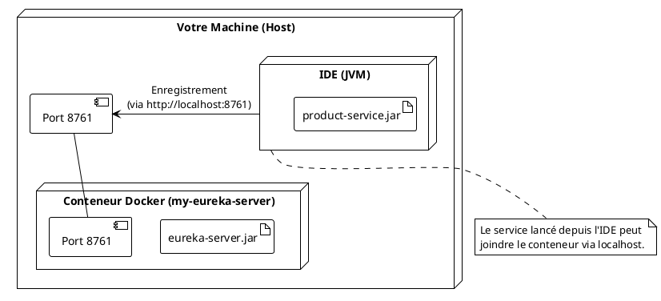

# TP 3 : "Je suis là !" - Enregistrement des services auprès d'Eureka

### Objectifs Pédagogiques

À la fin de ce TP, vous serez capable de :

* Transformer un microservice Spring Boot standard en client Eureka.
* Ajouter et configurer la dépendance `eureka-client`.
* Configurer un microservice pour qu'il s'enregistre auprès d'un serveur Eureka.
* Valider l'enregistrement en consultant le tableau de bord d'Eureka.

### Introduction : Connecter le navire au phare

Notre serveur Eureka est comme un port flambant neuf : les quais sont prêts, la capitainerie (le dashboard) est ouverte,
mais il n'y a aucun bateau. Notre `product-service`, lui, est comme un navire en mer, prêt à commercer, mais il navigue
à l'aveugle.

Le but de ce TP est de donner à notre `product-service` une radio et la bonne fréquence pour contacter la tour de
contrôle du port. Nous allons l'équiper pour qu'il devienne un **client Eureka**.

Concrètement, nous allons modifier le `product-service` pour qu'à son démarrage, il contacte le serveur Eureka que nous
avons lancé dans le TP précédent et qu'il s'y enregistre. Nous pourrons alors visualiser sa présence directement dans
l'interface web d'Eureka, ce qui sera la preuve que notre écosystème commence à prendre vie. C'est une étape très
gratifiante, car c'est la première fois que nos composants vont activement interagir.

### TP : Enregistrement de `product-service`

<procedure>
<p><b>Pré-requis :</b> Le conteneur Docker de votre serveur Eureka (`my-eureka-server`) doit être en cours d'exécution. Vérifiez avec <code>docker ps</code> et que vous pouvez accéder à <a href="http://localhost:8761/">http://localhost:8761/</a>.</p>

<p><b>Étape 1 : Ajout de la dépendance Eureka Client</b></p>
<p>Ouvrez le projet <code>product-service</code> dans votre IDE.</p>
<p>Nous devons ajouter la dépendance qui contient toute la logique du client Eureka. Ouvrez le fichier <code>pom.xml</code>.</p>
<p>Spring Cloud utilise un "Bill of Materials" (BOM) pour gérer les versions de ses différentes bibliothèques de manière cohérente. Nous devons d'abord ajouter ce BOM dans la section <code>&lt;dependencyManagement&gt;</code>.</p>

```xml
<!-- Dans product-service/pom.xml -->
<dependencyManagement>
    <dependencies>
        <dependency>
            <groupId>org.springframework.cloud</groupId>
            <artifactId>spring-cloud-dependencies</artifactId>
            <!-- Remplacez par la version compatible avec votre Spring Boot -->
            <!-- Par exemple, 2023.0.0 pour Spring Boot 3.2.x -->
            <version>2023.0.0</version>
            <type>pom</type>
            <scope>import</scope>
        </dependency>
    </dependencies>
</dependencyManagement>
```

> **Conseil :** Pour trouver la bonne version de `spring-cloud-dependencies`, vous pouvez consulter la documentation
> officielle de Spring Cloud ou la page du projet sur Spring Initializr. La compatibilité entre les versions de Spring
> Boot et Spring Cloud est très importante.

<p>Maintenant, ajoutez la dépendance du client Eureka dans la section <code>&lt;dependencies&gt;</code> :</p>

```xml
<!-- Dans product-service/pom.xml, à l'intérieur de <dependencies> -->
<dependency>
    <groupId>org.springframework.cloud</groupId>
    <artifactId>spring-cloud-starter-netflix-eureka-client</artifactId>
</dependency>
```

<p>Après avoir modifié le `pom.xml`, n'oubliez pas de demander à Maven de recharger les dépendances (votre IDE le propose généralement automatiquement).</p>

<p><b>Étape 2 : Configuration de l'application</b></p>
<p>Maintenant que notre service a la capacité technique d'être un client Eureka, nous devons lui dire où se trouve le serveur.</p>
<p>Ouvrez le fichier <code>src/main/resources/application.properties</code> du <code>product-service</code> et ajoutez la ligne suivante :</p>

```properties
# ... (configurations existantes : server.port, spring.application.name, etc.)
# URL du serveur Eureka où ce service doit s'enregistrer.
# C'est l'adresse de notre serveur Eureka, suivie de /eureka.
eureka.client.serviceUrl.defaultZone=http://localhost:8761/eureka
```

<p>C'est tout ! Le nom de l'application, que nous avions déjà défini avec <code>spring.application.name=product-service</code>, sera utilisé comme identifiant unique du service dans l'annuaire Eureka.</p>

<p><b>Étape 3 : Lancement et vérification</b></p>
<p>Arrêtez le conteneur du <code>product-service</code> s'il est encore en cours d'exécution (<code>docker stop my-product-service</code>).</p>
<p>Pour ce test, il est plus simple de lancer le <code>product-service</code> directement depuis votre IDE (en exécutant la méthode <code>main</code> de <code>ProductServiceApplication</code>). Cela vous permettra de voir les logs plus facilement.</p>
<p>Pendant le démarrage, surveillez la console. Vous devriez voir des logs indiquant que le client Eureka contacte le serveur :</p>
<pre>
...
DiscoveryClient_PRODUCT-SERVICE/DESKTOP-XXXXX... - registration status: 204
...
</pre>
<p>Maintenant, l'étape de vérité : rafraîchissez la page du tableau de bord Eureka dans votre navigateur (<a href="http://localhost:8761/">http://localhost:8761/</a>).</p>
<p>Victoire ! Vous devriez voir votre service apparaître dans la liste des instances enregistrées.</p>


<p>Le tableau de bord vous donne des informations précieuses :</p>
<ul>
    <li><b>Application :</b> Le nom que nous avons donné, `PRODUCT-SERVICE`. C'est sous ce nom que les autres services le chercheront.</li>
    <li><b>AMIs :</b> Non pertinent pour nous (concerne AWS).</li>
    <li><b>Availability Zones :</b> Le nombre d'instances (1).</li>
    <li><b>Status :</b> L'instance est `UP` (disponible) et indique son adresse IP et son port.</li>
</ul>

<p><b>Étape 4 : Mettre à jour l'image Docker</b></p>
<p>Maintenant que ça fonctionne depuis l'IDE, mettons à jour notre image Docker pour inclure ces changements.</p>
<p>Ouvrez un terminal à la racine du projet <code>product-service</code>.</p>

```bash
# Re-construire le .jar avec les nouvelles dépendances
mvn clean package


# Re-construire l'image Docker avec la nouvelle version du code

docker build -t product-service:1.1 .
```

<p>Notez que nous avons changé le tag de la version en `1.1` pour refléter les modifications.</p>

<warning>
<b>Problème de réseau Docker !</b>
<p>
Si vous lancez maintenant le conteneur <code>product-service</code> avec <code>docker run</code>, il ne pourra pas trouver le conteneur Eureka. Pourquoi ? Parce que <code>localhost</code> à l'intérieur d'un conteneur Docker désigne... le conteneur lui-même, et non la machine hôte !
</p>
<p>
Nous résoudrons ce problème de communication entre conteneurs de manière propre et définitive avec <b>Docker Compose</b> dans un module ultérieur. Pour l'instant, le fait que cela fonctionne depuis l'IDE suffit à valider notre configuration.
</p>
</warning>

</procedure>

Diagramme de notre architecture actuelle (en mode développement local) :



---

### Exercice 6 : Comprendre l'impact d'un arrêt

**Contexte :** Votre `product-service` est bien enregistré et visible dans le tableau de bord d'Eureka avec le statut
`UP`.

**Votre mission :**

1. Arrêtez proprement le `product-service` qui tourne dans votre IDE (en cliquant sur le bouton "Stop"). Observez les
   logs dans la console de l'IDE. Que se passe-t-il ?
2. Rafraîchissez immédiatement le tableau de bord d'Eureka. Le service a-t-il disparu ?
3. Maintenant, relancez `product-service` depuis l'IDE, mais cette fois-ci, "tuez" le processus brutalement (par
   exemple, via le gestionnaire des tâches de votre OS, ou en fermant le terminal si vous l'avez lancé en ligne de
   commande) pour simuler une panne.
4. Attendez 1 à 2 minutes, puis rafraîchissez le tableau de bord d'Eureka. Qu'observez-vous et pourquoi ?

#### Correction exercice 6 {collapsible='true'}

1. **Arrêt propre :** En arrêtant proprement le service, vous verrez dans les logs une ligne indiquant qu'il envoie une
   requête de "désenregistrement" au serveur Eureka. Le client Eureka est poli : avant de s'éteindre, il prévient le
   serveur qu'il part.
   ```
   ... unregistering from eureka ...
   ```

2. **Tableau de bord après arrêt propre :** Si vous rafraîchissez immédiatement, le service aura disparu de la liste des
   instances. L'arrêt propre a provoqué son retrait instantané de l'annuaire.

3. **Simulation de panne :** En tuant le processus, le client Eureka n'a pas l'opportunité d'envoyer sa requête de
   désenregistrement. Le serveur Eureka ne sait pas que le service est tombé.

4. **Tableau de bord après la panne :** Si vous rafraîchissez le tableau de bord juste après la panne, le service sera
   toujours listé comme `UP`. Le serveur Eureka attend toujours ses "heartbeats". Ce n'est qu'après l'expiration du
   bail (par défaut 90 secondes sans recevoir de heartbeat) que le serveur Eureka va considérer le service comme mort.
   Il affichera alors un message d'avertissement en rouge en haut de la page ("EMERGENCY! EUREKA MAY BE EXPERIENCING
   ISSUES...") et finira par retirer l'instance de la liste. Cela démontre le mécanisme de résilience basé sur les
   heartbeats.

---

### Auto-évaluation

Prenez un moment pour répondre à ces questions. Les corrections se trouvent à la toute fin du support de cours.

1. **(QCM)** Quelle dépendance Maven doit-on ajouter à un microservice pour qu'il puisse s'enregistrer auprès d'Eureka ?
    * A) `spring-cloud-starter-netflix-eureka-server`
    * B) `spring-boot-starter-web`
    * C) `spring-cloud-starter`
    * D) `spring-cloud-starter-netflix-eureka-client`
2. **(Question ouverte)** Dans `application.properties`, à quoi correspond la clé `spring.application.name` dans le
   contexte d'Eureka ?
3. **(QCM)** Quelle est la valeur de la propriété `eureka.client.serviceUrl.defaultZone` si mon serveur Eureka tourne en
   Docker sur le port 8761 de ma machine ?
    * A) `http://eureka-server:8761/eureka`
    * B) `http://localhost:8761/eureka`
    * C) `http://localhost:8761`
    * D) `http://product-service:8081/eureka`
4. **(Question ouverte)** Mon service ne s'enregistre pas auprès d'Eureka. Citez deux raisons probables à vérifier en
   premier.
5. **(QCM)** Par défaut, à quelle fréquence un client Eureka envoie-t-il un heartbeat au serveur ?
    * A) Toutes les 5 secondes.
    * B) Toutes les 30 secondes.
    * C) Toutes les 90 secondes.
    * D) Jamais, c'est le serveur qui contacte le client.

---

### Conclusion

Félicitations ! Vous avez réussi à connecter votre premier microservice à l'annuaire de découverte. Ce n'est plus une
collection de services isolés, mais le début d'un véritable écosystème conscient de ses propres membres.

Vous avez transformé `product-service` en client Eureka avec une simple dépendance et une ligne de configuration. Vous
avez validé son enregistrement et compris la différence fondamentale entre un arrêt propre et une panne grâce au
mécanisme de heartbeat.

Maintenant que notre `product-service` est repérable par son nom, nous avons toutes les pièces du puzzle pour réaliser
notre objectif initial : faire communiquer deux services de manière dynamique. Dans le prochain TP, nous allons enfin
créer le `order-service` et utiliser la puissance combinée d'**Eureka** et d'**OpenFeign** pour qu'il puisse appeler le
`product-service` sans jamais connaître son adresse IP. C'est là que la magie va vraiment opérer.