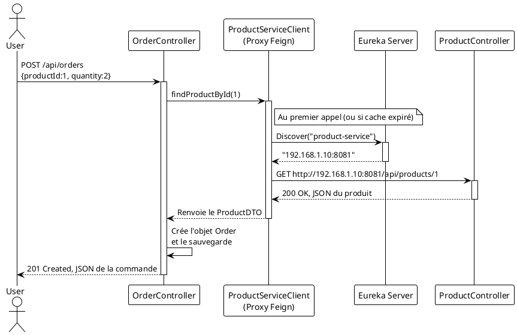

# TP 4 : Le Dialogue s'installe - Création et Communication avec un second service

### Objectifs Pédagogiques

À la fin de ce TP, vous serez capable de :

* Créer un second microservice (`order-service`) et le configurer comme client Eureka.
* Activer et configurer OpenFeign pour la communication inter-service.
* Créer une interface client Feign pour appeler `product-service` par son nom d'application.
* Implémenter un endpoint dans `order-service` qui récupère des données de `product-service`.
* Dockeriser le `order-service`.

### Introduction : Le premier appel

Jusqu'à présent, nos services vivaient dans leur coin. Le `product-service` gère ses livres, et le serveur Eureka tient
son annuaire. Il est temps d'introduire un nouvel acteur, le `order-service`, qui va avoir besoin de discuter avec le
premier. Le scénario est simple : pour créer une commande, le `order-service` doit pouvoir vérifier qu'un produit existe
et connaître ses informations (notamment son prix).

C'est ici que la magie de Spring Cloud va opérer. Nous allons utiliser **OpenFeign**, notre client REST déclaratif. Mais
cette fois, au lieu de lui donner une URL en dur, nous allons lui dire : "Je veux parler au service qui s'appelle
`PRODUCT-SERVICE`". OpenFeign va alors automatiquement interroger **Eureka** pour trouver l'adresse de ce service, puis
effectuer l'appel.

Le `order-service` n'aura jamais connaissance de l'IP ou du port du `product-service`. Notre communication sera enfin
dynamique, résiliente et prête pour la scalabilité. C'est le cœur battant d'une architecture microservices. Mettons-le
en place !

### Étape 1 : Création du `order-service`

<procedure>
<p>Comme pour les services précédents, nous commençons par le Spring Initializr.</p>
<p><b>Configuration du projet sur start.spring.io :</b></p>
<ul>
    <li><b>Project :</b> Maven Project, <b>Language :</b> Java, <b>Spring Boot :</b> 3.2.x, <b>Java :</b> 17</li>
    <li><b>Project Metadata :</b>
        <ul>
            <li><b>Group :</b> <code>fr.formation.spring</code></li>
            <li><b>Artifact :</b> <code>order-service</code></li>
            <li><b>Package name :</b> <code>fr.formation.spring.orderservice</code></li>
        </ul>
    </li>
    <li><b>Dependencies :</b>
        <ul>
            <li><code>Spring Web</code></li>
            <li><code>Spring Data JPA</code></li>
            <li><code>H2 Database</code></li>
            <li><code>Lombok</code></li>
            <li><code>Eureka Client</code> (Spring Cloud Discovery)</li>
            <li><code>OpenFeign</code> (Spring Cloud OpenFeign)</li>
        </ul>
    </li>
</ul>
<p>Générez, téléchargez et ouvrez ce nouveau projet dans votre IDE.</p>
</procedure>

### Étape 2 : Configuration initiale de `order-service`

#### 2.1. Fichier `application.properties`

Configurons notre nouveau service. Ouvrez `src/main/resources/application.properties`.

```properties
# Port du service (différent des autres)
server.port=8082
# Nom de l'application, très important pour Eureka !
spring.application.name=order-service
# Configuration H2 (similaire à product-service, mais avec un nom de DB différent)
spring.h2.console.enabled=true
spring.h2.console.path=/h2-console
spring.datasource.url=jdbc:h2:mem:orderdb
spring.datasource.driverClassName=org.h2.Driver
spring.datasource.username=sa
spring.datasource.password=password
spring.jpa.database-platform=org.hibernate.dialect.H2Dialect
# Configuration du client Eureka (pointe vers notre serveur)
eureka.client.serviceUrl.defaultZone=http://localhost:8761/eureka
```

#### 2.2. Activation d'OpenFeign

Tout comme Eureka, OpenFeign doit être activé. Ouvrez la classe principale `OrderServiceApplication.java` et ajoutez
l'annotation `@EnableFeignClients`.

```java
// package fr.formation.spring.orderservice;

import org.springframework.boot.SpringApplication;
import org.springframework.boot.autoconfigure.SpringBootApplication;
import org.springframework.cloud.openfeign.EnableFeignClients;

@SpringBootApplication
@EnableFeignClients // <-- Active la recherche et l'implémentation des clients Feign
public class OrderServiceApplication {

    public static void main(String[] args) {
        SpringApplication.run(OrderServiceApplication.class, args);
    }
}
```

### Étape 3 : Implémentation de la logique métier de `order-service`

Nous allons créer la structure de base pour gérer les commandes.

#### 3.1. Entités JPA

Une commande est composée de la commande elle-même et de lignes de commande.

`Order.java`

```java
// package fr.formation.spring.orderservice.model;

import jakarta.persistence.*;
import lombok.Data;

import java.time.LocalDate;
import java.util.List;

@Entity
@Table(name = "orders") // "order" est un mot-clé SQL, mieux vaut utiliser "orders"
@Data
public class Order {
    @Id
    @GeneratedValue(strategy = GenerationType.IDENTITY)
    private Long id;
    private LocalDate orderDate;

    @OneToMany(cascade = CascadeType.ALL)
    private List<OrderItem> orderItems;
}
```

`OrderItem.java`

```java
// package fr.formation.spring.orderservice.model;

import jakarta.persistence.Entity;
import jakarta.persistence.GeneratedValue;
import jakarta.persistence.GenerationType;
import jakarta.persistence.Id;
import lombok.Data;

@Entity
@Data
public class OrderItem {
    @Id
    @GeneratedValue(strategy = GenerationType.IDENTITY)
    private Long id;
    private Long productId; // On stocke juste l'ID du produit
    private int quantity;
    private double price; // Le prix au moment de la commande
}
```

#### 3.2. Repository

Créons le `OrderRepository`.

```java
// package fr.formation.spring.orderservice.repository;

import fr.formation.spring.orderservice.model.Order;
import org.springframework.data.jpa.repository.JpaRepository;

public interface OrderRepository extends JpaRepository<Order, Long> {
}
```

### Étape 4 : Création du Client Feign

C'est le cœur de ce TP. Nous allons créer l'interface qui va nous permettre de parler à `product-service`.

#### 4.1. Le DTO (Data Transfer Object)

Dans `order-service`, nous avons besoin d'un objet pour représenter les données que nous recevrons de `product-service`.
Créez un package `dto` et ajoutez-y la classe `ProductDTO`.

```java
// package fr.formation.spring.orderservice.dto;

import lombok.Data;

// Cet objet simple (POJO) représente les données d'un produit
// que order-service a besoin de connaître.
@Data
public class ProductDTO {
    private Long id;
    private String name;
    private double price;
    private int stock;
}
```

#### 4.2. L'interface du client Feign

Créez un package `client` et ajoutez-y l'interface `ProductServiceClient`.

```java
// package fr.formation.spring.orderservice.client;

import fr.formation.spring.orderservice.dto.ProductDTO;
import org.springframework.cloud.openfeign.FeignClient;
import org.springframework.web.bind.annotation.GetMapping;
import org.springframework.web.bind.annotation.PathVariable;

// @FeignClient est la clé !
// name = "product-service" : C'est le nom de l'application cible,
// tel qu'il est enregistré dans Eureka. C'est ici que la magie opère.
// Feign va demander à Eureka : "Donne-moi l'adresse de 'product-service'".
@FeignClient(name = "product-service")
public interface ProductServiceClient {

    // La signature de cette méthode doit correspondre à l'endpoint
    // du ProductController dans product-service.
    // GET /api/products/{id}
    @GetMapping("/api/products/{id}")
    ProductDTO findProductById(@PathVariable("id") Long id);
}
```

<warning>
<b>Attention à la casse !</b>
Le nom dans <code>@FeignClient(name = "...")</code> doit correspondre <b>exactement</b> à la valeur de <code>spring.application.name</code> du service cible. Par convention, on utilise des minuscules avec des tirets. Assurez-vous que votre <code>product-service</code> a bien <code>spring.application.name=product-service</code>.
</warning>

### Étape 5 : Utilisation du client Feign dans le Controller

Maintenant, nous pouvons créer notre `OrderController` et y injecter et utiliser notre `ProductServiceClient` comme s'il
s'agissait d'un service local.

```java
// package fr.formation.spring.orderservice.controller;

import fr.formation.spring.orderservice.client.ProductServiceClient;
import fr.formation.spring.orderservice.dto.ProductDTO;
import fr.formation.spring.orderservice.model.Order;
import fr.formation.spring.orderservice.model.OrderItem;
import fr.formation.spring.orderservice.repository.OrderRepository;
import org.springframework.http.HttpStatus;
import org.springframework.http.ResponseEntity;
import org.springframework.web.bind.annotation.*;

import java.time.LocalDate;
import java.util.List;

@RestController
@RequestMapping("/api/orders")
public class OrderController {

    private final OrderRepository orderRepository;
    private final ProductServiceClient productServiceClient; // Injection du client Feign

    public OrderController(OrderRepository orderRepository,
                           ProductServiceClient productServiceClient) {
        this.orderRepository = orderRepository;
        this.productServiceClient = productServiceClient;
    }

    // Endpoint pour créer une commande simple pour un produit et une quantité
    // POST http://localhost:8082/api/orders
    // Body: { "productId": 1, "quantity": 2 }
    @PostMapping
    public ResponseEntity<Order> createOrder(@RequestBody OrderRequest request) {
        // 1. Appel au product-service via Feign pour récupérer les infos du produit
        ProductDTO product;
        try {
            product = productServiceClient.findProductById(request.productId);
        } catch (Exception e) {
            // Gérer le cas où le produit n'est pas trouvé (Feign lèvera une exception)
            return ResponseEntity.status(HttpStatus.NOT_FOUND)
                    .header("X-Error-Message", "Product not found")
                    .build();
        }

        // 2. Vérifier si le stock est suffisant
        if (product.getStock() < request.quantity) {
            return ResponseEntity.status(HttpStatus.BAD_REQUEST)
                    .header("X-Error-Message", "Insufficient stock")
                    .build();
        }

        // 3. Créer et sauvegarder la commande
        Order order = new Order();
        order.setOrderDate(LocalDate.now());

        OrderItem orderItem = new OrderItem();
        orderItem.setProductId(product.getId());
        orderItem.setQuantity(request.getQuantity());
        orderItem.setPrice(product.getPrice()); // On enregistre le prix actuel

        order.setOrderItems(List.of(orderItem));

        Order savedOrder = orderRepository.save(order);
        return ResponseEntity.status(HttpStatus.CREATED).body(savedOrder);
    }

    // DTO interne pour la requête de création de commande
    @Data
    static class OrderRequest {
        private Long productId;
        private int quantity;
    }
}
```

Diagramme de séquence de l'appel :



### Étape 6 : Test de bout en bout

1. Assurez-vous que votre conteneur `eureka-server` est lancé.
2. Lancez `product-service` depuis votre IDE. Vérifiez qu'il est bien enregistré dans Eureka.
3. Lancez `order-service` depuis votre IDE. Vérifiez qu'il s'enregistre aussi dans Eureka.
4. Avec votre client HTTP, faites un appel pour créer une commande :

```http
### Create an order
POST http://localhost:8082/api/orders
Content-Type: application/json

{
  "productId": 1,
  "quantity": 2
}

```


Si tout se passe bien, vous devriez recevoir un statut `201 Created` et le JSON de la commande qui a été créée. Dans la
console de `order-service`, vous devriez voir la logique s'exécuter, et dans la console de `product-service`, vous
devriez voir une ligne de log indiquant qu'il a reçu une requête sur `/api/products/1`.

Félicitations, vos deux services ont communiqué via Eureka !

### Étape 7 : Dockerisation de `order-service`

Le processus est identique à celui des autres services.

1. Créez le `Dockerfile` à la racine de `order-service`.

   ```docker
   # ----- STAGE 1: Build -----
   FROM maven:3.8.5-openjdk-17 AS build
   WORKDIR /app
   COPY pom.xml .
   RUN mvn dependency:go-offline
   COPY src ./src
   RUN mvn package -DskipTests

   # ----- STAGE 2: Runtime -----
   FROM eclipse-temurin:17-jre-focal
   WORKDIR /app
   COPY --from=build /app/target/*.jar app.jar
   EXPOSE 8082
   ENTRYPOINT ["java", "-jar", "app.jar"]
   ```
2. Construisez l'image :
   
```bash
mvn clean package
docker build -t order-service:1.0 .
```

---

### Exercice 7 : Gestion d'un produit non trouvé

**Contexte :** Dans le `OrderController`, nous avons un bloc `try-catch` basique. Si le `product-service` renvoie une
erreur 404 (car le produit n'existe pas), Feign lève une `FeignException`.

**Votre mission :**

1. Faites un appel à `POST /api/orders` avec un `productId` qui n'existe pas (ex: 999). Observez la réponse.
2. Améliorez la gestion d'erreur. Actuellement, notre `catch(Exception e)` est trop générique. Modifiez le `catch` pour
   intercepter spécifiquement une `FeignException.NotFound`.
3. À l'intérieur de ce `catch` spécifique, retournez une réponse `404 Not Found` avec un message d'erreur plus clair
   dans le corps de la réponse, sous forme de JSON. Par exemple : `{ "error": "Product not found", "productId": 999 }`.

**Indice :** Vous pouvez créer une petite classe ou un `Map` pour construire le corps de la réponse d'erreur.

#### Correction exercice 7 {collapsible='true'}

Voici le `OrderController` modifié avec une meilleure gestion d'erreur.

```java
// package fr.formation.spring.orderservice.controller;

// ... (imports existants)

import feign.FeignException;

import java.util.Map;

// ...

@RestController
@RequestMapping("/api/orders")
public class OrderController {
    // ... (injection de dépendances)

    @PostMapping
    public ResponseEntity<?> createOrder(@RequestBody OrderRequest request) {
        ProductDTO product;
        try {
            product = productServiceClient.findProductById(request.productId);
        } catch (FeignException.NotFound ex) {
            // Catch spécifique pour les erreurs 404 de Feign
            // On construit une réponse d'erreur claire
            Map<String, Object> errorBody = Map.of(
                    "error", "Product not found",
                    "productId", request.productId
            );
            return ResponseEntity.status(HttpStatus.NOT_FOUND).body(errorBody);
        } catch (Exception e) {
            // Catch générique pour les autres erreurs (ex: product-service est down)
            Map<String, Object> errorBody = Map.of(
                    "error", "An unexpected error occurred with product service",
                    "message", e.getMessage()
            );
            return ResponseEntity.status(HttpStatus.INTERNAL_SERVER_ERROR)
                    .body(errorBody);
        }

        // ... (suite de la logique inchangée : stock, création commande)

        // ...
        // Pour que la signature de la méthode compile, il faut que le retour soit
        // compatible avec ResponseEntity<?>
        Order order = new Order();
        // ... (remplir l'objet order) ...
        order.setOrderDate(LocalDate.now());

        OrderItem orderItem = new OrderItem();
        orderItem.setProductId(product.getId());
        orderItem.setQuantity(request.getQuantity());
        orderItem.setPrice(product.getPrice());

        order.setOrderItems(List.of(orderItem));

        Order savedOrder = orderRepository.save(order);
        return ResponseEntity.status(HttpStatus.CREATED).body(savedOrder);
    }

    // ... (OrderRequest DTO)
}
```

Maintenant, un appel avec un `productId` de 999 renverra un code 404 et le corps JSON :

```json
{
  "error": "Product not found",
  "productId": 999
}
```

C'est beaucoup plus informatif pour le client de l'API.

---

### Auto-évaluation

1. **(QCM)** Quelle annotation est nécessaire dans la classe principale pour activer OpenFeign ?
    * A) `@EnableEurekaClient`
    * B) `@EnableFeignClients`
    * C) `@EnableDiscoveryClient`
    * D) `@EnableCircuitBreaker`
2. **(Question ouverte)** Dans l'annotation `@FeignClient(name = "product-service")`, d'où vient la valeur
   `"product-service"` et pourquoi est-elle si importante ?
3. **(QCM)** Si je lance 3 instances de `product-service`, comment Feign+Eureka vont-ils se comporter ?
    * A) Ils enverront toujours la requête à la première instance qui s'est enregistrée.
    * B) Ils enverront une requête à chaque instance et retourneront la première réponse.
    * C) Ils feront une répartition de charge (load balancing) de type round-robin entre les instances disponibles.
    * D) Cela provoquera une erreur.
4. **(Question ouverte)** Expliquez pourquoi il est préférable d'utiliser un `ProductDTO` dans `order-service` plutôt
   que de partager la classe d'entité JPA `Product` entre les deux services.
5. **(QCM)** Que se passe-t-il si j'appelle `order-service` alors que `product-service` est en panne (non enregistré
   dans Eureka) ?
    * A) `order-service` va planter.
    * B) L'appel Feign lèvera une exception, car Eureka ne trouvera aucune instance pour "product-service".
    * C) L'appel va attendre indéfiniment que `product-service` revienne.
    * D) Eureka va automatiquement démarrer une nouvelle instance de `product-service`.

---

### Conclusion

Quel accomplissement ! Vous avez construit une chaîne de communication complète et dynamique entre deux microservices.
Ce TP est la synthèse de tout ce que nous avons vu jusqu'à présent :

* Nous avons créé **deux services autonomes** (`product-service` et `order-service`).
* Nous les avons mis en boîte avec **Docker**.
* Nous les avons rendus découvrables grâce à **Eureka**.
* Et nous les avons fait communiquer élégamment via **OpenFeign**, sans la moindre URL en dur.

Vous avez touché du doigt la puissance et la flexibilité de l'écosystème Spring Cloud. La capacité de `order-service` à
appeler `product-service` en connaissant uniquement son nom logique est la clé de voûte des architectures distribuées.

Cependant, notre configuration commence à se complexifier. Chaque service a son propre fichier `application.properties`,
et certaines configurations (comme l'URL d'Eureka) sont dupliquées. Que se passe-t-il si nous avons 50 services ? C'est
le problème que nous allons résoudre dans le prochain module en introduisant la **Configuration Centralisée** avec
Spring Cloud Config Server.