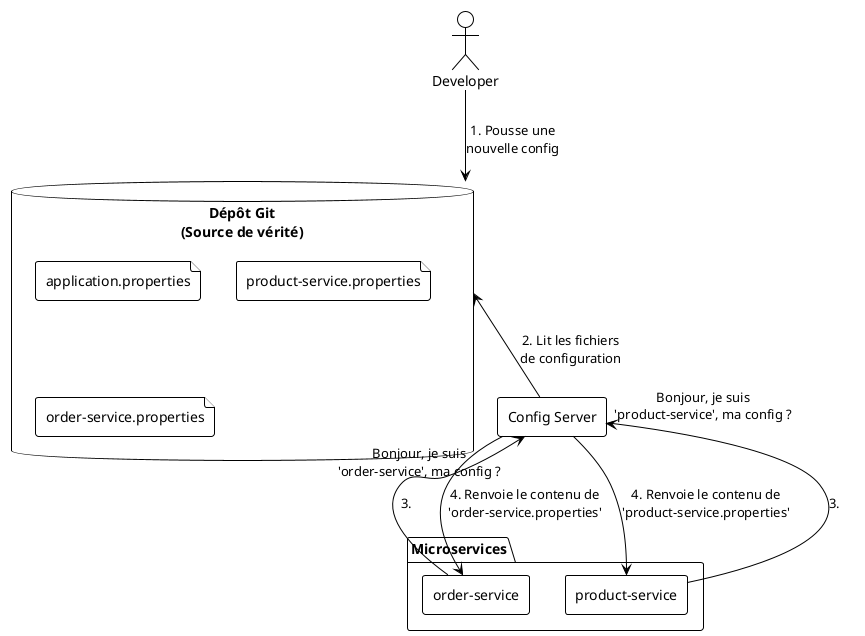

# Module 5 : La Configuration Centralisée (L'essentiel)

### Objectifs Pédagogiques

À la fin de cette partie, vous serez capable de :
*   Expliquer les problèmes liés à la gestion de la configuration dans de multiples services.
*   Décrire le pattern "Externalized Configuration" (Configuration Externalisée).
*   Présenter l'architecture et le rôle de Spring Cloud Config Server.
*   Expliquer comment un microservice devient un client du Config Server grâce à `bootstrap.properties`.

### Introduction : Le casse-tête des Post-it

Imaginez que notre écosystème de microservices est un petit village en pleine croissance. Nous avons la mairie (`eureka-server`), la librairie (`product-service`) et le bureau de poste (`order-service`). Pour l'instant, pour donner une instruction à chaque bâtiment (comme "Voici l'adresse de la mairie"), nous collons un Post-it (`application.properties`) sur sa porte.

Au début, avec deux ou trois bâtiments, c'est gérable. Mais si notre village grandit à 10, 20, 50 bâtiments ? Changer l'adresse de la mairie devient un travail de titan : il faut courir à chaque porte pour remplacer le Post-it. Et si on se trompe sur un seul, c'est le chaos !

Ne serait-il pas plus simple d'avoir un grand panneau d'affichage central au milieu du village, où toutes les informations officielles sont affichées ? Chaque commerçant viendrait simplement lire ce qui le concerne le matin en ouvrant. C'est exactement ce que nous allons construire avec **Spring Cloud Config Server**.

### Le Problème : Gérer la configuration de N services

À mesure que le nombre de services augmente, la gestion des fichiers `application.properties` individuels devient un problème majeur.

*   **Duplication :** Des propriétés comme l'adresse du serveur Eureka sont copiées-collées dans chaque service. Un changement nécessite de modifier N fichiers.
    ```plantuml
    @startuml
    !theme plain
    package "product-service" {
        file "application.properties" as P_PROPS {
            "eureka.client.serviceUrl=http://host:8761/eureka"
        }
    }
    package "order-service" {
        file "application.properties" as O_PROPS {
            "eureka.client.serviceUrl=http://host:8761/eureka"
        }
    }
    note "Duplication !" as N1
    P_PROPS .. N1
    O_PROPS .. N1
    @enduml
    ```
*   **Inconsistance :** Le risque d'erreur humaine en mettant à jour une propriété dans un service mais pas dans un autre est énorme.
*   **Sécurité :** Les informations sensibles (mots de passe de base de données, clés d'API) sont stockées dans le code source ou dans les images Docker. C'est une mauvaise pratique de sécurité.
*   **Manque de visibilité :** Il n'y a pas d'endroit unique pour voir la configuration de tout le système.

### La Solution : Le Pattern "Externalized Configuration"

Ce pattern propose de découpler la configuration du code de l'application. La configuration ne vit plus à l'intérieur de l'artefact déployable (le `.jar`), mais est récupérée depuis une source externe au démarrage.

> **Définition :** La **Configuration Externalisée** consiste à stocker les paramètres de configuration en dehors du code de l'application, permettant de la modifier sans avoir à recompiler ou à redéployer l'application.

### Notre Outil : Spring Cloud Config Server

Spring Cloud Config Server est l'implémentation de ce pattern par Spring. C'est un microservice à part entière dont le rôle est de servir des configurations aux autres services.

#### Architecture et Fonctionnement

L'architecture est simple et très puissante. Elle s'appuie généralement sur un dépôt Git comme source de vérité pour la configuration.

1.  **Le Dépôt Git :** Vous créez un dépôt Git dédié qui ne contient que des fichiers de configuration (`.properties` ou `.yml`). C'est votre "panneau d'affichage central". L'avantage de Git est immense : la configuration est versionnée, on peut voir qui a changé quoi, et on peut revenir en arrière.
2.  **Le Config Server :** C'est un service Spring Boot qui est lié à ce dépôt Git. Son unique API permet aux autres services de demander leur configuration.
3.  **Les Clients (nos microservices) :** Au démarrage, chaque microservice contacte le Config Server en disant : "Je suis `product-service`, donne-moi ma configuration". Le Config Server va alors chercher le fichier `product-service.properties` dans le dépôt Git et le renvoie au client.



#### Côté Client : Le rôle du `bootstrap.properties`

Ici se pose une question intéressante : comment notre `product-service` peut-il connaître l'adresse du Config Server, alors que cette adresse est elle-même une information de configuration ? C'est le problème de l'œuf et de la poule.

La solution de Spring Cloud est un mécanisme de démarrage en deux temps, via un fichier spécial : `bootstrap.properties` (ou `bootstrap.yml`).

1.  Au démarrage, une application Spring Cloud cliente cherche d'abord un fichier `bootstrap.properties`.
2.  Ce fichier est chargé **avant** `application.properties`. Il contient le strict minimum pour contacter le Config Server : le nom de l'application et l'URL du Config Server.
3.  Le service contacte le Config Server, récupère sa configuration distante et la charge en mémoire.
4.  Seulement après, le fichier `application.properties` local est chargé. Ses propriétés peuvent surcharger celles reçues du serveur, ce qui est utile pour les tests locaux.

<warning>
<b>Dépendance de Bootstrap Requise !</b>
Depuis Spring Boot 2.4, le mécanisme de `bootstrap` n'est plus activé par défaut. Pour que le fichier <code>bootstrap.properties</code> soit pris en compte, vous devez ajouter explicitement la dépendance suivante au <code>pom.xml</code> de vos services clients :
<pre><code class="xml">
&lt;dependency&gt;
    &lt;groupId&gt;org.springframework.cloud&lt;/groupId&gt;
    &lt;artifactId&gt;spring-cloud-starter-bootstrap&lt;/artifactId&gt;
&lt;/dependency&gt;
</code></pre>
</warning>

Exemple de fichier `bootstrap.properties` pour `product-service` :
```properties
# Nom de l'application, pour que le Config Server sache quel fichier chercher
spring.application.name=product-service

# URL du Config Server
spring.cloud.config.uri=http://localhost:8888
```

#### Côté Serveur : Organisation du Dépôt Git

Le Config Server est intelligent. Il sait quel fichier envoyer en se basant sur le `spring.application.name` du client qui l'appelle.

Une structure de dépôt de configuration typique pourrait ressembler à ceci :

```
config-repo/
├── application.properties      # Propriétés communes à TOUS les services
├── product-service.properties  # Propriétés spécifiques à product-service
├── order-service.properties    # Propriétés spécifiques à order-service
└── eureka-server.properties    # On peut même gérer la config d'Eureka !
```

*   `application.properties` : Contiendrait les propriétés partagées, comme `eureka.client.serviceUrl.defaultZone`. Il est chargé en premier.
*   `{application-name}.properties` : Contiendrait les propriétés spécifiques au service, comme `server.port`. Il est chargé après `application.properties` et peut surcharger les valeurs communes.

---

### Conclusion de la partie

Vous comprenez maintenant pourquoi la centralisation de la configuration est non seulement une bonne pratique, mais une nécessité dans une architecture microservices. Vous avez découvert le pattern de **Configuration Externalisée** et son implémentation robuste avec **Spring Cloud Config Server**.

Vous avez appris l'architecture clé basée sur un **dépôt Git** comme source de vérité, un **Config Server** comme intermédiaire, et des **clients** qui récupèrent leur configuration au démarrage via le fichier `bootstrap.properties`.

Cette approche nous apporte :
*   **Centralisation :** Un seul endroit pour gérer toute la configuration.
*   **Sécurité :** Les informations sensibles sont hors du code source.
*   **Consistance :** Tous les services partagent la même source de vérité.
*   **Audit et Versioning :** Grâce à Git, chaque changement est tracé.

La théorie est posée. Dans le TP suivant, nous allons mettre les mains dans le cambouis : créer notre dépôt Git de configuration, lancer notre propre Config Server, et transformer nos microservices en clients pour qu'ils abandonnent leurs fichiers `application.properties` locaux au profit de cette nouvelle source centralisée.

---

### Auto-évaluation

Prenez un moment pour répondre à ces questions. Les corrections se trouvent à la toute fin du support de cours.

1.  **(Question ouverte)** Quels sont les deux principaux avantages à utiliser Git comme backend pour un Config Server, par rapport à un simple dossier sur le serveur ?
2.  **(QCM)** Dans une application cliente du Config Server, quel fichier est lu en premier au démarrage ?
    *   A) `application.properties`
    *   B) `config.properties`
    *   C) `pom.xml`
    *   D) `bootstrap.properties`
3.  **(QCM)** Quelle dépendance est nécessaire dans les microservices clients pour que le `bootstrap.properties` soit pris en compte (avec Spring Boot 2.4+)?
    *   A) `spring-cloud-starter-config`
    *   B) `spring-cloud-starter-bootstrap`
    *   C) `spring-boot-starter-web`
    *   D) `spring-cloud-starter-git`
4.  **(Question ouverte)** Un `product-service` démarre et contacte le Config Server. Le dépôt Git contient un fichier `application.properties` avec `logging.level.root=INFO` et un fichier `product-service.properties` avec `logging.level.root=DEBUG`. Quel niveau de log sera finalement appliqué au `product-service` et pourquoi ?
5.  **(QCM)** Que se passe-t-il si le Config Server est inaccessible au moment où un microservice démarre ?
    *   A) Le service démarre avec une configuration par défaut.
    *   B) Le service utilise la dernière configuration qu'il avait mise en cache.
    *   C) Le service ne parvient pas à démarrer et s'arrête (comportement par défaut "fail-fast").
    *   D) Le service démarre, mais ne peut pas contacter les autres services.