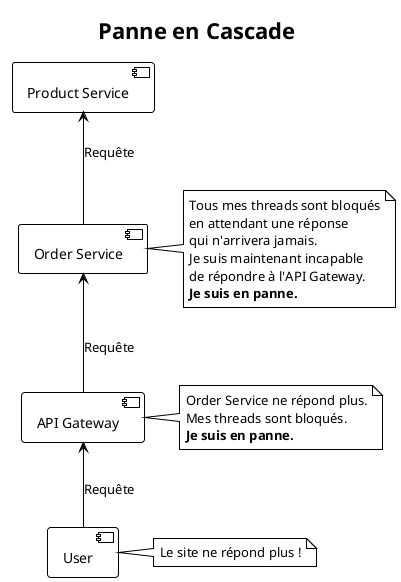
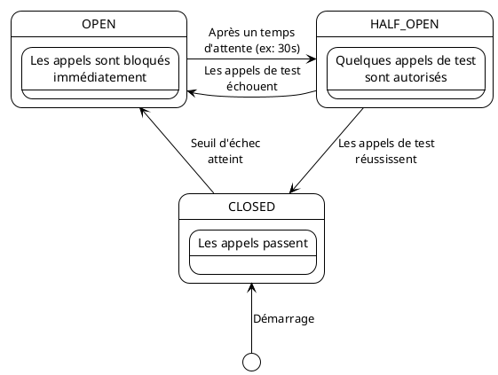

# Module 6 : Résilience et Tolérance aux Pannes - L'Art de ne pas s'effondrer (L'essentiel)

### Objectifs Pédagogiques

À la fin de cette partie, vous serez capable de :

* Expliquer le phénomène de pannes en cascade dans un système distribué.
* Décrire le pattern "Circuit Breaker" (Disjoncteur) et ses trois états : Fermé, Ouvert, Semi-ouvert.
* Définir le concept de "Fallback" (méthode de repli).
* Présenter Resilience4j comme la solution moderne pour implémenter ce pattern.

### Introduction : L'effet Domino

Imaginez une chaîne de montage complexe pour construire une voiture. La station A monte le châssis, la station B y fixe
les roues, la station C installe le moteur, et ainsi de suite. Tout fonctionne à merveille, jusqu'au jour où la machine
de la station B, qui fixe les roues, tombe en panne.

Que se passe-t-il ? La station A continue de produire des châssis et les envoie à la station B. Ces châssis
s'accumulent, bloquant la station A qui ne peut plus évacuer sa production. La station C, en aval, ne reçoit plus rien
et se retrouve à l'arrêt, incapable de travailler. Une seule panne locale a provoqué l'arrêt complet de toute la chaîne.
C'est une **panne en cascade**.

Dans nos microservices, c'est exactement le même risque. Notre `order-service` appelle `product-service`. Si
`product-service` devient très lent ou tombe en panne, tous les threads de `order-service` qui attendent une réponse
vont être bloqués. Bientôt, `order-service` n'aura plus de threads disponibles pour répondre aux requêtes des
utilisateurs. Il deviendra indisponible à son tour. Si un `api-gateway` l'appelle, il sera bloqué aussi, et ainsi de
suite. L'effet domino peut faire s'effondrer tout le système.



Pour éviter cela, nous devons apprendre à nos services à être plus intelligents et à ne pas insister bêtement quand un
de leurs partenaires est en difficulté.

### Le Pattern Circuit Breaker (Disjoncteur)

Ce pattern tire son nom des disjoncteurs électriques de votre maison. Si un appareil est défectueux et provoque un
court-circuit, le disjoncteur "saute" (s'ouvre) pour couper le courant et protéger le reste de votre installation
électrique (et éviter un incendie).

Le Circuit Breaker logiciel fait la même chose : il surveille les appels vers un service distant. S'il détecte trop d'
échecs, il "saute" et arrête d'envoyer des appels vers ce service pendant un certain temps. Il protège ainsi le service
appelant (le "consumer") d'une attente inutile et le service distant (le "provider") d'une surcharge de requêtes alors
qu'il est déjà en difficulté.

Le Circuit Breaker a trois états :

1. **`CLOSED` (Fermé) :** C'est l'état normal. Les appels passent à travers le disjoncteur vers le service distant. Le
   disjoncteur compte les succès et les échecs. Si le nombre d'échecs dépasse un certain seuil (ex: 50% d'échecs sur les
   10 dernières requêtes), il passe à l'état `OPEN`.

2. **`OPEN` (Ouvert) :** Le disjoncteur a "sauté". Pendant une durée configurée (ex: 30 secondes), **tous les appels
   sont immédiatement rejetés** sans même essayer de contacter le service distant. Cela donne au service en panne le
   temps de récupérer et protège le service appelant.

3. **`HALF-OPEN` (Semi-ouvert) :** Une fois le temps d'attente écoulé, le disjoncteur entre dans cet état de test. Il
   autorise un **nombre limité de requêtes de test** à passer.
    * Si ces requêtes réussissent, le disjoncteur considère que le service est de nouveau opérationnel et repasse à
      l'état `CLOSED`. Le trafic normal reprend.
    * Si ces requêtes échouent, il conclut que le service est toujours en panne et retourne à l'état `OPEN` pour une
      nouvelle période d'attente.



### Le Concept de "Fallback" (Méthode de Repli)

Ok, le disjoncteur est ouvert, l'appel est bloqué. Mais que fait-on à la place ? On ne va pas juste renvoyer une erreur
brute à l'utilisateur. C'est là qu'intervient le **Fallback**.

> **Définition :** Un **Fallback** est une méthode de repli qui est exécutée lorsque l'appel principal échoue (soit à
> cause d'une erreur, soit parce que le Circuit Breaker est ouvert).

C'est une logique alternative qui permet de fournir une réponse dégradée mais acceptable, plutôt que pas de réponse du
tout.

**Exemples de fallbacks pour notre `order-service` qui appelle `product-service` :**

* **Récupérer des données d'un cache :** Si nous avions une copie en cache des informations du produit, le fallback
  pourrait renvoyer ces données, même si elles ne sont pas 100% à jour.
* **Retourner une valeur par défaut :** Le fallback pourrait renvoyer un objet `ProductDTO` avec des informations
  génériques ("Information produit indisponible") ou un prix moyen.
* **Enclencher une logique métier alternative :** Mettre la demande de commande dans une file d'attente pour un
  traitement ultérieur.
* **Retourner une réponse d'erreur contrôlée :** C'est le fallback le plus simple, mais déjà mieux qu'une exception non
  gérée.

Le fallback est essentiel pour maintenir une bonne expérience utilisateur même en cas de panne partielle du système.

### Notre Outil : Resilience4j

Pendant des années, la solution de Netflix, **Hystrix**, a été le standard pour les Circuit Breakers dans l'écosystème
Spring Cloud. Cependant, Hystrix est maintenant en mode maintenance et n'est plus développé activement.

Son successeur officiel, recommandé par l'équipe Spring, est **Resilience4j**. C'est une bibliothèque de tolérance aux
pannes légère, modulaire et conçue pour Java 8 et la programmation fonctionnelle. Elle ne fournit pas seulement des
Circuit Breakers, mais aussi d'autres patterns de résilience comme les Rate Limiters, Retries, etc.

L'intégration avec Spring Boot est très simple grâce à des annotations. Pour protéger une méthode avec un Circuit
Breaker, on utilisera principalement l'annotation `@CircuitBreaker`.

**Exemple conceptuel :**

```java
// Dans notre ProductServiceClient de 'order-service'

@FeignClient(name = "product-service")
public interface ProductServiceClient {

    @GetMapping("/api/products/{id}")
    @CircuitBreaker(name = "productServiceBreaker", fallbackMethod = "getProductFallback")
    ProductDTO findProductById(@PathVariable("id") Long id);

    // La méthode de fallback DOIT avoir la même signature que la méthode protégée,
    // plus un paramètre pour l'exception si on veut la traiter.
    default ProductDTO getProductFallback(Long id, Throwable throwable) {
        // Logique de repli ici
        System.out.println("Circuit Breaker activé ! Fallback pour produit ID: " + id);
        // On retourne un DTO par défaut
        ProductDTO defaultProduct = new ProductDTO();
        defaultProduct.setId(id);
        defaultProduct.setName("Produit indisponible pour le moment");
        defaultProduct.setPrice(0.0);
        defaultProduct.setStock(0);
        return defaultProduct;
    }
}
```

<warning>
<b>Définition du Fallback</b>
Dans les versions modernes de Spring, la méthode de fallback ne peut plus se trouver directement dans l'interface Feign. Elle doit être dans une classe séparée, spécifiée dans l'annotation <code>@FeignClient</code>. Nous verrons cette implémentation correcte dans le TP. L'exemple ci-dessus est simplifié pour l'explication du concept.
</warning>

---

### Conclusion de la partie

Vous avez maintenant ajouté une compétence fondamentale à votre arsenal d'architecte logiciel : la **résilience**. Vous
comprenez le danger des **pannes en cascade** et vous savez comment les prévenir grâce au pattern **Circuit Breaker**.

Vous avez disséqué les trois états du disjoncteur (`CLOSED`, `OPEN`, `HALF-OPEN`) et compris comment il protège à la
fois le consommateur et le fournisseur de services. Vous avez aussi vu l'importance d'un **Fallback** pour fournir une
expérience utilisateur dégradée mais fonctionnelle plutôt qu'une erreur brute.

Enfin, vous avez identifié **Resilience4j** comme l'outil moderne et puissant que nous utiliserons pour implémenter ce
pattern de manière élégante avec Spring Boot.

Dans le TP suivant, nous allons mettre en pratique cette théorie. Nous allons ajouter Resilience4j à notre
`order-service`, protéger l'appel OpenFeign vers `product-service`, et simuler une panne pour voir notre Circuit Breaker
s'ouvrir et notre méthode de fallback se déclencher sous nos yeux.

---

### Auto-évaluation

Prenez un moment pour répondre à ces questions. Les corrections se trouvent à la toute fin du support de cours.

1. **(Question ouverte)** Expliquez pourquoi un Circuit Breaker protège non seulement le service "appelant" (consumer)
   mais aussi le service "appelé" (provider) qui est en difficulté.
2. **(QCM)** Dans quel état un Circuit Breaker bloque-t-il immédiatement les appels sans essayer de contacter le service
   distant ?
    * A) `CLOSED`
    * B) `HALF-OPEN`
    * C) `OPEN`
    * D) `DISABLED`
3. **(QCM)** Quel est le but principal d'une méthode de "Fallback" ?
    * A) Relancer l'appel automatiquement.
    * B) Arrêter le service appelant pour éviter les erreurs.
    * C) Fournir une réponse alternative ou dégradée quand l'appel principal échoue.
    * D) Envoyer une alerte à l'administrateur système.
4. **(Question ouverte)** Décrivez le comportement du Circuit Breaker dans l'état `HALF-OPEN`. Quel est son objectif ?
5. **(QCM)** Quel outil a largement remplacé Hystrix et est aujourd'hui la solution de résilience recommandée pour les
   applications Spring Cloud ?
    * A) Eureka
    * B) Feign
    * C) Resilience4j
    * D) Zuul