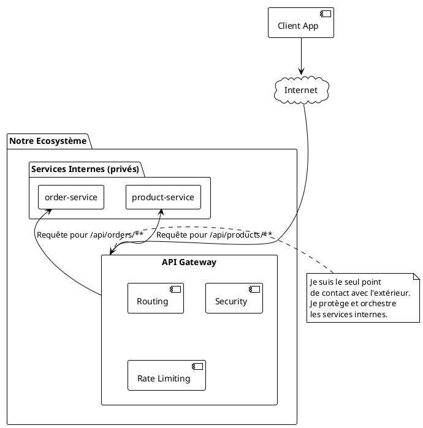

# Module 7 : La Passerelle d'API (API Gateway) (L'essentiel)

### Objectifs Pédagogiques

À la fin de cette partie, vous serez capable de :
*   Expliquer pourquoi on ne doit pas exposer tous les microservices directement sur Internet.
*   Lister les rôles principaux d'une API Gateway (point d'entrée unique, routage, etc.).
*   Présenter Spring Cloud Gateway comme la solution moderne pour implémenter ce pattern.
*   Définir les concepts clés de Spring Cloud Gateway : Route, Prédicat (Predicate) et Filtre (Filter).

### Introduction : Le Videur du Club

Imaginez que notre écosystème de microservices est une grande boîte de nuit. À l'intérieur, il y a plusieurs salles avec des ambiances différentes : le bar (`product-service`), la piste de danse (`order-service`), le carré VIP (`payment-service`), etc.

Maintenant, imaginez que chaque salle ait sa propre porte d'entrée donnant sur la rue. Ce serait le chaos !
*   Les clients (utilisateurs de l'API) seraient perdus, ne sachant pas à quelle porte frapper.
*   Il faudrait mettre un videur (système de sécurité) à chaque porte.
*   Chaque salle devrait gérer elle-même la file d'attente (limitation de débit).
*   Il serait impossible de savoir combien de personnes sont dans le club au total (monitoring centralisé).

La solution évidente est d'avoir une **seule entrée principale** avec un grand panneau lumineux, et un (ou plusieurs) videur(s) qui gère(nt) l'accès, vérifie(nt) les identités et oriente(nt) les gens vers la bonne salle. Ce videur, c'est notre **API Gateway**.

### Pourquoi ne pas exposer tous les services directement ?

Exposer chaque microservice directement sur Internet est une anti-pratique pour plusieurs raisons critiques :

1.  **Complexité pour le client :** Le client (une application mobile, un front-end web) devrait connaître l'adresse de chaque microservice. C'est lourd et fragile. Si on ajoute ou modifie un service, tous les clients doivent être mis à jour.
2.  **Problèmes de sécurité :** Chaque service exposé publiquement est une porte d'entrée potentielle pour une attaque. Il faudrait implémenter la sécurité (authentification, autorisation, protection DDoS) sur CHAQUE service, ce qui est redondant et source d'erreurs.
3.  **Gestion des problématiques transversales :** Des besoins comme la limitation de débit (rate limiting), la journalisation des requêtes (logging), la mise en cache ou la collecte de métriques devraient être réimplémentés partout. C'est inefficace.
4.  **Protocoles non web :** Certains services internes pourraient communiquer avec des protocoles non-HTTP (comme gRPC ou des messages AMQP). Une gateway peut traduire ces protocoles en HTTP pour les clients externes.

### Rôle de l'API Gateway : Le couteau suisse de vos APIs

L'API Gateway est un service qui se place en façade de tous les autres. C'est le **point d'entrée unique** (Single Point of Entry) pour toutes les requêtes externes. Elle agit comme un reverse proxy intelligent, examinant les requêtes entrantes et les redirigeant vers le service interne approprié.

Ses missions principales sont :
*   **Routage (Routing) :** C'est sa fonction de base. Elle redirige une requête (`/api/products/1`) vers le bon service (`product-service`).
*   **Sécurité :** Elle peut centraliser l'authentification. Elle vérifie si la requête contient un token valide (ex: JWT) avant de la laisser passer. Les services internes peuvent alors se faire confiance.
*   **Découplage :** Elle masque la structure interne de votre système. Le client ne voit qu'une seule API, même si derrière se cachent 50 microservices.
*   **Qualité de Service (Cross-cutting concerns) :** Elle peut appliquer des filtres pour gérer la limitation de débit, la mise en cache, la transformation de requêtes/réponses, l'ajout d'en-têtes, etc.
*   **Agrégation (optionnel) :** Elle peut recevoir une seule requête du client et faire plusieurs appels à des services internes pour agréger les réponses en une seule.



### Notre Outil : Spring Cloud Gateway

Pendant longtemps, Netflix Zuul était la solution de gateway fournie par Spring Cloud. Comme Hystrix, Zuul est maintenant en mode maintenance. La solution moderne, non-bloquante et réactive est **Spring Cloud Gateway**. Elle est construite sur Project Reactor, Netty et Spring WebFlux, ce qui la rend extrêmement performante et capable de gérer un grand nombre de connexions simultanées.

#### Les Concepts Clés de Spring Cloud Gateway

La configuration de la Gateway repose sur trois briques fondamentales :

1.  **Route :** C'est l'élément de base. Une route est définie par un ID unique, une URI de destination, une collection de prédicats et une collection de filtres. Si les prédicats sont satisfaits, la requête est envoyée vers l'URI.

2.  **Prédicat (Predicate) :** C'est une condition qui doit être vraie pour que la route soit activée. Spring Cloud Gateway fournit de nombreux prédicats prêts à l'emploi. Le plus courant est `Path`, qui vérifie si le chemin de la requête correspond à un certain pattern.
    *   Exemple : `Path=/api/products/**` -> Ce prédicat est vrai pour `/api/products/1` ou `/api/products/all`, mais pas pour `/api/orders/5`.

3.  **Filtre (Filter) :** C'est une logique qui peut modifier la requête entrante ou la réponse sortante. On peut les appliquer de manière globale ou spécifique à une route.
    *   Exemple de filtre de requête : Ajouter un en-tête (`X-Request-Source: Gateway`).
    *   Exemple de filtre de réponse : Ajouter un en-tête de sécurité (`X-Frame-Options: DENY`).

Le flux d'une requête dans la Gateway est le suivant :
**Requête entrante -> Mapping de la route (Prédicats) -> Filtres pré-routage -> Appel du service cible -> Filtres post-routage -> Réponse sortante**

#### Configuration : L'approche déclarative

La manière la plus simple de configurer Spring Cloud Gateway est d'utiliser le fichier `application.yml` (le format YAML est plus lisible que `.properties` pour les structures imbriquées).

Voici à quoi ressemblerait une configuration pour notre projet "GestBook" :

```yaml
# Configuration dans application.yml de la Gateway
server:
  port: 8080 # Le port public de notre application

spring:
  application:
    name: api-gateway
  cloud:
    gateway:
      routes:
        # Première route : pour le service produit
        - id: product-service-route
          # URI de destination. 'lb' signifie "Load Balancer".
          # La gateway va utiliser Eureka pour trouver une instance de 'product-service'.
          uri: lb://product-service
          predicates:
            # Cette route s'active si le chemin commence par /api/products/
            - Path=/api/products/**

        # Seconde route : pour le service commande
        - id: order-service-route
          uri: lb://order-service
          predicates:
            - Path=/api/orders/**
```
Avec cette configuration :
*   Une requête `GET http://localhost:8080/api/products/1` sera interceptée par la Gateway. Le prédicat `Path` de la première route correspondra. La Gateway demandera à Eureka l'adresse de `product-service` et lui transmettra la requête.
*   Une requête `POST http://localhost:8080/api/orders` correspondra à la seconde route et sera dirigée vers `order-service`.

Le `lb://` est crucial : il indique à la Gateway d'utiliser son intégration avec le client de découverte (Eureka dans notre cas) pour résoudre le nom du service en une adresse IP et un port concrets, tout en faisant de la répartition de charge si plusieurs instances sont disponibles.

---

### Conclusion de la partie

Vous comprenez maintenant le rôle indispensable de l'**API Gateway** en tant que gardien et chef d'orchestre de votre architecture. C'est le composant qui apporte de l'ordre, de la sécurité et de la cohérence à un système distribué qui pourrait autrement être chaotique.

Vous avez découvert **Spring Cloud Gateway**, la solution moderne et performante de l'écosystème Spring, et vous maîtrisez ses trois concepts fondamentaux : les **Routes**, les **Prédicats** et les **Filtres**. Vous avez vu à quel point la configuration déclarative en YAML est puissante, notamment avec l'intégration du load balancing (`lb://`) qui tire parti de notre infrastructure de découverte de services.

Dans le TP suivant, nous allons construire et configurer notre propre API Gateway. Nous la placerons en amont de nos services et validerons que nous pouvons accéder à l'ensemble de notre écosystème en passant uniquement par ce point d'entrée unique.

---

### Auto-évaluation

Prenez un moment pour répondre à ces questions. Les corrections se trouvent à la toute fin du support de cours.

1.  **(Question ouverte)** Citez trois raisons pour lesquelles il est déconseillé d'exposer chaque microservice directement sur Internet.
2.  **(QCM)** Quel est le rôle principal d'un "Prédicat" dans Spring Cloud Gateway ?
    *   A) Modifier le contenu de la requête.
    *   B) Définir la destination de la requête.
    *   C) Définir une condition qui doit être remplie pour qu'une route soit choisie.
    *   D) Mesurer le temps de réponse.
3.  **(QCM)** Dans l'URI d'une route, que signifie le préfixe `lb://` (ex: `uri: lb://product-service`) ?
    *   A) Que l'URI est une adresse locale (`localhost`).
    *   B) Que la Gateway doit utiliser son client de découverte de services (comme Eureka) pour trouver et répartir la charge vers le service nommé.
    *   C) Que la communication doit être chiffrée.
    *   D) Que le service de destination est une base de données (`local base`).
4.  **(Question ouverte)** Une requête `GET /api/v2/products/info` arrive sur la Gateway. La première route a un prédicat `Path=/api/products/**` et la seconde a `Path=/api/v2/products/**`. Vers quelle route la Gateway va-t-elle diriger la requête et pourquoi ?
5.  **(QCM)** Quel projet Spring Cloud Gateway a-t-il remplacé en tant que solution de gateway recommandée ?
    *   A) Spring Cloud Config
    *   B) Netflix Eureka
    *   C) Netflix Hystrix
    *   D) Netflix Zuul