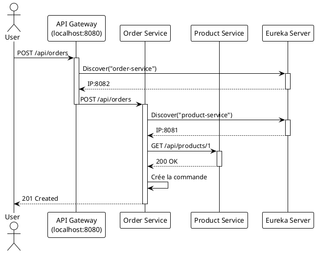

# TP 7 : Le Grand Portail - Mise en place de l'API Gateway

### Objectifs Pédagogiques

À la fin de ce TP, vous serez capable de :

* Créer un projet Spring Boot pour héberger une API Gateway.
* Ajouter et configurer les dépendances `spring-cloud-starter-gateway` et `eureka-client`.
* Définir des routes de manière déclarative dans `application.yml`.
* Utiliser la découverte de services (`lb://`) pour router les requêtes dynamiquement.
* Valider que toutes les requêtes vers les services internes peuvent passer par la Gateway.
* Dockeriser l'API Gateway.

### Introduction : Le Videur prend son poste

Notre club "GestBook" a ses salles fonctionnelles (`product-service`, `order-service`), mais les clients entrent encore
par les portes de service. Il est temps d'ouvrir la grande entrée principale et de poster notre videur, l'**API Gateway
**.

Dans ce TP, nous allons construire ce service très spécial. Il ne contiendra quasiment aucune logique métier en Java. Sa
puissance résidera entièrement dans sa **configuration**. Nous allons lui apprendre à :

1. Se présenter à Eureka pour savoir où se trouvent les autres services.
2. Écouter sur le port principal de notre application (le port 8080).
3. Inspecter les requêtes entrantes et, en fonction de leur chemin (path), les rediriger vers le bon service interne.

Une fois ce TP terminé, nous n'aurons plus besoin d'appeler `localhost:8081` ou `localhost:8082`. Toutes nos
interactions avec l'écosystème se feront via un point d'entrée unique : `localhost:8080`, celui de la Gateway.

### Étape 1 : Création du projet API Gateway

<procedure>
<p>Comme toujours, on commence sur <a href="https://start.spring.io/">start.spring.io</a>.</p>
<p><b>Configuration du projet :</b></p>
<ul>
    <li><b>Project :</b> Maven, <b>Language :</b> Java, <b>Spring Boot :</b> 3.2.x, <b>Java :</b> 17</li>
    <li><b>Metadata :</b>
        <ul>
            <li><b>Group :</b> <code>fr.formation.spring</code></li>
            <li><b>Artifact :</b> <code>api-gateway</code></li>
            <li><b>Package name :</b> <code>fr.formation.spring.apigateway</code></li>
        </ul>
    </li>
    <li><b>Dependencies :</b>
        <ul>
            <li><code>Gateway</code> (dans la section Spring Cloud Routing)</li>
            <li><code>Eureka Client</code> (dans la section Spring Cloud Discovery)</li>
        </ul>
    </li>
</ul>
<p>Générez, téléchargez et ouvrez le projet dans votre IDE.</p>
</procedure>

### Étape 2 : Configuration du service

Spring Cloud Gateway se configure le plus souvent avec un fichier `.yml`, car sa structure hiérarchique est plus lisible
qu'avec un fichier `.properties`.

<procedure>
<p><b>2.1. Création du fichier `application.yml`</b></p>
<p>Dans <code>src/main/resources</code>, supprimez le fichier <code>application.properties</code> vide et remplacez-le par un nouveau fichier nommé <code>application.yml</code>.</p>
<p>Copiez-y le contenu suivant :</p>

```yaml
# Le port de la Gateway, c'est le point d'entrée public de notre application.
# 8080 est un choix standard.
server:
  port: 8080

# Nom de l'application

spring:
application:
name: api-gateway

cloud:
gateway:

# Activation de la découverte de services pour le routage

discovery:
locator:
enabled: true

# Permet de traduire les noms de service en minuscules avec tirets

lower-case-service-id: true

      # Définition de nos routes
      routes:
        # Première route : pour le service produit
        # On lui donne un ID unique
        - id: product-service-route
          # L'URI de destination. 'lb' signifie "Load Balanced".
          # La Gateway va utiliser Eureka pour trouver une instance
          # de 'product-service'. Le nom ici est l'ID de l'application
          # enregistrée dans Eureka.
          uri: lb://product-service
          # Le prédicat qui déclenche cette route
          predicates:
            - Path=/api/products/**

        # Seconde route : pour le service commande
        - id: order-service-route
          uri: lb://order-service
          predicates:
            - Path=/api/orders/**

# Configuration du client Eureka : la Gateway doit aussi s'enregistrer

# et connaître l'adresse du serveur.

# Note : Pour l'instant, nous laissons cette configuration ici.

# Dans le TP suivant, nous la déplacerons aussi dans le Config Server.

eureka:
client:
serviceUrl:
defaultZone: http://localhost:8761/eureka

```
<p>Cette configuration est le cœur de notre Gateway. Elle définit deux règles de routage simples mais puissantes :</p>
<ul>
    <li>Toute requête dont le chemin commence par <code>/api/products/</code> sera routée vers une instance de <code>product-service</code> trouvée via Eureka.</li>
    <li>Toute requête dont le chemin commence par <code>/api/orders/</code> sera routée vers une instance de <code>order-service</code> trouvée via Eureka.</li>
</ul>

<p><b>2.2. La classe principale</b></p>
<p>La classe principale <code>ApiGatewayApplication.java</code> ne nécessite aucune annotation particulière. Les dépendances que nous avons ajoutées suffisent à activer la Gateway et le client Eureka.</p>

```java
// package fr.formation.spring.apigateway;

import org.springframework.boot.SpringApplication;
import org.springframework.boot.autoconfigure.SpringBootApplication;

@SpringBootApplication
public class ApiGatewayApplication {

    public static void main(String[] args) {
        SpringApplication.run(ApiGatewayApplication.class, args);
    }
}
```

</procedure>

### Étape 3 : Scénario de test

Il est temps de vérifier que notre portail fonctionne.

<procedure>
<p><b>3.1. Préparation de l'environnement</b></p>
<ol>
    <li>Si ce n'est pas déjà fait, assurez-vous que les conteneurs Docker de <code>eureka-server</code> et <code>config-server</code> sont lancés.</li>
    <li>Lancez le <code>product-service</code> depuis votre IDE.</li>
    <li>Lancez le <code>order-service</code> depuis votre IDE.</li>
    <li>Vérifiez dans le dashboard Eureka que ces deux services sont bien enregistrés.</li>
    <li>Maintenant, <b>lancez le projet <code>api-gateway</code></b> depuis votre IDE.</li>
    <li>Vérifiez le dashboard Eureka : vous devriez maintenant voir 3 services enregistrés : `PRODUCT-SERVICE`, `ORDER-SERVICE` et `API-GATEWAY`.</li>
</ol>

<p><b>3.2. Test du routage</b></p>
<p>Ouvrez votre client HTTP. Nous n'allons plus utiliser les ports 8081 et 8082. Tous les appels se feront sur le port <b>8080</b> de la Gateway.</p>

<b>Test 1 : Accéder aux produits via la Gateway</b>
<p>Faites un appel qui, avant, allait sur <code>localhost:8081/api/products</code>.</p>
<pre><code class="http">
### Get all products VIA GATEWAY
GET http://localhost:8080/api/products
Accept: application/json
</code></pre>
<p>Vous devriez recevoir la liste des produits, exactement comme avant ! La Gateway a correctement routé votre requête vers le <code>product-service</code>.</p>

<b>Test 2 : Créer une commande via la Gateway</b>
<p>Faites un appel qui, avant, allait sur <code>localhost:8082/api/orders</code>.</p>

```http request
### Create an order VIA GATEWAY
POST http://localhost:8080/api/orders
Content-Type: application/json

{
"productId": 1,
"quantity": 1
}
```

<p>Vous devriez recevoir une réponse `201 Created` avec le corps de la commande. La Gateway a routé l'appel vers `order-service`, qui a lui-même appelé `product-service` (via Feign et Eureka). La chaîne de communication est complète !</p>
</procedure>

Diagramme de la requête de création de commande via la Gateway :



### Étape 4 : Dockerisation de l'API Gateway

La procédure est maintenant une routine bien connue.

1. Créez le `Dockerfile` à la racine du projet `api-gateway`.

```docker
   # ----- STAGE 1: Build -----
   FROM maven:3.8.5-openjdk-17 AS build
   WORKDIR /app
   COPY pom.xml .
   RUN mvn dependency:go-offline
   COPY src ./src
   RUN mvn package -DskipTests

   # ----- STAGE 2: Runtime -----
   FROM eclipse-temurin:17-jre-focal
   WORKDIR /app
   COPY --from=build /app/target/*.jar app.jar
   EXPOSE 8080
   ENTRYPOINT ["java", "-jar", "app.jar"]
```
2. Construisez l'image :

```bash
    mvn clean package
   docker build -t api-gateway:1.0 .
```

---

### Exercice 10 : Ajouter un filtre global

**Contexte :** Pour des raisons de débogage, nous voulons que chaque requête qui passe par la Gateway se voie ajouter un
en-tête (header) HTTP spécifique, par exemple `X-Request-Source: api-gateway`.

**Votre mission :**

1. Modifiez le fichier `application.yml` de l'API Gateway.
2. Ajoutez une section `default-filters` au niveau de la configuration de la gateway.
3. Utilisez le filtre `AddRequestHeader` pour ajouter l'en-tête `X-Request-Source` avec la valeur `api-gateway`.
4. Redémarrez la Gateway et faites un appel à `GET /api/products/1`.
5. Dans la console de `product-service`, modifiez le `ProductController` pour qu'il affiche les en-têtes de la requête
   reçue et vérifiez que le nouvel en-tête est bien présent.

**Indice :** La structure YAML pour les filtres par défaut est `spring.cloud.gateway.default-filters`.

#### Correction exercice 10 {collapsible='true'}

1. et 2. Voici le `application.yml` de l'API Gateway modifié :
    ```yaml
    # ... (server, spring.application.name)
    spring:
      application:
        name: api-gateway
      cloud:
        gateway:
          # ... (discovery, routes)
          # Ajout des filtres par défaut
          default-filters:
            - AddRequestHeader=X-Request-Source, api-gateway
    # ... (eureka)
    ```
   Cette configuration simple appliquera ce filtre à TOUTES les routes définies.

3. Après avoir redémarré la Gateway, il faut modifier le `ProductController` pour observer le résultat.

   ```java
   // Dans ProductController.java du projet product-service

   // ...
   @GetMapping("/{id}")
   public ResponseEntity<Product> getProductById(
       @PathVariable Long id,
       @RequestHeader(required = false, name = "X-Request-Source") String source
   ) {
       System.out.println("Requête reçue de : " + (source != null ? source : "Inconnu"));
       Optional<Product> product = productRepository.findById(id);
       return product.map(ResponseEntity::ok)
                     .orElseGet(() -> ResponseEntity.notFound().build());
   }
   // ...
   ```

4. Relancez `product-service` et `api-gateway`. Lorsque vous appelez `http://localhost:8080/api/products/1`, vous verrez
   dans la console du **product-service** le message :
   ```
   Requête reçue de : api-gateway
   ```
   Cela prouve que la Gateway a bien intercepté la requête, ajouté l'en-tête, et l'a ensuite transmise. C'est un exemple
   simple de la puissance des filtres.

---

### Auto-évaluation

1. **(QCM)** Quelle est la dépendance Maven principale pour créer une API Gateway avec Spring Cloud ?
    * A) `spring-cloud-starter-openfeign`
    * B) `spring-cloud-starter-gateway`
    * C) `spring-cloud-starter-netflix-zuul`
    * D) `spring-boot-starter-web`
2. **(Question ouverte)** Dans la configuration d'une route de la Gateway, expliquez la différence entre `uri` et
   `predicates`.
3. **(QCM)** Pour router les requêtes vers `/utilisateurs/123/details` vers un service nommé `user-service`, quel
   prédicat est le plus approprié ?
    * A) `Path=/utilisateurs/**`
    * B) `Host=user-service.com`
    * C) `Method=GET`
    * D) `Header=Content-Type, application/json`
4. **(Question ouverte)** Pourquoi le projet Spring Cloud Gateway est-il basé sur Spring WebFlux (le stack réactif)
   plutôt que sur Spring Web MVC (le stack servlet traditionnel) ?
5. **(QCM)** Si on ne spécifie pas de routes dans le `application.yml`, que fait la Gateway par défaut ?
    * A) Elle refuse toutes les requêtes.
    * B) Elle route toutes les requêtes vers un service par défaut nommé "default-service".
    * C) Si `discovery.locator` est activé, elle crée des routes dynamiquement pour chaque service trouvé dans Eureka (
      ex: `/product-service/**` -> `product-service`).
    * D) Elle plante au démarrage.

---

### Conclusion

Le gardien est en place ! Vous avez construit, configuré et testé une **API Gateway**, le point d'entrée unique et
sécurisé de votre écosystème. Vous avez vu à quel point il est simple, avec Spring Cloud Gateway, de définir des règles
de **routage** basées sur des **prédicats** et d'enrichir les requêtes avec des **filtres**.

Tous nos services sont maintenant cachés derrière cette façade, ce qui simplifie énormément la vie des clients de l'API
et centralise la gestion des problématiques transversales.

Nous avons maintenant toutes les briques de notre architecture : des services métier, un annuaire, un serveur de
configuration, une gateway... mais les lancer toutes manuellement est devenu un véritable calvaire. Il est temps
d'apprendre à les orchestrer. Dans le prochain module, nous allons découvrir **Docker Compose** pour lancer toute notre
pile avec une seule commande.