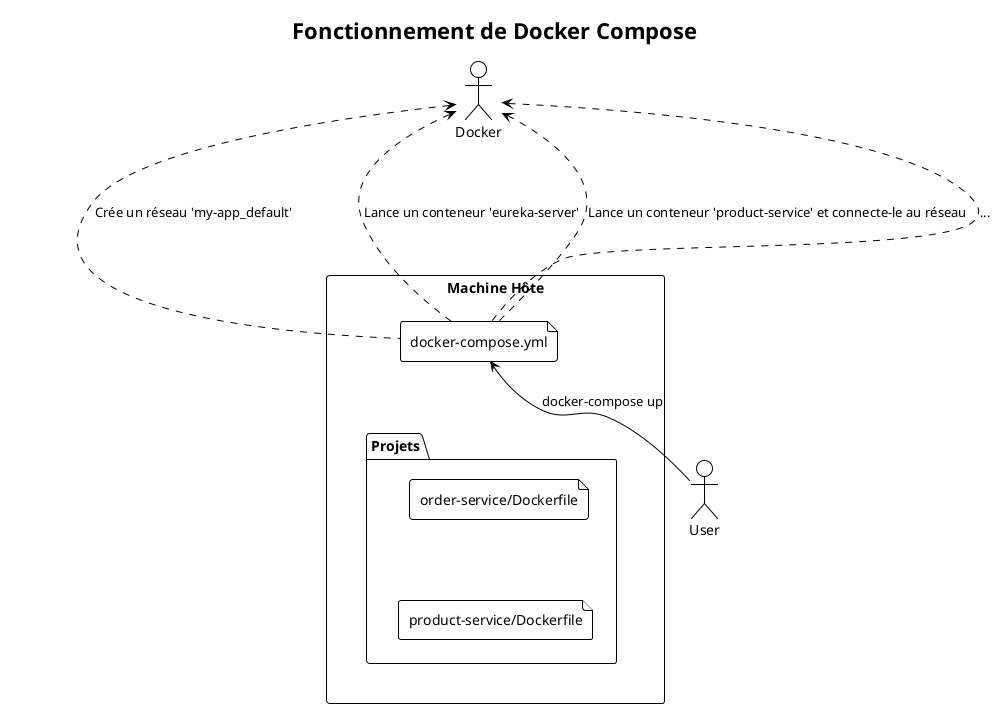
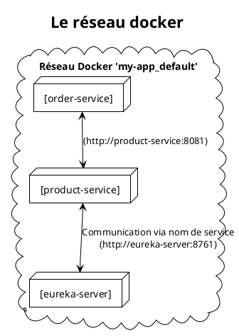

# Module 8 : Orchestration avec Docker Compose (L'essentiel)

### Objectifs Pédagogiques

À la fin de cette partie, vous serez capable de :
*   Expliquer le problème lié au lancement manuel de multiples conteneurs.
*   Présenter Docker Compose comme solution d'orchestration locale.
*   Décrire la structure et les concepts de base d'un fichier `docker-compose.yml` (services, networks, depends_on).
*   Comprendre comment Docker Compose facilite la communication entre conteneurs.

### Introduction : Le Chef d'Orchestre

Jusqu'à présent, pour lancer notre architecture, nous avons agi comme des machinistes de théâtre :
1.  On lance le conteneur `eureka-server` avec une commande `docker run...`.
2.  On lance le conteneur `config-server` avec une autre commande `docker run...`.
3.  On lance `product-service`, puis `order-service`, puis `api-gateway`...

C'est fastidieux, source d'erreurs et difficile à maintenir. On a dû faire des acrobaties avec `localhost` et les noms d'hôtes. Si on oublie un conteneur ou si on le lance dans le mauvais ordre, rien ne fonctionne.

Imaginez un orchestre symphonique. Chaque musicien (`conteneur`) sait jouer sa partition (`son application`). Mais pour qu'ils jouent ensemble et créent une symphonie harmonieuse, il faut un **chef d'orchestre**. Ce chef d'orchestre leur dit quand commencer, s'assure qu'ils sont tous là, et leur permet de s'écouter les uns les autres.

Pour notre développement local, ce chef d'orchestre, c'est **Docker Compose**. C'est un outil qui nous permet de décrire toute notre application multi-conteneurs dans un seul fichier et de la lancer (ou de l'arrêter) avec une seule commande.

### Le Problème : L'enfer des commandes `docker run`

Lancer nos 5 services manuellement pose plusieurs problèmes :
*   **Commandes complexes :** Chaque `docker run` peut avoir de nombreux arguments (`-p`, `-e`, `--name`, volumes, etc.). Il est facile de se tromper.
*   **Gestion du réseau :** Par défaut, chaque conteneur est isolé. Pour qu'ils communiquent, il faut les attacher manuellement à un réseau Docker partagé (`docker network create ...`, `docker run --network=...`).
*   **Ordre de démarrage :** Le `config-server` et `eureka-server` doivent démarrer avant les autres services. Gérer cet ordre manuellement est pénible.
*   **Nettoyage :** Pour tout arrêter, il faut faire `docker stop` et `docker rm` pour chaque conteneur.

Bref, ce n'est pas une solution viable, même pour le développement.

### La Solution : Docker Compose

Docker Compose est un outil inclus avec Docker Desktop qui lit un fichier de configuration au format **YAML**, généralement nommé `docker-compose.yml`, pour gérer le cycle de vie d'une application multi-conteneurs.

> **Définition :** **Docker Compose** est un outil pour définir et exécuter des applications Docker multi-conteneurs. Il utilise un fichier YAML pour configurer les services de l'application, puis, à partir d'une seule commande, il crée et démarre tous les services à partir de votre configuration.

#### Le Fichier `docker-compose.yml` : Notre Partition

Ce fichier est le cœur de Docker Compose. Il décrit tous les composants de notre système. Voyons ses concepts clés.

**1. `services`**
C'est la section principale où l'on définit chaque conteneur que l'on veut lancer. Chaque service est un "bloc" de configuration.

**2. `image`**
Pour chaque service, on spécifie l'image Docker à utiliser (ex: `product-service:1.0`). Si l'image n'est pas disponible localement, Docker Compose essaiera de la récupérer depuis Docker Hub. Si on veut la construire à partir d'un Dockerfile, on peut utiliser la directive `build: .`.

**3. `ports`**
C'est l'équivalent du `-p` de `docker run`. On mappe un port de la machine hôte vers un port du conteneur (ex: `8080:8080`).

**4. `environment`**
C'est l'équivalent du `-e`. On peut y définir des variables d'environnement pour configurer le conteneur.

**5. `networks`**
Docker Compose crée automatiquement un **réseau privé** par défaut pour tous les services définis dans le fichier. C'est magique ! À l'intérieur de ce réseau, chaque service peut joindre les autres en utilisant simplement son **nom de service** comme nom d'hôte.
*   Exemple : Depuis le conteneur `api-gateway`, l'URL `http://product-service:8081` fonctionnera, car Docker Compose gère la résolution DNS interne.

**6. `depends_on`**
Cette directive permet de définir un ordre de démarrage simple. Si `order-service` a `depends_on: [eureka-server]`, Docker Compose démarrera d'abord le conteneur `eureka-server` avant de démarrer `order-service`.

<warning>
<b>`depends_on` ne garantit que le démarrage !</b>
<p>
<code>depends_on</code> attend que le conteneur dépendant soit <b>lancé</b>, mais pas que l'application à l'intérieur soit <b>prête</b> à accepter des connexions. Un conteneur Eureka peut être "lancé", mais l'application Java à l'intérieur peut prendre 10-20 secondes pour être pleinement opérationnelle. Nos clients Spring (Config, Eureka) sont conçus pour réessayer de se connecter, ce qui résout généralement ce problème. Pour des cas plus complexes, des solutions comme des "wait-for-it scripts" ou des "healthchecks" peuvent être nécessaires.
</p>
</warning>

#### Exemple de structure pour notre projet

Voici à quoi pourrait ressembler un extrait de notre futur `docker-compose.yml` :

```yaml
# docker-compose.yml
version: '3.8' # Spécifie la version de la syntaxe du fichier

services:
  # Définition du service Eureka
  eureka-server:
    image: eureka-server:1.0 # L'image que nous avons construite
    ports:
      - "8761:8761" # Mappe le port pour qu'on puisse y accéder de l'extérieur

  # Définition du service Produit
  product-service:
    image: product-service:1.1
    ports:
      - "8081:8081"
    environment:
      # On pourrait surcharger des configurations ici si besoin
      - WELCOME_MESSAGE="Hello from Docker Compose!"
    depends_on:
      - eureka-server # Ne démarre pas avant qu'Eureka soit lancé
      - config-server # Dépend aussi du config server

  # ... et ainsi de suite pour tous les autres services
  config-server:
    # ...
  order-service:
    # ...
  api-gateway:
    # ...

```

Avec un tel fichier, il suffit de se placer dans le même répertoire et de taper :
*   `docker-compose up` pour tout construire et lancer en avant-plan.
*   `docker-compose up -d` pour tout lancer en arrière-plan.
*   `docker-compose down` pour arrêter et supprimer tous les conteneurs et le réseau.

C'est simple, reproductible et puissant.






---

### Conclusion de la partie

Vous avez découvert la solution au chaos du lancement manuel de conteneurs. **Docker Compose** est votre meilleur ami pour l'orchestration locale. Il vous permet de décrire l'ensemble de votre application dans un fichier **`docker-compose.yml`** unique et déclaratif.

Vous avez compris ses concepts clés :
*   La définition des **`services`**.
*   La création automatique d'un **réseau privé** qui permet la communication par nom de service.
*   La gestion de l'ordre de démarrage avec **`depends_on`**.

Grâce à Docker Compose, n'importe quel développeur rejoignant votre projet pourra lancer l'intégralité de l'environnement avec une seule commande, garantissant une expérience de développement cohérente et sans friction.

Dans le TP final de ce module, nous allons écrire le `docker-compose.yml` complet pour notre écosystème "GestBook". Nous rassemblerons toutes les pièces du puzzle (Config Server, Eureka, nos services métier, l'API Gateway) et lancerons toute la pile d'un seul coup. Ce sera l'aboutissement de tout notre travail d'assemblage.

---

### Auto-évaluation

Prenez un moment pour répondre à ces questions. Les corrections se trouvent à la toute fin du support de cours.

1.  **(Question ouverte)** Quel est, selon vous, le plus grand avantage de Docker Compose pour un développeur travaillant en équipe ?
2.  **(QCM)** Quelle commande permet de lancer tous les services définis dans `docker-compose.yml` en arrière-plan ?
    *   A) `docker-compose run`
    *   B) `docker-compose start -d`
    *   C) `docker-compose up -d`
    *   D) `docker-compose exec -d`
3.  **(QCM)** Dans un `docker-compose.yml`, si `order-service` veut appeler `product-service` qui écoute sur le port 8081, quelle URL doit-il utiliser ?
    *   A) `http://localhost:8081`
    *   B) `http://product-service:8081`
    *   C) `http://host.docker.internal:8081`
    *   D) Il ne peut pas l'appeler directement.
4.  **(Question ouverte)** Expliquez la limitation de la directive `depends_on`.
5.  **(QCM)** Pour arrêter et supprimer tous les conteneurs, réseaux et volumes (par défaut) créés par `docker-compose up`, quelle commande faut-il utiliser ?
    *   A) `docker-compose stop`
    *   B) `docker-compose rm -f`
    *   C) `docker-compose kill`
    *   D) `docker-compose down`