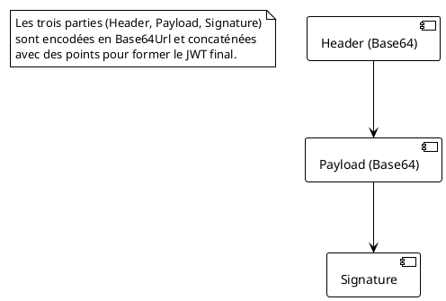
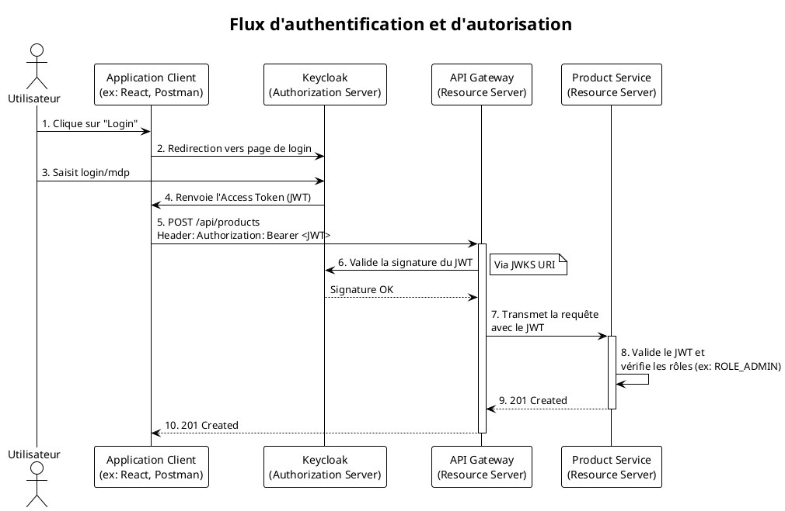

# Module 9 : Sécurité Avancée avec Spring Security & OAuth2/OIDC (L'essentiel)

### Objectifs Pédagogiques

À la fin de cette partie, vous serez capable de :

* Expliquer ce qu'est un JWT, sa structure et son rôle dans une authentification stateless.
* Démystifier les concepts clés d'OAuth2 et OIDC : les rôles (Resource Owner, Client, etc.) et la différence entre
  autorisation et authentification.
* Décrire le rôle d'un serveur d'autorisation comme Keycloak.
* Comprendre le flux de sécurisation : le client obtient un token, le présente à l'API Gateway qui le valide, puis les
  services internes valident aussi ce token.

### Introduction : Qui êtes-vous et qu'avez-vous le droit de faire ?

Notre club "GestBook" est maintenant ouvert, avec une belle entrée (`API Gateway`) et des salles bien organisées. Le
problème ? N'importe qui peut entrer et faire n'importe quoi. Un client lambda pourrait aller dans l'arrière-boutique (
`product-service`) et ajouter de nouveaux livres au catalogue, ou consulter les commandes des autres. C'est
inacceptable.

Nous avons besoin d'un service de sécurité robuste. Ce service doit répondre à deux questions fondamentales pour chaque
personne qui se présente à l'entrée :

1. **Authentification : Qui êtes-vous ?** (Prouvez votre identité, montrez-moi votre carte d'identité).
2. **Autorisation : Qu'avez-vous le droit de faire ?** (Votre carte d'identité dit que vous êtes un client, vous pouvez
   aller au bar, mais pas derrière le comptoir. Si vous êtes un employé, vous avez plus de droits).

Dans le monde des APIs modernes, la solution à ce problème repose sur des standards ouverts comme **OAuth2**, **OpenID
Connect (OIDC)** et les **JSON Web Tokens (JWT)**. Nous allons utiliser un "serveur d'autorisation" externe, **Keycloak
**, qui jouera le rôle de l'agence de sécurité qui délivre les cartes d'identité (les tokens).

### Le Laissez-passer : JSON Web Token (JWT)

Dans une architecture stateless comme les microservices, on ne veut pas que chaque service ait à vérifier un nom
d'utilisateur et un mot de passe à chaque appel. La solution est un "laissez-passer" auto-contenu et sécurisé : le JWT.

> **Définition :** Un **JWT** est un standard (RFC 7519) qui définit un format compact et autonome pour transmettre de
> manière sécurisée des informations (appelées "claims") entre des parties sous forme d'objet JSON.

Un JWT ressemble à une longue chaîne de caractères incompréhensible, mais il est en réalité composé de trois parties,
séparées par des points : `xxxxx.yyyyy.zzzzz`

1. **Header (En-tête) :** Contient des métadonnées sur le token, comme l'algorithme de signature utilisé (`alg`, ex: "
   HS256" ou "RS256"). Encodé en Base64Url.
2. **Payload (Charge utile) :** Contient les "claims", les informations que l'on veut transmettre. Ce sont des paires
   clé-valeur.
    * **Claims enregistrés :** `iss` (issuer/émetteur), `sub` (subject/sujet, souvent l'ID de l'utilisateur), `exp` (
      expiration time).
    * **Claims personnalisés :** `email`, `given_name`, `roles`, etc.
    * **C'est ici que l'on met les informations d'identité et les autorisations de l'utilisateur !** Encodé en
      Base64Url.
3. **Signature :** C'est la partie qui garantit l'authenticité du token. Elle est calculée en signant le header et le
   payload avec une clé secrète (pour l'algorithme symétrique HS256) ou une clé privée (pour l'algorithme asymétrique
   RS256) connue uniquement du serveur d'autorisation.

**Comment ça marche ?**
Le service qui reçoit le JWT (ex: notre API Gateway) peut vérifier la signature en utilisant la clé publique
correspondante.

* Si la signature est valide, le service a la **garantie** que le token n'a pas été modifié et qu'il a bien été émis par
  une source de confiance.
* Il peut alors faire confiance aux informations du Payload (comme le rôle de l'utilisateur) pour prendre des décisions
  d'autorisation.

```plantuml
@startjson
{
  "alg": "RS256",
  "typ": "JWT"
}
@endjson

@startjson
{
  "sub": "1234567890",
  "name": "John Doe",
  "iat": 1516239022,
  "exp": 1516242622,
  "roles": ["user", "reader"]
}
@endjson
```

### L'Agence de Sécurité : OAuth2 & OpenID Connect (OIDC)

On ne crée pas les JWT nous-mêmes. On délègue cette tâche à un service spécialisé : un **Serveur d'Autorisation**. Les
protocoles **OAuth2** et **OIDC** définissent comment une application peut obtenir ces tokens de manière sécurisée.

**Les Rôles Clés :**

* **Resource Owner (Le Propriétaire de la Ressource) :** C'est l'**utilisateur final**. C'est vous. Vous êtes
  propriétaire de vos données (votre profil, vos commandes).
* **Client :** C'est l'**application** qui veut accéder aux ressources pour le compte de l'utilisateur (ex: une
  application mobile, un front-end React).
* **Authorization Server (Le Serveur d'Autorisation) :** C'est le cœur du système. C'est lui qui **authentifie**
  l'utilisateur (demande login/mdp) et qui, avec son consentement, délivre des tokens au Client. **Keycloak** jouera ce
  rôle.
* **Resource Server (Le Serveur de Ressources) :** C'est l'**API** qui protège les ressources (nos microservices :
  `product-service`, `order-service`). Il demande un token valide pour donner l'accès.

**Quelle est la différence entre OAuth2 et OIDC ?**

* **OAuth2 est un framework d'AUTORISATION.** Son but est de permettre à un Client d'accéder à des ressources pour un
  utilisateur. Il définit comment obtenir un **Access Token**. Cet access token dit ce que l'application a le droit de
  *faire*.
* **OpenID Connect (OIDC) est une surcouche d'AUTHENTIFICATION au-dessus d'OAuth2.** Son but est de vérifier l'identité
  de l'utilisateur. Il ajoute le concept d'**ID Token** (qui est un JWT) et un endpoint (`/userinfo`) pour obtenir des
  informations sur l'utilisateur.

En résumé : **OIDC = Authentification (Qui êtes-vous ?)**, **OAuth2 = Autorisation (Que pouvez-vous faire ?)**.

### Le Flux de Sécurisation dans notre Architecture

Voici comment nous allons sécuriser notre application. C'est un flux très standard.

1. **L'utilisateur veut se connecter :** Notre application front-end (que nous n'avons pas, mais que nous simulons avec
   Postman) redirige l'utilisateur vers la page de connexion de **Keycloak**.
2. **Authentification :** L'utilisateur saisit son nom d'utilisateur et son mot de passe **sur le site de Keycloak**.
   Nos services ne voient JAMAIS ces identifiants.
3. **Obtention du Token :** Si l'authentification réussit, Keycloak renvoie un **Access Token** (un JWT) au front-end.
4. **Appel de l'API :** Le front-end effectue maintenant ses appels à notre API en incluant ce token dans l'en-tête
   `Authorization` (ex: `Authorization: Bearer xxxxx.yyyyy.zzzzz`).
5. **Validation par l'API Gateway :**
    * L'**API Gateway** reçoit la requête. Elle est configurée comme un "Resource Server".
    * Elle voit le token, contacte Keycloak (ou utilise sa clé publique mise en cache) pour **valider la signature du
      JWT**.
    * Si le token est valide et non expiré, la Gateway peut prendre une première décision de routage ou de filtrage.
6. **Transmission et validation par les services internes :**
    * La Gateway transmet la requête (avec le token) au service interne concerné (ex: `product-service`).
    * Le `product-service` est lui aussi configuré comme "Resource Server". Il **re-valide le token** pour s'assurer qu'
      il n'a pas été falsifié en cours de route.
    * Il peut alors utiliser les informations du token (ex: les `roles`) pour appliquer une logique d'autorisation fine.
      Par exemple : "Cette requête `POST /api/products` est-elle autorisée ? Oui, si le token contient le rôle
      `ROLE_ADMIN`."

### Notre Boîte à Outils

Pour implémenter tout cela, nous allons utiliser :

* **Keycloak :** Notre serveur d'autorisation, que nous lancerons dans Docker.
* **`spring-boot-starter-oauth2-resource-server` :** Une dépendance Spring Boot qui transforme magiquement un service
  en "Resource Server". Il suffit de lui indiquer dans `application.properties` l'adresse de notre serveur Keycloak, et
  il saura automatiquement comment valider les JWT entrants.
* **Spring Security :** Pour configurer les règles d'autorisation fines sur nos endpoints (ex:
  `http.authorizeHttpRequests(auth -> auth.requestMatchers(HttpMethod.POST, "/api/products").hasRole("ADMIN"))`).

---

### Conclusion de la partie

La sécurité n'est plus une boîte noire. Vous comprenez maintenant la "danse" à trois entre l'utilisateur, le client et
le serveur d'autorisation, orchestrée par les protocoles **OAuth2/OIDC**. Vous savez que le **JWT** est le
laissez-passer qui contient l'identité et les droits de l'utilisateur de manière sécurisée et vérifiable.

Vous avez une vision claire du flux que nous allons mettre en place :

1. **Keycloak** émet les tokens.
2. L'**API Gateway** agit comme premier rempart, validant chaque token entrant.
3. Les **microservices internes** agissent comme second rempart, re-validant le token et appliquant des règles
   d'autorisation précises.

Dans le TP qui suit, nous allons mettre tout cela en pratique : ajouter Keycloak à notre `docker-compose.yml`, le
configurer, et transformer notre `product-service` en un "Resource Server" capable de protéger ses endpoints.

---

### Auto-évaluation

1. **(Question ouverte)** Quelle est la différence fondamentale entre l'authentification et l'autorisation ?
2. **(QCM)** Quelle partie d'un JWT garantit qu'il n'a pas été altéré ?
    * A) Le Header
    * B) Le Payload
    * C) La Signature
    * D) L'encodage Base64
3. **(QCM)** Dans l'écosystème OAuth2, quel est le rôle de Keycloak ?
    * A) Client
    * B) Resource Owner
    * C) Resource Server
    * D) Authorization Server
4. **(Question ouverte)** Pourquoi est-il important que l'API Gateway ET les microservices internes valident tous les
   deux le JWT ?
5. **(QCM)** Une application front-end a besoin de connaître le nom et l'email de l'utilisateur connecté pour afficher "
   Bonjour, John Doe". Quel standard est spécifiquement conçu pour ce besoin d'identité ?
    * A) OAuth 2.0
    * B) JWT
    * C) OpenID Connect (OIDC)
    * D) SAML