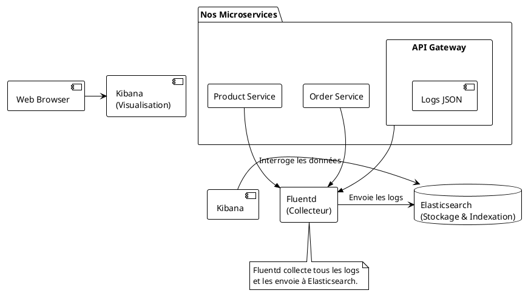

# Module 10 : Logs Centralisés (Pattern EFK) - Voir clair dans le brouillard

### Objectifs Pédagogiques

À la fin de ce module, vous serez capable de :
*   Comprendre la nécessité de centraliser les logs dans une architecture distribuée.
*   Décrire le rôle de chaque composant de la stack EFK (Elasticsearch, Fluentd, Kibana).
*   Configurer un microservice Spring Boot pour produire des logs structurés au format JSON.
*   Exploiter l'interface de Kibana pour rechercher et filtrer les logs de manière efficace.
*   Apprécier l'importance des ID de corrélation pour suivre une requête à travers plusieurs services.

### Introduction : La recherche de l'aiguille dans une botte de foin

Imaginez un instant que notre application "GestBook" est en production. Un utilisateur vous appelle, furieux : "J'ai essayé de passer une commande il y a 5 minutes, et j'ai eu une erreur obscure !".

Dans notre architecture, cette simple requête a potentiellement traversé :
1.  L'**API Gateway**
2.  L'**Order Service**
3.  Le **Product Service**

Pour comprendre ce qui s'est passé, vous devriez :
1.  Vous connecter au serveur (ou conteneur) de l'API Gateway et fouiller dans ses fichiers de logs.
2.  Faire de même pour le serveur de l'Order Service.
3.  Et encore pour le Product Service.

C'est une tâche titanesque, lente et inefficace. C'est comme chercher une aiguille, non pas dans une botte de foin, mais dans trois bottes de foin différentes, sans savoir dans laquelle elle se trouve. C'est ici qu'intervient la **centralisation des logs**. L'idée est simple : tous les services envoient leurs logs vers un seul et même endroit, où ils peuvent être stockés, indexés et interrogés facilement.

### La Stack EFK : Notre Centre de Tri du Courrier

Pour mettre en place cette centralisation, nous allons utiliser une stack très populaire : **EFK**.

*   **E - Elasticsearch :** C'est la base de données de notre système. Mais ce n'est pas une base de données relationnelle. C'est un moteur de recherche et d'analyse extrêmement puissant, optimisé pour stocker, indexer et rechercher d'énormes volumes de données textuelles (comme nos logs) à une vitesse fulgurante. C'est notre entrepôt de "bottes de foin".

*   **F - Fluentd :** C'est le collecteur de logs. C'est l'agent "postier" qui tourne sur nos serveurs (ou en tant que service). Son rôle est de récupérer les logs de différentes sources (fichiers, sorties de conteneurs Docker, etc.), de les transformer si besoin (ex: ajouter des métadonnées), et de les acheminer de manière fiable vers une destination, en l'occurrence Elasticsearch. Il est léger et très configurable. C'est une alternative populaire à Logstash (qui donne la stack ELK).

*   **K - Kibana :** C'est l'interface de visualisation. C'est la magnifique salle de tri avec des outils de recherche, des loupes et des filtres. Kibana est une application web qui se connecte à Elasticsearch et nous permet d'explorer nos logs, de créer des tableaux de bord, des graphiques et des alertes. C'est notre principal outil d'investigation.



### L'importance des Logs Structurés (JSON)

Un log standard ressemble souvent à ceci :
`2023-10-27 10:30:05.123 INFO [product-service] [http-nio-8081-exec-1] c.f.s.p.ProductController - Product with id 1 found.`

C'est lisible pour un humain, mais difficile à analyser pour une machine. Pour la filtrer, il faut utiliser des expressions régulières complexes.

La solution est le **log structuré**, le plus souvent au format **JSON**. On configure notre application pour qu'elle produise des logs qui sont déjà des objets JSON :

```json
{
  "@timestamp": "2023-10-27T10:30:05.123+02:00",
  "level": "INFO",
  "service": "product-service",
  "thread_name": "http-nio-8081-exec-1",
  "logger_name": "fr.formation.spring.productservice.controller.ProductController",
  "message": "Product with id 1 found.",
  "product_id": 1,
  "trace_id": "a4fde8a1-b2c3-4d5e-f6a7-b8c9d0e1f2a3"
}
```

**Pourquoi c'est mieux ?**
*   **Facile à parser :** Elasticsearch adore le JSON. Il va automatiquement créer des "champs" pour `level`, `service`, `product_id`, etc.
*   **Recherche puissante :** Avec Kibana, on peut alors faire des recherches très simples et puissantes, comme :
    *   `level: "ERROR"` (Montre-moi toutes les erreurs)
    *   `service: "order-service"` (Montre-moi uniquement les logs de ce service)
    *   `product_id: 123` (Montre-moi tous les logs concernant ce produit spécifique)

### L'ID de Corrélation : Suivre une Requête de bout en bout

C'est la fonctionnalité la plus magique. Comment savoir que le log de l'API Gateway, celui de l'Order Service et celui du Product Service concernent tous la même requête de l'utilisateur ?

Grâce à un **ID de trace** (ou ID de corrélation). Des bibliothèques comme **Micrometer Tracing** (le successeur de Spring Cloud Sleuth) s'en chargent pour nous.
1.  Quand une requête entre pour la première fois dans notre système (au niveau de l'API Gateway), Micrometer Tracing lui assigne un ID de trace unique (ex: `a4fde8a1...`).
2.  Cet ID est ajouté à un contexte de log (le MDC - Mapped Diagnostic Context). Notre logger JSON l'inclura dans chaque ligne de log.
3.  **Plus important :** Lorsque la Gateway fait un appel à l'Order Service, Micrometer Tracing propage automatiquement cet ID de trace dans les en-têtes HTTP de la requête.
4.  L'Order Service reçoit la requête, voit l'en-tête, et utilise ce même ID de trace pour tous ses propres logs.
5.  Et ainsi de suite...

Le résultat ? Tous les logs générés par une seule et même requête utilisateur, à travers tous les microservices, partagent le **même `trace_id`**.

Dans Kibana, il suffit alors de filtrer sur cet ID (`trace_id: "a4fde8a1-b2c3-4d5e-f6a7-b8c9d0e1f2a3"`) pour voir l'histoire complète et chronologique de la requête, de son entrée à sa sortie. Le débogage devient un jeu d'enfant.

---

### Conclusion de la partie

Vous comprenez maintenant que les logs ne sont pas juste des messages affichés dans une console, mais une source de données vitale pour l'**observabilité** de votre système. Vous avez vu que dans un monde distribué, la **centralisation** est obligatoire.

Vous avez découvert la stack **EFK (Elasticsearch, Fluentd, Kibana)** et le rôle de chacun de ses composants. Vous avez surtout compris deux concepts fondamentaux qui décuplent la puissance de la centralisation :
1.  Le **log structuré (JSON)**, qui transforme vos logs en données interrogeables.
2.  L'**ID de trace**, qui vous permet de suivre une requête à travers le labyrinthe de vos microservices.

Dans le TP qui suit, nous allons ajouter la stack EFK à notre `docker-compose.yml`, configurer nos services pour qu'ils parlent en JSON, et utiliser Kibana pour explorer le flux de logs de notre application.

---

### Auto-évaluation

1.  **(Question ouverte)** Expliquez avec vos propres mots le principal problème que la centralisation des logs cherche à résoudre.
2.  **(QCM)** Dans la stack EFK, quel composant est responsable de la collecte et de l'acheminement des logs ?
    *   A) Elasticsearch
    *   B) Fluentd
    *   C) Kibana
    *   D) Logback
3.  **(QCM)** Quel est le principal avantage de produire des logs au format JSON ?
    *   A) Ils sont plus compacts que le texte brut.
    *   B) Ils sont plus faciles à lire pour un humain.
    *   C) Ils sont nativement structurés, ce qui facilite leur indexation et leur interrogation par des outils.
    *   D) Ils sont chiffrés par défaut.
4.  **(Question ouverte)** Qu'est-ce qu'un ID de trace (ou de corrélation) et comment est-il propagé entre les microservices ?
5.  **(QCM)** Pour retrouver tous les logs liés à une seule requête utilisateur qui a traversé 3 microservices, sur quel champ est-il plus efficace de filtrer dans Kibana ?
    *   A) `level: "INFO"`
    *   B) `service: "api-gateway"`
    *   C) `timestamp`
    *   D) `trace_id`