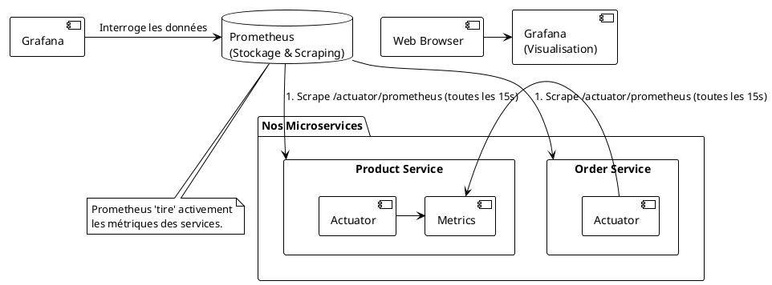

# Module 11 : Monitoring et Métriques (Prometheus & Grafana) - Prendre le pouls du système

### Objectifs Pédagogiques

À la fin de ce module, vous serez capable de :
*   Différencier le monitoring (métriques) du logging.
*   Expliquer le rôle de Spring Boot Actuator pour exposer des métriques.
*   Décrire le modèle de collecte de Prometheus (scraping).
*   Présenter Grafana comme outil de visualisation et de création de tableaux de bord.
*   Comprendre le rôle de Micrometer comme façade d'instrumentation.

### Introduction : Le tableau de bord du pilote

Dans le module précédent, nous avons installé une "boîte noire" (EFK) dans notre voiture. Si un accident se produit, nous pouvons l'analyser pour comprendre ce qui s'est passé. C'est essentiel, mais c'est réactif.

Maintenant, nous allons équiper notre voiture d'un **tableau de bord**. Nous voulons voir en temps réel la vitesse, le régime moteur, la température de l'huile, le niveau de carburant... Ce sont des **métriques**. Elles nous permettent de savoir si tout va bien *maintenant*, et de détecter des problèmes *avant* qu'ils ne provoquent un accident. Par exemple, si la température du moteur monte en flèche, on peut s'arrêter avant que le moteur ne casse.

Le **monitoring** est l'activité qui consiste à collecter, agréger et visualiser ces métriques. Le **logging** raconte ce qui *s'est passé*, le **monitoring** décrit ce qui *se passe*.

### La Stack Prometheus & Grafana : Nos Cadrans et Jauges

Pour mettre en place le monitoring, nous allons utiliser une autre stack très populaire, souvent en complément d'EFK.

*   **Spring Boot Actuator (Le Capteur) :** C'est un projet de Spring Boot qui "instrumente" notre application. En ajoutant simplement une dépendance, notre service va automatiquement exposer un ensemble de "capteurs" via des endpoints HTTP (par exemple, `/actuator/health`, `/actuator/metrics`). Ces capteurs fournissent des informations sur la santé de l'application, l'état de la JVM, le nombre de requêtes HTTP reçues, leur temps de réponse, etc.

*   **Prometheus (La Base de Données Temporelles) :** Prometheus est une base de données open-source spécifiquement conçue pour stocker des **séries temporelles** (time series), c'est-à-dire des métriques avec un timestamp. Son modèle de fonctionnement est basé sur le **pull** (tirer) : à intervalle régulier (ex: toutes les 15 secondes), Prometheus va lui-même contacter les endpoints `/actuator/prometheus` de tous nos microservices pour "gratter" (to scrape) les dernières valeurs des métriques et les stocker.

*   **Grafana (Le Tableau de Bord) :** Grafana est l'outil de visualisation. Il se connecte à une source de données (comme Prometheus) et permet de créer des tableaux de bord magnifiques et interactifs avec des graphiques, des jauges, des alertes, etc. C'est ici que nous allons visualiser l'état de santé de notre système.

### Micrometer : La Façade d'Instrumentation

Comment Spring Boot Actuator fait-il pour exposer des métriques dans un format que Prometheus comprend ? Grâce à **Micrometer**.

> **Définition :** **Micrometer** est une façade de collecte de métriques pour les applications JVM. C'est l'équivalent de SLF4J (la façade de logging), mais pour les métriques.

Micrometer fournit une API simple pour enregistrer des métriques dans votre code (`Counter`, `Gauge`, `Timer`...). Ensuite, en fonction des dépendances que vous ajoutez à votre projet, il peut "exporter" ces métriques dans des dizaines de formats différents : Prometheus, Datadog, InfluxDB, etc.

Lorsque nous ajoutons la dépendance `micrometer-registry-prometheus`, nous disons à Micrometer : "Prends toutes les métriques et expose-les sur un endpoint `/actuator/prometheus` dans le format textuel que Prometheus adore."

C'est extrêmement puissant, car si un jour on décide de changer de système de monitoring, il suffit de changer une dépendance (`micrometer-registry-datadog`) sans avoir à modifier une seule ligne de notre code d'instrumentation.

### Types de Métriques à Surveiller

On peut classer les métriques en deux grandes catégories :

1.  **Métriques Techniques (ou Système) :** Elles décrivent la santé de l'infrastructure. Spring Boot Actuator nous en fournit beaucoup par défaut :
    *   **JVM :** Utilisation de la mémoire (heap, non-heap), nombre de threads, activité du Garbage Collector.
    *   **CPU :** Utilisation du processeur.
    *   **Requêtes HTTP :** Nombre de requêtes par seconde, temps de latence (moyenne, p95, p99), nombre d'erreurs 4xx/5xx.
    *   **Pool de connexions DB :** Nombre de connexions actives, en attente.

2.  **Métriques Métier (ou Business) :** Elles décrivent la performance de l'application du point de vue du métier. Celles-ci, c'est à nous de les créer avec l'API Micrometer.
    *   Nombre d'utilisateurs inscrits par heure.
    *   Nombre de commandes passées.
    *   Chiffre d'affaires total.
    *   Taux d'échec de paiement.

Un bon tableau de bord combine ces deux types de métriques pour avoir une vision complète.

---

### Conclusion de la partie

Vous avez maintenant ajouté le deuxième pilier de l'observabilité à vos compétences. Vous savez faire la différence cruciale entre les **logs** (événements discrets) et les **métriques** (mesures continues).

Vous avez découvert la stack de monitoring standard de l'industrie cloud-native :
*   **Spring Boot Actuator** pour exposer les données de santé de vos services.
*   **Prometheus** pour collecter et stocker ces données de manière efficace.
*   **Grafana** pour les visualiser et créer des alertes.

Vous avez également compris le rôle central de **Micrometer** comme façade universelle, qui découple votre code de la technologie de monitoring sous-jacente.

Dans le TP suivant, nous allons ajouter Prometheus et Grafana à notre `docker-compose.yml`, configurer nos services pour qu'ils exposent leurs métriques, et enfin, construire notre premier tableau de bord dans Grafana pour visualiser en temps réel la santé de notre écosystème "GestBook".

---

### Auto-évaluation

1.  **(Question ouverte)** Expliquez avec vos propres mots la différence entre logging et monitoring.
2.  **(QCM)** Quel est le modèle de collecte de données utilisé par Prometheus ?
    *   A) Push : les services envoient leurs métriques à Prometheus.
    *   B) Pull : Prometheus contacte les services pour récupérer leurs métriques.
    *   C) Streaming : les services maintiennent une connexion ouverte avec Prometheus.
    *   D) Manuel : un administrateur doit copier/coller les métriques.
3.  **(QCM)** Quel composant est responsable de la création de tableaux de bord et de la visualisation des métriques ?
    *   A) Prometheus
    *   B) Actuator
    *   C) Grafana
    *   D) Micrometer
4.  **(Question ouverte)** Quel est le rôle de Micrometer et pourquoi est-il comparable à SLF4J ?
5.  **(QCM)** Le nombre de commandes créées par minute est un exemple de :
    *   A) Métrique technique
    *   B) Log d'erreur
    *   C) Métrique métier
    *   D) Trace distribuée