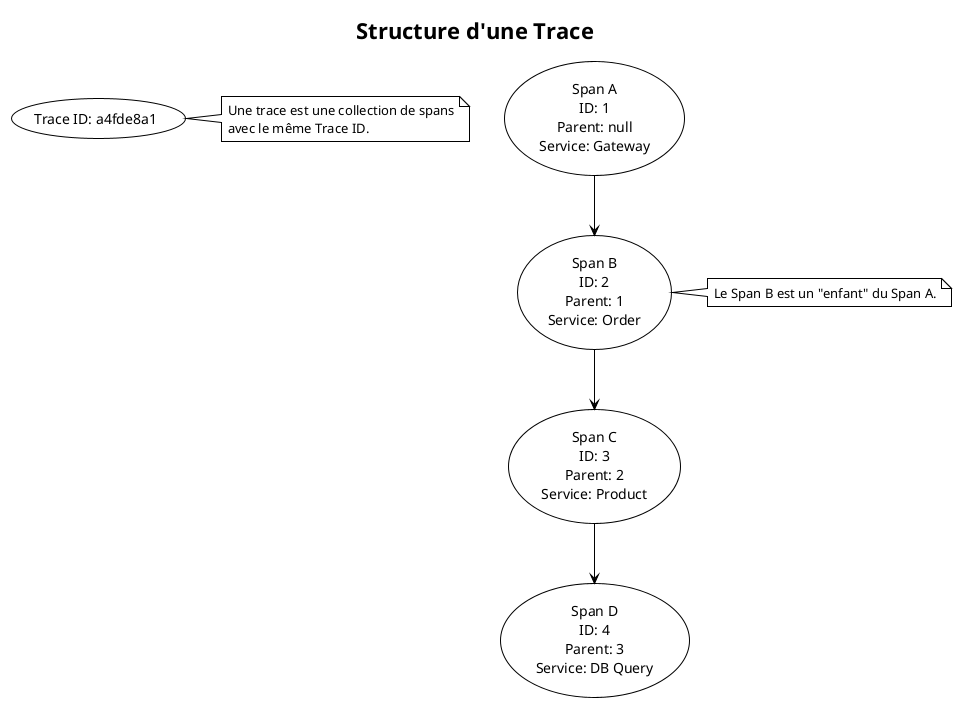
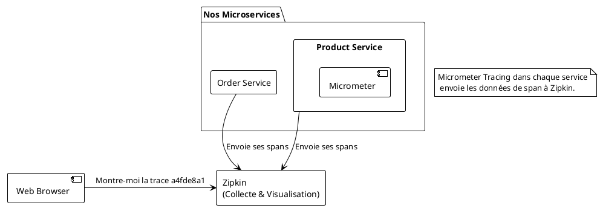

# Module 12 : Tracing Distribué (Zipkin) - Sur la piste de la requête perdue

### Objectifs Pédagogiques

À la fin de ce module, vous serez capable de :
*   Expliquer le problème du débogage des latences dans un système distribué.
*   Définir les concepts du tracing : Trace, Span et ID de corrélation.
*   Comprendre le rôle de Micrometer Tracing pour l'instrumentation automatique.
*   Présenter Zipkin comme un outil de collecte et de visualisation de traces.
*   Analyser un diagramme en cascade (waterfall) pour identifier les goulots d'étranglement.

### Introduction : Le détective des temps de réponse

Imaginez qu'un utilisateur se plaigne : "Chaque fois que j'ajoute un article à mon panier, ça prend 5 secondes, c'est trop long !".

Notre tableau de bord Grafana nous confirme qu'il y a un pic de latence sur l'endpoint `POST /api/orders`. Nos logs nous montrent que la requête a bien traversé la Gateway, l'Order Service et le Product Service. Mais **OÙ** sont passées ces 5 secondes ?
*   Est-ce l'API Gateway qui est lente ?
*   Est-ce que l'Order Service passe beaucoup de temps à traiter la logique avant d'appeler le Product Service ?
*   Est-ce que l'appel réseau entre les deux services est lent ?
*   Est-ce que le Product Service met beaucoup de temps à répondre ?
*   Est-ce que la requête à la base de données du Product Service est le goulot d'étranglement ?

Ni les logs, ni les métriques ne peuvent répondre à cette question avec précision. Il nous faut un nouvel outil, un "détective privé" capable de suivre une requête à la trace, de la chronométrer à chaque étape de son parcours et de nous fournir un rapport détaillé. Cet outil, c'est le **tracing distribué**.

### Les Concepts Clés du Tracing

Le tracing distribué repose sur une structure de données simple mais puissante.

*   **Trace :** Représente le parcours complet d'une requête à travers l'ensemble du système. Une trace est un ensemble de "spans". Elle est identifiée par un **Trace ID** unique, que nous avons déjà rencontré dans le module sur les logs.

*   **Span :** Représente une seule unité de travail ou une opération au sein d'une trace. Un appel à un microservice est un span. Un appel à une base de données est un span. Chaque span a :
    *   Un nom (ex: `POST /api/orders`).
    *   Un ID de span unique.
    *   L'ID de la trace à laquelle il appartient.
    *   Un ID de span parent (sauf pour le premier span).
    *   Un timestamp de début et de fin.
    *   Des "tags" (métadonnées clé-valeur, comme l'URL appelée, le statut HTTP...).

L'ensemble des spans d'une même trace forme une arborescence. C'est cette structure qui nous permet de reconstituer le chemin exact et la chronologie de la requête.



### Notre Boîte à Outils : Micrometer Tracing & Zipkin

*   **Micrometer Tracing (Le Mouchard) :** Comme pour les métriques, Micrometer nous fournit une façade d'instrumentation. Anciennement, c'était le rôle de **Spring Cloud Sleuth**, qui est maintenant intégré dans Micrometer. En ajoutant les bonnes dépendances, Micrometer va automatiquement "instrumenter" les points de communication de notre application (clients Feign, contrôleurs REST, appels JDBC, etc.). Pour chaque opération, il va :
    1.  Créer un nouveau span (ou continuer une trace existante).
    2.  Mesurer sa durée.
    3.  Propager le contexte (Trace ID, Span ID) aux appels sortants via les en-têtes HTTP (généralement `b3` ou `W3C Trace-Context`).

*   **Zipkin (Le Bureau du Détective) :** Zipkin est un système de collecte et de visualisation de traces, initialement développé par Twitter. Il est simple et très efficace. Son rôle est de :
    1.  Recevoir les données de spans envoyées par les microservices.
    2.  Les stocker.
    3.  Les assembler en traces.
    4.  Fournir une interface web pour rechercher des traces et les visualiser sous forme de diagramme en cascade (waterfall).

Le diagramme en cascade est la représentation la plus utile. Il montre la durée de chaque span et comment ils s'emboîtent, rendant les latences immédiatement visibles.


**Exemple de diagramme en cascade (waterfall) dans Zipkin :**

Imaginez ce diagramme dans l'interface de Zipkin. On voit instantanément que la requête à la base de données (`select product`) est la partie la plus longue de toute l'opération.

```
Requête complète ------------------------------------- [ 500ms ]
  api-gateway: GET /api/orders/1 --------------------- [ 495ms ]
    order-service: GET /... -------------------------- [ 480ms ]
      product-service: GET /api/products/123 --------- [ 450ms ]
        db: select product ... ----------------------- [ 400ms ]
```

---

### Conclusion de la partie

Vous avez maintenant la dernière pièce du puzzle de l'observabilité. Le **tracing distribué** est l'outil ultime pour comprendre les performances et les goulots d'étranglement de votre architecture microservices.

Vous avez appris les concepts fondamentaux de **Trace** et de **Span**, et compris comment ils s'assemblent pour raconter l'histoire d'une requête. Vous avez identifié la stack que nous allons utiliser :
*   **Micrometer Tracing** pour instrumenter automatiquement nos applications.
*   **Zipkin** pour collecter et visualiser ces traces.

Vous êtes maintenant prêt à répondre non seulement à "Est-ce que ça marche ?" (monitoring), et "Que s'est-il passé ?" (logging), mais aussi à "**Pourquoi est-ce lent ?**" (tracing).

Dans le TP qui suit, nous allons ajouter Zipkin à notre écosystème, instrumenter nos services, et enfin utiliser l'interface de Zipkin pour traquer une requête de bout en bout et analyser ses performances.

---

### Auto-évaluation

1.  **(Question ouverte)** Quel type de problème le tracing distribué résout-il, que ni les logs ni les métriques ne peuvent résoudre facilement ?
2.  **(QCM)** Dans le contexte du tracing, qu'est-ce qu'un "Span" ?
    *   A) L'ensemble du parcours d'une requête.
    *   B) Une seule unité de travail ou opération, comme un appel HTTP.
    *   C) Un log d'erreur.
    *   D) Un tableau de bord de visualisation.
3.  **(QCM)** Comment le contexte de trace (Trace ID, Span ID) est-il typiquement propagé d'un microservice à un autre ?
    *   A) Via le corps de la requête (payload).
    *   B) Via des en-têtes HTTP spécifiques (ex: B3 headers).
    *   C) Via une base de données partagée.
    *   D) Il n'est pas propagé, chaque service crée une nouvelle trace.
4.  **(Question ouverte)** Quel outil a été intégré dans Micrometer pour fournir la fonctionnalité de tracing, remplaçant ainsi un ancien projet de Spring Cloud ?
5.  **(QCM)** L'objectif principal de l'analyse d'un diagramme en cascade (waterfall) dans Zipkin est de :
    *   A) Compter le nombre d'erreurs.
    *   B) Voir le contenu des logs.
    *   C) Identifier visuellement les opérations qui prennent le plus de temps (latence).
    *   D) Lister tous les services impliqués.