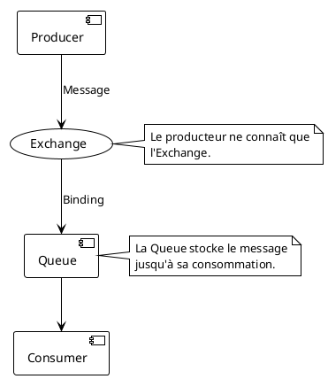
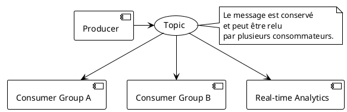

# Module 13 : Communication Asynchrone (RabbitMQ / Kafka) - Le Découplage Ultime

### Objectifs Pédagogiques

À la fin de ce module, vous serez capable de :

* Expliquer les avantages et les cas d'usage de la communication asynchrone par rapport à la communication synchrone.
* Distinguer les concepts d'un Message Broker (RabbitMQ) de ceux d'un Distributed Log (Kafka).
* Mettre en œuvre un pattern Producteur/Consommateur simple.
* Comprendre comment la communication asynchrone augmente la résilience et la scalabilité.

### Introduction : Le Téléphone vs. la Boîte aux Lettres

Jusqu'à présent, toutes nos communications étaient synchrones. L'Order Service "téléphonait" au Product Service et
attendait en ligne qu'il réponde. C'est simple et direct, parfait pour des requêtes qui nécessitent une réponse
immédiate ("Quel est le prix de ce produit ?").

Mais imaginez ce scénario : quand une commande est validée, nous devons effectuer plusieurs actions :

1. Envoyer un email de confirmation à l'utilisateur.
2. Notifier le service d'expédition.
3. Mettre à jour les statistiques de vente.

Si l'Order Service devait appeler séquentiellement trois autres services (Notification, Expédition, Statistiques) et
attendre leur réponse, le temps de réponse pour l'utilisateur final serait la somme de tous ces appels. Pire, si le
service de notification est en panne, la commande entière échoue, même si la partie la plus importante (la création de
la commande) a réussi.

La communication asynchrone propose une autre approche : la **boîte aux lettres**. L'Order Service ne fait qu'une seule
chose : il dépose un "message" (un événement `CommandeValidée`) dans une boîte aux lettres partagée, puis il répond
immédiatement à l'utilisateur "Votre commande est prise en compte !". Il ne se soucie pas de qui va lire ce message, ni
quand. Les autres services (Notification, Expédition...), quant à eux, sont abonnés à cette boîte aux lettres et
viendront récupérer le message pour le traiter à leur propre rythme.

### Synchronous vs. Asynchronous : Avantages et Inconvénients

| Aspect          | Synchrone (API REST)                                                          | Asynchrone (Messaging)                                                                                  |
|-----------------|-------------------------------------------------------------------------------|---------------------------------------------------------------------------------------------------------|
| **Couplage**    | **Temporel :** L'appelant et l'appelé doivent être disponibles en même temps. | **Découplage temporel :** L'émetteur et le récepteur n'ont pas besoin d'être disponibles simultanément. |
| **Latence**     | La latence pour l'utilisateur est la somme des latences de tous les appels.   | La latence pour l'utilisateur est très faible. Le traitement est différé.                               |
| **Résilience**  | Une panne dans un service appelé peut faire échouer toute la chaîne.          | Si un consommateur est en panne, le message reste dans la file et sera traité à son redémarrage.        |
| **Scalabilité** | L'appelant doit gérer les pics de charge de l'appelé.                         | La file de messages agit comme un tampon (buffer), lissant les pics de charge.                          |
| **Complexité**  | Plus simple à raisonner et à déboguer (flux direct).                          | Plus complexe : suivi des messages, gestion des erreurs, consistance à terme (eventual consistency).    |

### Deux Outils, Deux Philosophies : RabbitMQ vs. Kafka

Pour implémenter la communication asynchrone, on utilise un "intermédiaire", un **Message Broker** ou un **Event
Streaming Platform**. Les deux leaders du marché sont RabbitMQ et Kafka, mais ils fonctionnent différemment.

#### RabbitMQ (Le Facteur Intelligent)

RabbitMQ est un **Message Broker** traditionnel. Il implémente le protocole AMQP (Advanced Message Queuing Protocol). Il
est conçu comme un système postal intelligent.

* **Producer (Producteur) :** L'application qui envoie le message.
* **Consumer (Consommateur) :** L'application qui reçoit le message.
* **Exchange (Bureau de Tri) :** Le producteur envoie toujours ses messages à un Exchange. Il ne sait pas où le message
  va finir.
* **Queue (File d'attente / Boîte aux lettres) :** C'est là que les messages sont stockés en attendant d'être lus par un
  consommateur.
* **Binding (Règle de routage) :** C'est une règle qui lie un Exchange à une Queue. C'est le cœur de l'intelligence de
  RabbitMQ. On peut avoir des règles très complexes (ex: "Envoie tous les messages dont la clé de routage commence par
  `europe.` à cette file").

**Idéal pour :** Les messages de type **commande** (ex: "Envoie cet email"). Le routage intelligent et la garantie de
livraison à un consommateur spécifique sont ses points forts.

#### Kafka (Le Journal de Bord Public)

Kafka est différent. Ce n'est pas un simple broker, mais une **plateforme de streaming d'événements** (un "distributed
log"). Il a été conçu pour des volumes de données massifs (Big Data).

* **Producer :** Envoie des messages (ici appelés "records").
* **Consumer :** Lit des messages.
* **Topic (Sujet / Journal) :** C'est l'équivalent d'une catégorie. Les producteurs écrivent dans des topics.
* **Partition :** Un topic est divisé en plusieurs partitions pour la scalabilité et le parallélisme.
* **Offset :** Chaque message dans une partition a un numéro de séquence unique, l'offset. Les consommateurs ne
  suppriment pas les messages, ils se contentent de suivre leur offset de lecture ("J'ai lu jusqu'au message 42").

La grande différence est que les messages dans Kafka sont **immuables et persistants** pendant une période
configurable (ex: 7 jours). Plusieurs consommateurs (de types différents) peuvent relire le même flux d'événements pour
des besoins différents.

**Idéal pour :** Les messages de type **événement** (ex: "Un utilisateur a cliqué sur ce bouton"). Le streaming,
l'historisation des événements et la capacité à être lu par de multiples systèmes sont ses points forts.

### Intégration avec Spring

Spring facilite grandement l'utilisation de ces outils :

* **Spring AMQP :** Fournit une intégration de haut niveau avec RabbitMQ (`RabbitTemplate` pour produire,
  `@RabbitListener` pour consommer).
* **Spring for Kafka :** Fournit une intégration similaire pour Kafka (`KafkaTemplate` et `@KafkaListener`).
* **Spring Cloud Stream :** C'est une surcouche d'abstraction encore plus élevée. Elle permet d'écrire du code
  agnostique du broker sous-jacent. On écrit du code qui envoie des données à un "canal de sortie" (output channel) et
  en reçoit d'un "canal d'entrée" (input channel), et la configuration (`application.yml`) se charge de lier ces canaux
  à un topic Kafka ou un exchange RabbitMQ. C'est très puissant pour changer de technologie sans changer de code.

---

### Conclusion de la partie

Vous avez découvert un nouveau monde de communication, puissant et flexible. La **communication asynchrone** est la clé
pour construire des systèmes **hautement découplés, résilients et scalables**.

Vous avez appris :

* Les avantages du découplage temporel pour la **résilience** (un service qui tombe n'impacte pas les autres) et la *
  *scalabilité** (les files de messages absorbent les pics de charge).
* La différence fondamentale entre **RabbitMQ**, le facteur intelligent optimisé pour le routage de commandes, et *
  *Kafka**, le journal de bord distribué optimisé pour le streaming d'événements.

Dans le TP qui suit, nous allons mettre en pratique ces concepts. Nous allons ajouter RabbitMQ à notre
`docker-compose.yml`, créer un nouveau `notification-service`, et modifier notre `order-service` pour qu'il publie un
événement `OrderCreatedEvent` de manière asynchrone, démontrant ainsi la puissance du découplage.

---

### Auto-évaluation

1. **(Question ouverte)** Citez deux avantages de la communication asynchrone par rapport à la communication synchrone.
2. **(QCM)** Dans RabbitMQ, quelle est l'entité qui reçoit les messages des producteurs et les route vers les files d'
   attente ?
    * A) La Queue
    * B) Le Binding
    * C) L'Exchange
    * D) Le Consumer
3. **(QCM)** Quelle technologie est la plus adaptée pour un cas d'usage de type "Event Sourcing", où l'on veut conserver
   un historique immuable de tous les événements qui se sont produits ?
    * A) API REST
    * B) RabbitMQ
    * C) Kafka
    * D) gRPC
4. **(Question ouverte)** Expliquez ce qu'est le "découplage temporel" et pourquoi il améliore la résilience.
5. **(QCM)** L'annotation Spring `@RabbitListener` est utilisée pour :
    * A) Envoyer un message à une file RabbitMQ.
    * B) Déclarer une méthode comme étant un consommateur de messages d'une file RabbitMQ.
    * C) Créer une nouvelle file RabbitMQ.
    * D) Configurer la connexion à RabbitMQ.