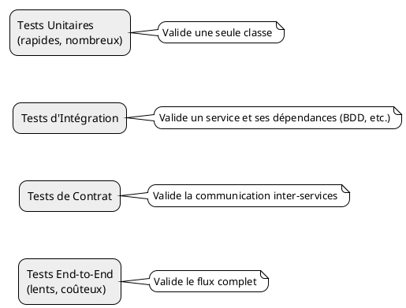
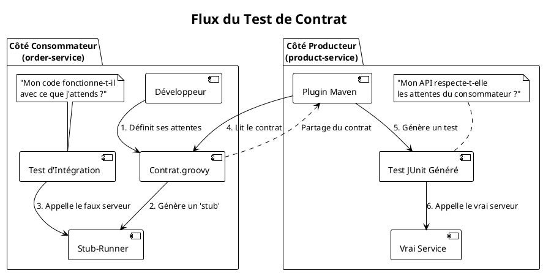

# Module 14 : Stratégies de Test pour les Microservices - Comment garantir la qualité ?

### Objectifs Pédagogiques

À la fin de ce module, vous serez capable de :

* Adapter la pyramide des tests au contexte des microservices.
* Expliquer l'intérêt des tests d'intégration et les défis qu'ils posent.
* Utiliser **Testcontainers** pour lancer des dépendances (comme une base de données) dans des conteneurs Docker durant
  les tests.
* Comprendre le concept de **Test de Contrat** (Consumer-Driven Contracts) et le problème qu'il résout.
* Décrire le rôle de **Spring Cloud Contract** dans la mise en œuvre des tests de contrat.

### Introduction : La confiance ne suffit pas

Nous avons construit une architecture complexe avec de nombreuses pièces mobiles. Comment être sûr que tout fonctionne ?
Et, plus important encore, comment s'assurer qu'une modification dans le `product-service` ne va pas casser l'
`order-service` qui en dépend ?

Dans un monolithe, les tests d'intégration étaient relativement simples. Dans une architecture microservices, c'est plus
compliqué. Lancer l'intégralité de l'écosystème (10, 20, 50 services) pour chaque test est lent, coûteux et instable.
Nous avons besoin de stratégies de test plus intelligentes et plus ciblées.

Ce module explore comment tester nos services de manière efficace et fiable, en se concentrant sur deux techniques
puissantes : les tests d'intégration avec **Testcontainers** et les **Tests de Contrat** avec Spring Cloud Contract.

### La Pyramide des Tests revisitée

La pyramide des tests classique s'applique toujours, mais avec quelques nuances.

* **Tests Unitaires (la base) :** Ils restent le fondement. Ils testent une seule classe, une seule méthode, de manière
  totalement isolée (en "mockant" ses dépendances). Ils sont rapides et peu coûteux. Rien de nouveau ici, mais ils sont
  plus importants que jamais.

* **Tests d'Intégration (le milieu) :** C'est ici que les choses changent. Un test d'intégration pour un microservice
  doit valider le service dans son ensemble (du contrôleur à la base de données), mais de manière **isolée des autres
  microservices**. C'est un test de la "boîte noire" du service. Le grand défi est de gérer ses dépendances externes (
  base de données, message broker...).

* **Tests de Contrat (nouveau !) :** Ils se situent entre les tests d'intégration et les tests E2E. Ils ne testent pas
  la logique métier, mais s'assurent que la "convention de communication" (le contrat) entre un service consommateur et
  un service producteur est respectée.

* **Tests End-to-End (E2E - le sommet) :** Ils testent un parcours utilisateur complet à travers tout le système
  déployé. Ils sont lents, fragiles et coûteux, mais nécessaires pour valider que l'intégration globale fonctionne. On
  en fait le moins possible.

### Tests d'Intégration avec Testcontainers

Comment tester notre `product-service` et son interaction avec sa base de données PostgreSQL sans avoir à installer
PostgreSQL sur la machine du développeur ou sur le serveur d'intégration continue ?

**Testcontainers** est la solution. C'est une bibliothèque Java qui permet de lancer n'importe quel conteneur Docker
directement depuis votre code de test JUnit.

> **Définition :** **Testcontainers** fournit des instances légères et jetables de services courants (bases de données,
> brokers, etc.) dans des conteneurs Docker, à utiliser dans les tests.

**Comment ça marche ?**

1. Vous ajoutez la dépendance Testcontainers à votre `pom.xml`.
2. Dans votre classe de test, vous déclarez un conteneur (ex: `PostgreSQLContainer`).
3. Testcontainers va démarrer ce conteneur Docker avant l'exécution de vos tests.
4. Il vous fournit l'adresse, le port, le nom d'utilisateur, etc. du conteneur fraîchement démarré.
5. Vous configurez votre application Spring Boot (pour ce test uniquement) pour qu'elle se connecte à cette base de
   données jetable.
6. À la fin des tests, Testcontainers détruit le conteneur.

Cela garantit des tests d'intégration **fiables, reproductibles et totalement isolés**.

### Tests de Contrat (Consumer-Driven Contracts)

C'est le concept le plus novateur.
**Le problème :** L'équipe du `product-service` veut ajouter un nouveau champ `description` à son API
`GET /api/products/{id}`. C'est une modification non cassante. Mais dans la précipitation, ils renomment le champ
`price` en `cost`. Catastrophe ! L'`order-service`, qui s'attendait à un champ `price`, va planter. Comment détecter
cela *avant* de déployer ?

**La solution :** Le **Consommateur** (`order-service`) va **définir un contrat**. Ce contrat est un fichier texte
simple qui décrit ses attentes : "Quand j'appelle `GET /api/products/1`, je m'attends à recevoir une réponse `200 OK`
avec un corps JSON qui contient un champ numérique `price`."

Ce contrat est ensuite partagé avec le **Producteur** (`product-service`).

**Notre outil : Spring Cloud Contract**
Spring Cloud Contract automatise ce processus.

1. **Côté Consommateur (`order-service`) :**
    * Le développeur écrit une définition de contrat (souvent en Groovy ou YAML).
    * Il utilise une dépendance (`spring-cloud-starter-contract-verifier`) qui va générer à partir de ce contrat un *
      *stub** (un faux serveur).
    * Le consommateur peut alors écrire des tests d'intégration qui appellent ce stub au lieu du vrai `product-service`,
      garantissant que sa logique est compatible avec le contrat.

2. **Côté Producteur (`product-service`) :**
    * Le producteur récupère le contrat défini par le consommateur.
    * Il utilise le plugin Maven `spring-cloud-contract-maven-plugin`.
    * Ce plugin va lire le contrat et **générer automatiquement une classe de test JUnit** !
    * Cette classe de test démarre le vrai `product-service`, lui envoie la requête décrite dans le contrat, et vérifie
      que la réponse est bien conforme au contrat.
    * Ce test s'exécute à chaque build du `product-service`. Si l'équipe renomme `price` en `cost`, le test généré
      échouera, et la modification sera bloquée avant même d'être déployée.

Le contrat devient la source unique de vérité qui garantit que le consommateur et le producteur restent synchronisés.

---

### Conclusion de la partie

Tester les microservices n'est pas plus difficile, c'est simplement différent. Vous avez maintenant une vision claire
des stratégies modernes pour assurer la qualité de votre architecture.

Vous avez appris l'importance :

* Des **tests d'intégration** isolés, rendus fiables et portables grâce à **Testcontainers**.
* Des **tests de contrat**, un pattern puissant pour éviter les ruptures de compatibilité entre services, implémenté
  avec **Spring Cloud Contract**.

Ces techniques permettent aux équipes de travailler de manière autonome tout en ayant un haut degré de confiance dans le
fait que leurs modifications n'auront pas d'impact négatif sur le reste de l'écosystème.

Dans le TP final, nous allons mettre en pratique ces deux approches. Nous allons d'abord écrire un test d'intégration
pour notre `product-service` en utilisant Testcontainers pour lancer une base de données PostgreSQL. Ensuite, nous
mettrons en place un test de contrat simple entre l'`order-service` et le `product-service`.

---

### Auto-évaluation

1. **(Question ouverte)** Quel est le principal défi des tests d'intégration dans une architecture microservices, et
   comment Testcontainers aide-t-il à le résoudre ?
2. **(QCM)** Dans un scénario de test de contrat, qui définit le contrat ?
    * A) Le service Producteur
    * B) Le service Consommateur
    * C) Une équipe d'architectes indépendante
    * D) Le contrat est généré automatiquement en observant le trafic réseau.
3. **(QCM)** Testcontainers est une bibliothèque qui permet de :
    * A) Tester des interfaces utilisateur dans des conteneurs.
    * B) Lancer des dépendances (BDD, brokers...) dans des conteneurs Docker durant les tests JUnit.
    * C) Analyser la sécurité des conteneurs Docker.
    * D) "Containeriser" une application de test.
4. **(Question ouverte)** Quel est le principal avantage d'utiliser les tests de contrat par rapport aux tests
   End-to-End pour vérifier la compatibilité entre deux services ?
5. **(QCM)** Côté Producteur, le plugin Spring Cloud Contract...
    * A) ...génère un client de test pour appeler le consommateur.
    * B) ...génère un stub du consommateur.
    * C) ...lit un contrat et génère un test JUnit qui vérifie que le producteur respecte ce contrat.
    * D) ...lit un contrat et génère la documentation de l'API.