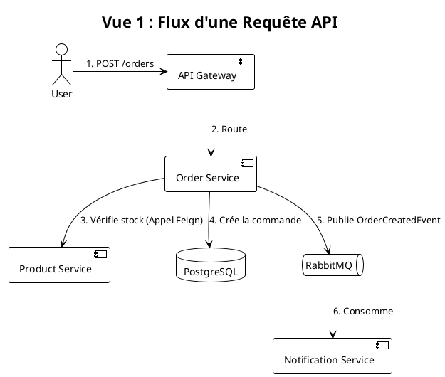
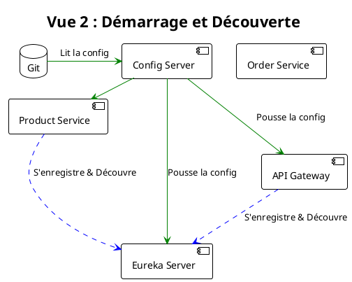
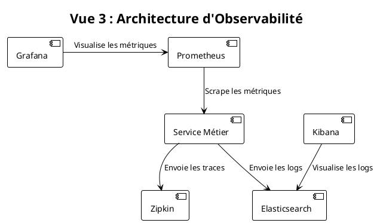
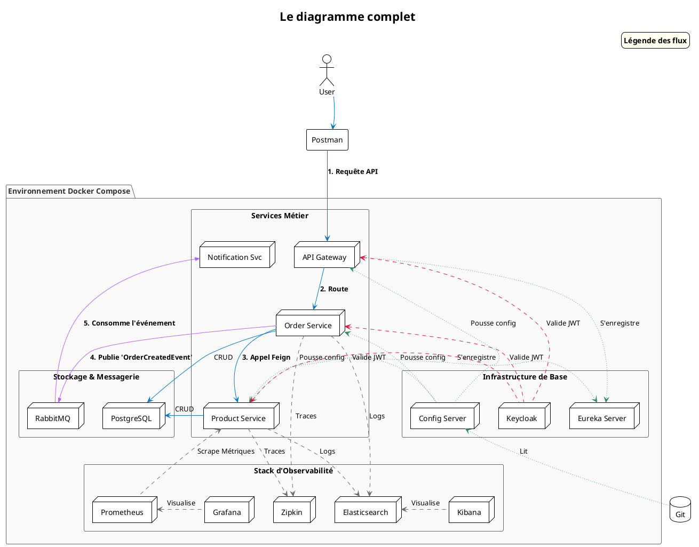

# Conclusion et Pour Aller Plus Loin

### Objectifs Pédagogiques

À la fin de ce module final, vous serez capable de :

* Synthétiser l'architecture complète que vous avez construite.
* Prendre du recul sur les avantages et les défis de cette architecture.
* Identifier les prochaines étapes logiques pour faire évoluer ce projet vers un système de production.
* Découvrir d'autres technologies et concepts de l'écosystème cloud-native.

### Introduction : Le Voyage Accompli

Félicitations ! Regardez le chemin parcouru. Nous sommes partis d'une simple idée, celle de déconstruire un monolithe,
et nous avons, brique par brique, assemblé une architecture microservices complète, fonctionnelle, robuste et
observable.

Vous n'avez pas seulement lu des concepts, vous les avez mis en œuvre. Vous avez joué le rôle de l'architecte, du
développeur, de l'ingénieur DevOps et de l'ingénieur qualité. Vous avez affronté les problèmes concrets de la
communication distribuée, de la configuration, de la sécurité et des tests, et vous les avez résolus avec les outils
standards de l'industrie.

Ce dernier chapitre n'est pas un TP, mais un moment de recul. Nous allons admirer la "cathédrale" que nous avons bâtie,
comprendre ses forces et ses faiblesses, et dessiner la carte des territoires qui restent à explorer.

### Synthèse de l'Architecture Construite

Ce que vous avez bâti est un formidable exemple d'une architecture microservices moderne basée sur l'écosystème Spring.

Voici une vue d'ensemble de tous les composants et de leurs interactions :

Vous avez mis en place les patterns fondamentaux :

* **Service Discovery** (Eureka)
* **Externalized Configuration** (Config Server)
* **API Gateway** (Spring Cloud Gateway)
* **Circuit Breaker** (Resilience4j)
* **Centralized Logging** (EFK)
* **Distributed Tracing** (Zipkin)
* **Metrics & Monitoring** (Prometheus & Grafana)
* **Centralized Authentication** (Keycloak & OAuth2)
* **Asynchronous Messaging** (RabbitMQ)

C'est un accomplissement remarquable qui couvre une très grande partie des problématiques des systèmes distribués.

### Discussion sur les Prochaines Étapes

Notre projet est un excellent squelette, mais pour le transformer en un système de production, plusieurs pistes
d'amélioration et d'exploration s'offrent à vous.

#### 1. Améliorer la Résilience et la Configuration

* **Haute Disponibilité des services d'infrastructure :** Lancer plusieurs instances d'Eureka Server qui s'enregistrent
  les unes auprès des autres. Faire de même pour le Config Server.
* **Refresh dynamique de la configuration :** Actuellement, pour qu'un changement de configuration soit pris en compte,
  il faut appeler l'endpoint `/actuator/refresh` sur chaque instance de chaque service. En utilisant **Spring Cloud Bus
  ** avec RabbitMQ ou Kafka, un seul appel à la Gateway pourrait diffuser l'événement de rafraîchissement à tous les
  services en une seule fois.

#### 2. Déploiement et Automatisation (CI/CD)

* **Intégration Continue (CI) :** Mettre en place un pipeline (avec Jenkins, GitLab CI, GitHub Actions...) qui, à chaque
  `git push`, compile le code, exécute les tests unitaires, d'intégration et de contrat, et construit les images Docker.
* **Déploiement Continu (CD) :** Automatiser le déploiement de ces nouvelles images dans un environnement de staging ou
  de production.
* **Orchestration de production :** Docker Compose est fantastique pour le développement, mais en production, on utilise
  des orchestrateurs plus puissants comme **Kubernetes (K8s)**. Apprendre à "traduire" votre `docker-compose.yml` en
  manifestes Kubernetes (Deployments, Services, Ingress...) est la prochaine grande étape pour un développeur
  cloud-native.

#### 3. Stratégies de Données Avancées

* **Pattern Saga :** Comment gérer une transaction qui s'étend sur plusieurs services ? Par exemple, une commande doit
  réserver un produit, traiter un paiement et notifier l'expédition. Si le paiement échoue, il faut annuler la
  réservation du produit. Le pattern Saga, qui utilise des événements et des actions de compensation, est la solution
  pour gérer la consistance des données distribuées.
* **CQRS (Command Query Responsibility Segregation) :** Séparer le modèle utilisé pour les écritures (commandes) de
  celui utilisé pour les lectures (requêtes). Cela permet d'optimiser chaque côté indépendamment et se marie très bien
  avec les microservices.

#### 4. Aller plus loin dans l'écosystème

* **gRPC :** Explorer des protocoles de communication alternatifs à REST, comme gRPC, qui est souvent plus performant
  pour la communication interne entre services.
* **Service Mesh (ex: Istio, Linkerd) :** Pour les architectures très complexes, un Service Mesh peut externaliser une
  grande partie de la logique de communication (routing, circuit breaking, sécurité mTLS...) hors du code de
  l'application, dans un "sidecar proxy" qui tourne à côté de chaque service.
* **Tests de performance et de charge :** Utiliser des outils comme Gatling ou k6 pour simuler des milliers
  d'utilisateurs et tester comment votre architecture se comporte sous pression.

---

### Auto-évaluation Finale

Voici quelques questions pour faire le point sur l'ensemble du cours.

1. **(Question ouverte)** Si un nouveau développeur rejoint votre équipe, quel est, selon vous, le principal avantage de
   lui fournir le `docker-compose.yml` que vous avez créé ?
2. **(Question ouverte)** Expliquez le cheminement d'une requête de création de commande depuis le client REST jusqu'à
   la base de données de l'`order-service`, en nommant les principaux composants traversés dans l'ordre.
3. **(Question ouverte)** Un utilisateur se plaint d'une erreur 500 intermittente. Décrivez votre plan d'action en 3
   étapes pour diagnostiquer le problème, en utilisant les outils d'observabilité que vous avez mis en place.
4. **(Question ouverte)** L'équipe `product-service` souhaite changer le type de sa base de données de PostgreSQL à
   MongoDB. Quel est l'impact de ce changement sur l'`order-service` ? Expliquez pourquoi.
5. **(Question ouverte)** Vous devez ajouter une nouvelle fonctionnalité : un service de "wishlist" (liste de souhaits).
   Décrivez les grandes étapes pour intégrer ce nouveau microservice dans l'architecture existante.

---

### Conclusion Finale

Vous voilà au terme de ce parcours intensif. Vous avez non seulement appris la **théorie** des microservices, mais vous
l'avez surtout **pratiquée**. Vous avez construit un système qui, il y a quelques années, aurait nécessité des mois de
travail et des équipes d'experts. Aujourd'hui, grâce à la puissance de l'écosystème Spring et des outils cloud-native,
vous avez pu le faire vous-même.

Le titre de "Concepteur Développeur d'Applications" prend tout son sens ici. Vous n'êtes plus seulement un codeur, mais
un véritable architecte, capable de raisonner sur des systèmes distribués, de faire des choix technologiques éclairés et
de construire des applications modernes, scalables et résilientes.

Ce cours vous a donné des fondations solides. Le monde du cloud et des microservices est en constante évolution, alors
restez curieux, continuez à expérimenter, et n'hésitez jamais à explorer les pistes que nous avons évoquées. Le voyage
ne fait que commencer. Bravo pour votre travail et votre persévérance !

---

# Annexe : Corrections des Auto-évaluations

{collapsible="true" title="Cliquez pour voir les corrections"}

### Module 1

1. **Mise à l'échelle :** Pour un monolithe, on met à l'échelle "horizontalement" en dupliquant l'intégralité de l'
   énorme application, même les parties peu utilisées. Pour les microservices, on met à l'échelle de manière ciblée, en
   ajoutant des instances uniquement pour les services qui subissent une forte charge, ce qui est beaucoup plus efficace
   en termes de ressources.
2. B) Le couplage fort entre les modules rend les changements difficiles et risqués.
3. B) Base de données unique et centralisée pour tous les services.
4. **"Un service, une base de données" :** Ce principe garantit qu'un service est le seul maître de son schéma de
   données. Si d'autres services pouvaient modifier directement sa base, le service ne serait plus autonome. Il ne
   pourrait pas faire évoluer son modèle de données sans risquer de casser les autres services, ce qui recréerait un
   couplage fort.
5. B) Seul le "Service Produits" (ou un "Service Prix") devra être modifié et redéployé, sans toucher aux autres
   services.
6. B) La scalabilité indépendante.
7. **Panne en cascade :** C'est un effet domino où la panne d'un service (ex: service C) provoque la panne du service
   qui l'appelle (service B, car ses ressources sont bloquées en attente), qui à son tour fait tomber le service A, etc.
   Le pattern pour s'en prémunir est le **Circuit Breaker** (Disjoncteur), implémenté dans notre cours avec *
   *Resilience4j**.
8. C) Polyglottisme technologique.
9. **Deux nouveaux problèmes :** a) **Latence réseau :** l'appel se fait via le réseau (HTTP), ce qui est beaucoup plus
   lent qu'un appel de méthode en mémoire. b) **Fiabilité du réseau / Panne partielle :** le `product-service` peut être
   en panne ou le réseau peut être indisponible, ce qui n'arrive pas pour un appel de méthode local.
10. C) Permettre aux services de se trouver les uns les autres sur le réseau.

### Module 2

1. B) `spring-boot-starter-web`
2. **`@RestController`** est une annotation de commodité qui combine `@Controller` et `@ResponseBody`. Elle indique que
   la classe est un contrôleur REST et que les valeurs retournées par ses méthodes doivent être directement écrites dans
   le corps de la réponse HTTP (souvent en JSON), sans passer par un système de vues (comme Thymeleaf ou JSP).
   `@Controller` seul est utilisé pour les applications web traditionnelles qui retournent des vues.
3. C) À spécifier le port d'écoute du serveur web embarqué.
4. **`extends JpaRepository` :** Cette ligne déclare que `ProductRepository` est une interface gérée par Spring Data
   JPA. En étendant `JpaRepository`, on hérite d'un ensemble complet de méthodes CRUD (`save`, `findById`, `findAll`,
   `delete`...). Spring Data JPA analyse le nom des méthodes que l'on pourrait y ajouter (ex: `findByName(String name)`)
   et génère dynamiquement l'implémentation et la requête JPQL correspondante au démarrage de l'application. On n'a donc
   pas besoin d'écrire le code nous-mêmes.
5. B) POST, 201 Created

### TP 1

1. **Avantage du multi-stage build :** Il permet de produire une image Docker finale beaucoup plus **petite** et plus *
   *sécurisée**. L'image finale ne contient que l'environnement d'exécution Java (JRE) et le `.jar` de l'application,
   tandis que tous les outils de build (Maven, le JDK complet, le code source) qui étaient dans la première étape sont
   jetés.
2. B) `docker ps`
3. B) `RUN` exécute une commande pendant la construction de l'image, `ENTRYPOINT` spécifie la commande à exécuter quand
   un conteneur est lancé.
4. Sur `http://localhost:8000`. Le premier chiffre de `-p 8000:8081` est le port sur la machine hôte, le second est le
   port à l'intérieur du conteneur.
5. C) Pour profiter du système de cache de Docker et accélérer les builds futurs. Les dépendances du `pom.xml` changent
   moins souvent que le code source. En les copiant en premier, Docker peut réutiliser la couche de l'image contenant
   les dépendances téléchargées si seul le code source a changé.

### Module 3

1. **Analogie Synchrone/Asynchrone :** Commander au restaurant. **Synchrone :** Aller au fast-food. Vous passez votre
   commande au comptoir et vous attendez activement devant que votre plateau soit prêt. Vous êtes bloqué. **Asynchrone :
   ** Aller dans un restaurant avec service à table. Vous passez commande au serveur, puis vous retournez à votre
   conversation (vous faites autre chose). Le serveur (le broker) prend la commande, la transmet en cuisine (le
   consommateur), et le plat vous est apporté plus tard.
2. C) Parce que les adresses IP et les ports des services peuvent changer et qu'on ne peut pas gérer la scalabilité.
3. C) `WebClient`
4. **Approche déclarative :** On "déclare" ce que l'on veut, pas comment on le fait. On déclare une interface Java avec
   des méthodes et des annotations (`@GetMapping`, etc.). On ne code pas la logique de l'appel HTTP (création du client,
   construction de la requête, gestion de la réponse...). OpenFeign s'en charge pour nous en générant l'implémentation.
5. B) Dans `order-service`. Le client Feign appartient au service qui consomme l'API (le consommateur).

### Module 4

1. **Scalabilité horizontale :** Quand on ajoute une nouvelle instance d'un service, elle s'enregistre automatiquement
   auprès du Service Registry. Le Registry est alors au courant de cette nouvelle instance. Les autres services qui
   demandent l'adresse de ce service recevront, via le mécanisme de load balancing du client, l'adresse de la nouvelle
   instance, répartissant ainsi la charge sans aucune configuration manuelle.
2. D) S'enregistrer auprès du serveur Eureka et/ou découvrir d'autres services.
3. B) Un signal périodique envoyé par un client pour prouver qu'il est toujours en vie.
4. **Panne du serveur Eureka :** Oui, les services peuvent continuer à communiquer ! C'est grâce au **cache côté client
   **. Chaque client Eureka maintient une copie locale de l'annuaire. Si le serveur tombe, les clients utiliseront leur
   dernière copie connue pour trouver les autres services. La communication fonctionnera, mais aucune nouvelle instance
   ne pourra s'enregistrer et aucune instance morte ne sera retirée de l'annuaire jusqu'au retour du serveur.
5. C) ...uniquement l'adresse du serveur Eureka.

### TP 2

1. C) `@EnableEurekaServer`
2. **Port 8761.** C'est une convention forte dans l'écosystème Spring Cloud. La respecter facilite la vie des autres
   développeurs qui rejoignent le projet, car ils s'attendront intuitivement à trouver Eureka sur ce port.
3. B) À empêcher le serveur de s'enregistrer lui-même en tant que client.
4. Il faut utiliser `http://localhost:8761/eureka`. Le `product-service` tourne sur la machine hôte et peut donc accéder
   au port exposé par le conteneur via `localhost`.
5. C) Une liste vide.

### TP 3

1. D) `spring-cloud-starter-netflix-eureka-client`
2. C'est l'**identifiant unique** du service dans l'annuaire Eureka. C'est ce nom que les autres services utiliseront
   pour le découvrir.
3. B) `http://localhost:8761/eureka`
4. **Deux raisons probables :** a) Une erreur dans l'URL du serveur Eureka (`eureka.client.serviceUrl.defaultZone`). b)
   Le serveur Eureka n'est pas démarré ou n'est pas accessible depuis le service client (problème de réseau/pare-feu).
5. B) Toutes les 30 secondes.

### TP 4

1. B) `@EnableFeignClients`
2. La valeur `"product-service"` vient de la propriété `spring.application.name` dans le fichier de configuration du
   `product-service`. Elle est cruciale car c'est la clé qu'OpenFeign va utiliser pour interroger Eureka afin de trouver
   l'adresse IP et le port du service cible.
3. C) Ils feront une répartition de charge (load balancing) de type round-robin entre les instances disponibles.
4. **Utiliser un DTO :** Cela permet de **découpler** les deux services. L'`order-service` n'a peut-être besoin que de 3
   champs sur les 15 que contient l'entité `Product`. Le DTO permet de n'exposer que le strict nécessaire. Si le
   `product-service` ajoute ou modifie un champ interne dans son entité JPA qui n'est pas dans le DTO, cela ne casse pas
   l'`order-service`.
5. B) L'appel Feign lèvera une exception, car Eureka ne trouvera aucune instance pour "product-service".

### Module 5

1. **Avantages de Git :** a) **Versioning et Audit :** chaque changement de configuration est tracé, on sait qui a
   changé quoi et quand, et on peut facilement revenir à une version précédente. b) **Workflows de validation :** on
   peut utiliser les Pull/Merge Requests pour faire valider les changements de configuration par d'autres membres de l'
   équipe avant de les appliquer.
2. D) `bootstrap.properties`
3. B) `spring-cloud-starter-bootstrap`
4. **Niveau de log :** `DEBUG` sera appliqué. Les propriétés du fichier spécifique au service (
   `product-service.properties`) sont chargées après celles du fichier commun (`application.properties`) et ont donc la
   priorité. Elles surchargent les valeurs communes.
5. C) Le service ne parvient pas à démarrer et s'arrête (comportement par défaut "fail-fast").

### TP 5

1. C) 8888
2. **Mise à jour à chaud :** Il faut appeler l'endpoint Actuator `POST /actuator/refresh`. Côté client, il faut la
   dépendance `spring-boot-starter-actuator` et le bean concerné par la mise à jour doit être annoté avec
   `@RefreshScope`.
3. C) C'est le nom que le client enverra au Config Server pour identifier le fichier de configuration qu'il doit
   recevoir.
4. **`application.properties` vs `{service}.properties` :** Le premier contient les propriétés **communes** à tous les
   services qui contactent le Config Server. Le second contient les propriétés **spécifiques** à un service particulier.
   Le fichier spécifique surcharge les propriétés communes en cas de conflit.
5. D) `file:///`

### Module 6

1. **Protection du provider :** Quand le disjoncteur est ouvert, il empêche le service appelant d'envoyer de nouvelles
   requêtes au service en difficulté. Cela lui donne un répit, un temps pour se rétablir sans être submergé par un flot
   continu de requêtes qui échouent.
2. C) `OPEN`
3. C) Fournir une réponse alternative ou dégradée quand l'appel principal échoue.
4. **État `HALF-OPEN` :** Après un temps d'attente en état `OPEN`, le disjoncteur autorise un nombre limité de requêtes
   de test à passer pour "sonder" si le service distant est de nouveau opérationnel, sans risquer d'envoyer tout le
   trafic d'un coup. C'est une phase de vérification avant de revenir à la normale.
5. C) Resilience4j

### TP 6

1. C) `@CircuitBreaker`
2. **`failure-rate-threshold=60` :** Cela signifie que le disjoncteur s'ouvrira si, sur la fenêtre des 5 derniers
   appels (définie par `sliding-window-size`), 60% ou plus de ces appels ont échoué (soit 3 appels sur 5).
3. B) En créant une classe qui implémente l'interface Feign et en la référençant dans l'annotation `@FeignClient`.
4. **Circuit `OPEN` :** Non, l'appel Feign ne tente pas de contacter le service via le réseau. Le Circuit Breaker
   intercepte l'appel en amont et le rejette immédiatement, puis déclenche la logique de fallback. C'est le principe
   même de la protection.
5. B) ...`order-service` (le service appelant).

### Module 7

1. **Trois raisons :** a) **Complexité client :** le client devrait connaître l'adresse de chaque service. b) *
   *Sécurité :** il faudrait implémenter la sécurité sur chaque service. c) **Problématiques transversales :** il
   faudrait réimplémenter le logging, le rate limiting, etc. partout.
2. C) Définir une condition qui doit être remplie pour qu'une route soit choisie.
3. B) Que la Gateway doit utiliser son client de découverte de services (comme Eureka) pour trouver et répartir la
   charge vers le service nommé.
4. Vers la seconde route (`Path=/api/v2/products/**`). La Gateway évalue les routes dans l'ordre et choisit la première
   dont le prédicat correspond le mieux. `/api/v2/products/info` correspond plus spécifiquement au pattern
   `/api/v2/products/**`.
5. D) Netflix Zuul

### TP 7

1. B) `spring-cloud-starter-gateway`
2. **`uri`** définit la **destination** où la requête sera envoyée si la route est choisie. **`predicates`** définit la
   ou les **conditions** qui doivent être vraies pour que cette route soit choisie.
3. A) `Path=/utilisateurs/**`
4. **WebFlux :** L'API Gateway est un goulot d'étranglement potentiel qui gère un grand nombre de connexions entrantes.
   Le modèle non-bloquant et réactif de WebFlux est beaucoup plus efficace pour gérer des I/O intensives avec un nombre
   limité de threads, ce qui le rend plus scalable et plus résilient qu'un modèle bloquant comme Web MVC.
5. C) Si `discovery.locator` est activé, elle crée des routes dynamiquement pour chaque service trouvé dans Eureka.

### Module 8

1. **Avantage pour l'équipe :** Il permet à un nouveau développeur de lancer l'intégralité de l'environnement de
   développement complexe, avec toutes ses dépendances et sa configuration réseau, avec une seule commande (
   `docker-compose up`), garantissant une expérience de développement cohérente et sans friction.
2. C) `docker-compose up -d`
3. B) `http://product-service:8081`
4. **Limitation de `depends_on` :** Il garantit seulement que le conteneur dépendant a été *lancé*, mais pas que
   l'application à l'intérieur est *prête* à accepter des connexions.
5. D) `docker-compose down`

### TP 8

1. C) `docker-compose up`
2. **Résolution de nom :** Docker Compose crée un réseau virtuel privé pour tous les services définis dans le fichier. À
   l'intérieur de ce réseau, Docker fournit un serveur DNS interne qui résout automatiquement le nom d'un service (ex:
   `config-server`) en l'adresse IP interne du conteneur correspondant.
3. B) Contrôle uniquement l'ordre de démarrage des conteneurs.
4. **Volume sur `config-server` :** Cela permet de modifier les fichiers de configuration sur la machine hôte et de voir
   les changements pris en compte par le Config Server sans avoir à reconstruire son image Docker, ce qui accélère
   considérablement le développement et les tests de configuration.
5. D) `docker-compose down`

### Module 9

1. **AuthN vs AuthZ :** L'**authentification** (AuthN) est le processus de vérification de l'identité de quelqu'un (
   prouver que vous êtes bien qui vous prétendez être). L'**autorisation** (AuthZ) est le processus de vérification de
   ce qu'un utilisateur authentifié a le droit de faire.
2. C) La Signature
3. D) Authorization Server
4. **Validation en deux temps :** La Gateway agit comme premier rempart et peut rejeter rapidement les requêtes
   invalides, protégeant les services internes d'un trafic inutile. Les services internes re-valident pour appliquer le
   principe de "zero trust" (ne faire confiance à personne, même pas aux composants du réseau interne) et pour avoir une
   source d'autorité locale (les rôles) pour leur propre logique d'autorisation.
5. C) OpenID Connect (OIDC)

### TP 9

1. C) Un espace de sécurité isolé contenant ses propres utilisateurs, clients et rôles.
2. `spring.security.oauth2.resourceserver.jwt.issuer-uri=...`
3. C) `.hasRole("MANAGER")`
4. **401 vs 403 :** `401 Unauthorized` signifie que la requête n'a pas pu être authentifiée (token manquant, invalide ou
   expiré). `403 Forbidden` signifie que la requête a été authentifiée avec succès, mais que l'utilisateur identifié n'a
   pas les permissions/rôles nécessaires pour accéder à la ressource demandée.
5. C) `password`

### Module 10

1. **Problème de la centralisation :** Dans une architecture distribuée, les logs sont éparpillés sur de nombreux
   serveurs/conteneurs. Pour diagnostiquer un problème, il faudrait se connecter à chaque machine et fouiller
   manuellement dans les fichiers, ce qui est extrêmement lent et inefficace. La centralisation regroupe tous les logs
   en un seul endroit interrogeable.
2. B) Fluentd
3. C) Ils sont nativement structurés, ce qui facilite leur indexation et leur interrogation par des outils.
4. **ID de trace :** C'est un identifiant unique assigné à une requête lors de son entrée dans le système. Il est
   propagé d'un service à l'autre via les en-têtes HTTP de l'appel inter-service.
5. D) `trace_id`

### TP 10

1. C) Visualiser et interroger les logs.
2. **Logging driver :** Pour indiquer à Docker que la sortie standard de ce conteneur ne doit pas être gérée localement,
   mais doit être redirigée vers un système de logging externe, en l'occurrence Fluentd.
3. C) Générer et propager les ID de trace et de span.
4. **Filtrer une requête spécifique :** Il faudrait d'abord trouver un log de la requête dans l'`api-gateway`, récupérer
   son `trace.trace_id`, puis appliquer un double filtre dans Kibana : `trace.trace_id : "ID_RECUPERE"` ET
   `service_name : "order-service"`.
5. C) D'où les logs proviennent.

### Module 11

1. **Logging vs Monitoring :** Le logging enregistre des événements discrets qui se sont produits dans le passé ("Que
   s'est-il passé ?"). Le monitoring mesure et suit des données continues (métriques) en temps réel pour évaluer l'état
   de santé actuel du système ("Comment ça va maintenant ?").
2. B) Pull : Prometheus contacte les services pour récupérer leurs métriques.
3. C) Grafana
4. **Micrometer** est une façade d'instrumentation pour les métriques. Elle fournit une API unique pour coder la
   collecte de métriques, tout en étant capable de les exporter dans de nombreux formats différents (Prometheus,
   Datadog, etc.) simplement en changeant une dépendance. C'est comme SLF4J qui fournit une API de logging unique (
   log.info, log.error) tout en pouvant utiliser différents moteurs de logging (Logback, Log4j) en backend.
5. C) Métrique métier

### TP 11

1. C) `micrometer-registry-prometheus`
2. **`prometheus:9090` vs `localhost:9091` :** Grafana et Prometheus s'exécutent dans des conteneurs différents au sein
   du même réseau Docker Compose. Pour que le conteneur Grafana puisse joindre le conteneur Prometheus, il doit utiliser
   le nom du service (`prometheus`) et son port interne (`9090`), qui sont résolus par le DNS de Docker.
   `localhost:9091` est l'adresse sur la machine hôte, inaccessible depuis l'intérieur du conteneur Grafana.
3. D) Micrometer
4. **Scraping :** C'est le processus par lequel Prometheus contacte périodiquement les endpoints `/actuator/prometheus`
   des services cibles pour "tirer" (pull) et collecter les valeurs actuelles de leurs métriques.
5. B) Importer un dashboard communautaire existant via son ID.

### Module 12

1. **Problème résolu par le tracing :** L'analyse de la **latence** et l'identification des **goulots d'étranglement**
   dans une chaîne d'appels distribués. Il répond à la question "Où est passé le temps ?".
2. B) Une seule unité de travail ou opération, comme un appel HTTP.
3. B) Via des en-têtes HTTP spécifiques (ex: B3 headers).
4. **Spring Cloud Sleuth** a été intégré dans **Micrometer Tracing**.
5. C) Identifier visuellement les opérations qui prennent le plus de temps (latence).

### TP 12

1. C) `zipkin-reporter-brave`
2. Le port par défaut est **9411**.
3. C) Visualiser la chronologie et la durée des spans d'une trace.
4. La propriété est `management.tracing.sampling.probability`.
5. B) Le service parent a effectué un long traitement en interne (non instrumenté) avant de faire l'appel suivant.

### Module 13

1. **Deux avantages :** a) **Résilience :** la panne d'un service consommateur n'impacte pas le service producteur. b) *
   *Scalabilité/Découplage de charge :** le broker de messages agit comme un tampon, permettant aux consommateurs de
   traiter les messages à leur propre rythme, même si le producteur envoie de nombreux messages d'un coup.
2. C) L'Exchange
3. C) Kafka
4. **Découplage temporel :** Le producteur et le consommateur n'ont pas besoin d'être disponibles en même temps pour
   communiquer. Le producteur peut envoyer un message même si le consommateur est en panne. Celui-ci traitera le message
   à son redémarrage, ce qui améliore la résilience globale.
5. B) Déclarer une méthode comme étant un consommateur de messages d'une file RabbitMQ.

### TP 13

1. **Avantage illustré :** La **résilience**. L'`order-service` a pu continuer à accepter des commandes et à fonctionner
   normalement même lorsque le `notification-service` était complètement arrêté.
2. C) `@RabbitListener`
3. C) Envoyer des messages.
4. **5 instances, 1 message :** RabbitMQ livrera le message à **une seule** des cinq instances, selon une stratégie de
   distribution de type round-robin. C'est le comportement par défaut d'une queue, qui permet de répartir le travail
   entre plusieurs consommateurs.
5. B) RabbitMQ

### Module 14

1. **Défi des tests d'intégration et Testcontainers :** Le défi est de gérer les dépendances externes d'un service (BDD,
   broker...) de manière fiable et isolée. Testcontainers résout ce problème en démarrant ces dépendances dans des
   conteneurs Docker éphémères pour la durée du test, garantissant un environnement propre, contrôlé et reproductible
   sans installation manuelle.
2. B) Le service Consommateur
3. B) Lancer des dépendances (BDD, brokers...) dans des conteneurs Docker durant les tests JUnit.
4. **Avantage des tests de contrat vs E2E :** Ils sont beaucoup plus **rapides**, plus **stables** et plus **ciblés**.
   Ils permettent de détecter une rupture de compatibilité au moment du build du service producteur, bien plus tôt dans
   le cycle de développement, et sans avoir besoin de déployer tout l'écosystème.
5. C) S'assurer qu'un consommateur et un producteur respectent une convention d'API partagée, sans avoir à les déployer
   ensemble.

### TP 14

1. **`@AutoConfigureTestDatabase(replace = ...NONE)` :** Par défaut, `@DataJpaTest` essaie de remplacer la source de
   données de l'application par une base de données H2 en mémoire. Avec cette annotation, on lui dit : "N'essaie pas de
   remplacer la datasource, je vais te fournir la configuration moi-même" (via `@DynamicPropertySource` et
   Testcontainers).
2. **Rôle de `BaseContractTest` :** Elle sert de "point de départ" pour les tests JUnit qui seront générés
   automatiquement par le plugin Spring Cloud Contract. Elle est responsable de la mise en place du contexte de test (
   démarrer l'application, mocker les dépendances comme le repository) pour que le test généré puisse s'exécuter
   correctement.
3. A) Définir des valeurs différentes pour le test du consommateur et celui du producteur.
4. **Échec du test de contrat :** Le test échouera côté **producteur**, au moment de son build (`mvn test`). Le test
   généré par Spring Cloud Contract appellera l'API et vérifiera que le champ `price` est un nombre, conformément au
   contrat. Comme l'API retournera maintenant une chaîne, le test échouera, empêchant la livraison du code cassant.
5. C) S'assurer qu'un consommateur et un producteur respectent une convention d'API partagée, sans avoir à les déployer
   ensemble.

{/collapsible}